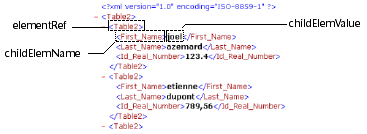

<!--REF #_command_.DOM Get first child XML element.Syntax-->**DOM Get first child XML element** ( *elementRef* {; *childElemName* {; *childElemValue*}} ) : Text<!-- END REF-->
<!--REF #_command_.DOM Get first child XML element.Params-->
| Parameter | Type |  | Description |
| --- | --- | --- | --- |
| elementRef | Text | &#8594;  | XML element reference |
| childElemName | Text | &#8592; | Name of child XML element |
| childElemValue | Text | &#8592; | Value of child XML element |
| Function result | Text | &#8592; | Child XML element reference |

<!-- END REF-->

#### Description 

<!--REF #_command_.DOM Get first child XML element.Summary-->The DOM Get first child XML element command returns a reference to the first “child” of the XML element passed in *elementRef*.<!-- END REF--> This reference can be used with other XML parsing commands.

The *childElemName* and *childElemValue* parameters, if they are passed, receive respectively the name and the value of the child element. 



#### Example 1 

Retrieval of the reference of the first XML element of the parent root. The XML structure (C:\\\\import.xml) is first loaded into a BLOB: 

```4d
 var myBlobVar : Blob
 var $xml_Parent_Ref;$xml_Child_Ref : Text
 
 DOCUMENT TO BLOB("c:\\import.xml";myBlobVar)
 $xml_Parent_Ref:=DOM Parse XML variable(myBlobVar)
 $xml_Child_Ref:=DOM Get first child XML element($xml_Parent_Ref)
```

#### Example 2 

Retrieval of the reference, name and value of the first XML element of the parent root. The XML structure (C:\\\\import.xml) is first loaded into a BLOB: 

```4d
 var myBlobVar : Blob
 var $xml_Parent_Ref;$xml_Child_Ref : Text
 var $childName;$childValue : Text
 
 DOCUMENT TO BLOB("c:\\import.xml";myBlobVar)
 $xml_Parent_Ref:=DOM Parse XML variable(myBlobVar)
 $xml_Child_Ref:=DOM Get first child XML element($xml_Parent_Ref;$childName;$childValue)
```

#### System variables and sets 

If the command has been correctly executed, the system variable OK is set to 1\. Otherwise, it is set to 0\. 

#### See also 

[DOM Get next sibling XML element](dom-get-next-sibling-xml-element.md)  

#### Properties
|  |  |
| --- | --- |
| Command number | 723 |
| Thread safe | &check; |
| Modifies variables | OK |
| Forbidden on the server ||


