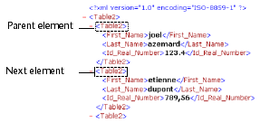

<!--REF #_command_.DOM Get next sibling XML element.Syntax-->**DOM Get next sibling XML element** ( *elementRef* {; *siblingElemName* {; *siblingElemValue*}} ) : Text<!-- END REF-->
<!--REF #_command_.DOM Get next sibling XML element.Params-->
| Parameter | Type |  | Description |
| --- | --- | --- | --- |
| elementRef | Text | &#8594;  | XML element reference |
| siblingElemName | Text | &#8592; | Name of sibling XML element |
| siblingElemValue | Text | &#8592; | Value of sibling XML element |
| Function result | Text | &#8592; | Sibling XML element reference |

<!-- END REF-->

#### Description 

<!--REF #_command_.DOM Get next sibling XML element.Summary-->The DOM Get next sibling XML element command returns a reference to the next “sibling” of the XML element passed as reference.<!-- END REF--> This reference can be used with other XML parsing commands.

The *siblingElemName* and *siblingElemValue* parameters, if they are passed, receive respectively the name and the value of the “sibling” element. 

This command is used to navigate among the “children” of the XML element. 

After the last “sibling,” the system variable OK is set to 0\. 

#### Example 1 

Retrieval of the reference of the next sibling XML element following the element passed as parameter:

```4d
 var $xml_Parent_Ref;$next_XML_Ref : Text
 $next_XML_Ref:=DOM Get next sibling XML element($xml_Parent_Ref)
```



#### Example 2 

Retrieval in a reference loop of all the child XML elements following the parent element passed as parameter, beginning with the first child:

```4d
 var $xml_Parent_Ref;$first_XML_Ref;$next_XML_Ref : Text
 
 $first_XML_Ref:=DOM Get first child XML element($xml_Parent_Ref)
 $next_XML_Ref:=$first_XML_Ref
 While(OK=1)
    $next_XML_Ref:=DOM Get next sibling XML element($next_XML_Ref)
 End while
```


#### System variables and sets 

If the command has been correctly executed and if the parsed element is not the last “sibling” of the referenced element, the system variable OK is set to 1\. If an error occurs or if the parsed element is the last “sibling” of the referenced element, it is set to 0.

#### See also 

[DOM Get first child XML element](dom-get-first-child-xml-element.md)  