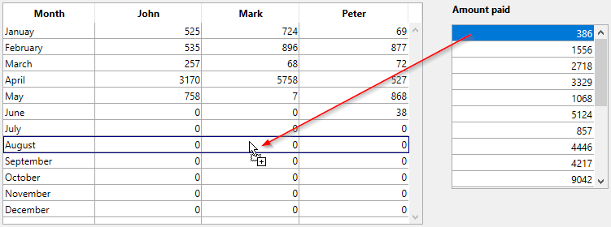

<!--REF #_command_.Drop position.Syntax-->**Drop position** {( columnNumber | pictPosY )} -> Function result<!-- END REF-->
<!--REF #_command_.Drop position.Params-->
| Parameter | Type |  | Description |
| --- | --- | --- | --- |
| columnNumber &#124; pictPosY | Longint | &#8592; | List box column number (-1 if the drop occurs beyond the last column) or Position of Y coordinate in picture |
| Function result | Longint | &#8592; | • Number (list box) or • Position (hierarchical list) or • Position in string (text/combo box/4D Write Pro area) of destination item or • -1 if drop occurred beyond the last list item • Position of X coordinate in picture |

<!-- END REF-->

#### Description 

<!--REF #_command_.Drop position.Summary-->The Drop position command can be used to find out the location, in a “complex” destination object, where an object has been (dragged and) dropped.<!-- END REF-->

Typically, you will use Drop position when handling a drag and drop event that occurred over a list box, a hierarchical list, a text or picture field, or a 4D Write Pro area.

* If the destination object is a list box, the command returns a row number. In this case, the command also returns the column number where the drop took place in the optional *columnNumber* parameter.
* If the destination object is a hierarchical list, the command returns an item position.
* If the destination object is a text type variable or field, or a combo box, the command returns a character position within the string.  
In all the above cases, the command may return -1 if the source object has been dropped beyond the last element or the last item of the destination object.
* If the destination object is a picture type variable or field, the command returns the horizontal location of the click and, in the optional *pictPosY* parameter, the vertical location of the click. The values returned are expressed in pixels and in relation to the local coordinate system.

If you call Drop position when handling an event that is not a drag-and-drop event and that occurred over a list box, a combo box, a hierarchical list, a text, a picture, or a 4D Write Pro area, the command returns -1.

**Important:** A form object accepts dropped data if its **Droppable** property has been selected. Also, its object method must be activated for On Drag Over and/or On Drop, in order to process these events.

#### Example 

In the following example, a list of amounts paid must be broken down per month and per person. This is carried out by drag and drop between two list boxes:



The right (source) list box object method contains the following code:

```4d
 If(Form event code=On Begin Drag Over) //event must be selected for the list box
    var $tomove : Blob
    var $val : Text
    LISTBOX GET CELL POSITION(*;"LBPaid";$col;$row)
    $val:=PaidCol{$row}
    VARIABLE TO BLOB($val;$tomove)
    APPEND DATA TO PASTEBOARD("mydrag";$tomove) //use a custom key
 End if
```

The left (destination) list box object method contains the following code:

```4d
 Case of
 
    :(Form event code=On Drag Over) //event must be selected for the list box
       var $toGet : Blob
       var $rownum : Integer
       $rownum:=Drop position($colnum)
       GET PASTEBOARD DATA("mydrag";$toGet) //get data
       If(Pasteboard data size("mydrag")>0)&($colnum#1)) //If data are in the pasteboard
          $0:=0 //we would accept the drop
       Else
          $0:=-1 //The drop is refused
       End if
 
    :(Form event code=On Drop) //event must be selected for the list box
       var $toGet : Blob
       var $rownum;$val : Integer
       $rownum:=Drop position($colnum)
       GET PASTEBOARD DATA("mydrag";$toGet)
       BLOB TO VARIABLE($toGet;$val) //get the value
       If(Pasteboard data size("mydrag")>0))
          If($colnum=1)
             BEEP
          Else
             Case of //Adding of dropped values
                :($colnum=2)
                   John{$rownum}:=John{$rownum}+$val
                :($colnum=3)
                   Mark{$rownum}:=Mark{$rownum}+$val
                :($colnum=4)
                   Peter{$rownum}:=Peter{$rownum}+$val
             End case
             DELETE FROM ARRAY(PaidCol;Find in array(PaidCol;$val)) //Update source listbox
          End if
       End if
 End case
```

#### See also 

*\_o\_DRAG AND DROP PROPERTIES*  
*Drag and Drop*  