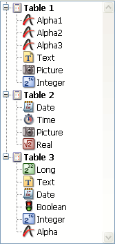

<!--REF #_command_.Find in list.Syntax-->**Find in list** ( {* ;} *list* ; *value* ; *scope* {; *itemsArray* {; *}} ) : Integer<!-- END REF-->
<!--REF #_command_.Find in list.Params-->
| Parameter | Type |  | Description |
| --- | --- | --- | --- |
| * | Operator | &#8594;  | If specified, list is an object name (string) If omitted, list is a list reference number |
| list | Integer, Text | &#8594;  | List reference number (if * omitted) Name of list type object (if * passed) |
| value | Text | &#8594;  | Value to be searched for |
| scope | Integer | &#8594;  | 0=Main list, 1=Sublist |
| itemsArray | Array integer | &#8592; | - If 2nd * omitted: array of positions of items found - If 2nd * passed: array of reference numbers of items found |
| * | Operator | &#8594;  | - If omitted: use position of items - If passed: use reference number of items |
| Function result | Integer | &#8592; | - If 2nd * omitted: position of item found - If 2nd * passed: reference number of item found |

<!-- END REF-->

#### Description 

<!--REF #_command_.Find in list.Summary-->The **Find in list** command returns the position or reference of the first item of the *list* that is equivalent to the string passed in *value*.<!-- END REF--> If several items are found, the function can also fill an *itemsArray* array with the position or reference of each item.

If you pass the first optional \* parameter, you indicate that the *list* parameter is an object name (string) corresponding to a representation of the list in the form. If you do not pass this parameter, you indicate that the *list* parameter is a hierarchical list reference ([ListRef](# "A Longint reference to a hierachical list")). If you only use a single representation of the list or work with item reference numbers (the second \* is omitted), you can use either syntax. Conversely, if you use several representations of the same list and work with item positions (the second \* is passed), the syntax based on the object name is required since the position of items can vary from one representation to another. 

**Note:** If you use the @ character in the object name of the list and the form contains several lists that match this name, the **Find in list** command will be applied to the first object whose name corresponds.

The second \* parameter can be used to indicate whether you want to work with the current positions of the items (in which case, this parameter is omitted) or with the absolute references of the items (in which case, it must be passed).

Pass the character strings to be searched for in *value*. The search will be of the “is exactly” type; in other words, searching for “wood” will not find “wooden.” However, you can use the wildcard character (@ ) to set up searches of the “begins with,” “ends with” or “contains” types.

The *scope* parameter is used to set whether the search must only be carried out at the first level of the *list* or whether it should include all the sublists. Pass 0 to limit the search to the first level of the list and 1 to extend it to all the sublists. 

If you want to find out the position or number of all the items corresponding to *value*, pass a longint array in the optional *itemsArray* parameter. If necessary, the array will be created and resized by the command. The command will fill in the array with the positions (if the second \* is omitted) or the reference numbers (if the second \* is passed) of the items found.

Positions are expressed in relation to the top item of the main list, while taking into account the current expanded/collapsed state of the list and sublists.

If no item corresponds to the *value* searched for, the function returns 0 and the *itemsArray* array is returned empty.

#### Example 

Given the following hierarchical list:



```4d
 $vlItemPos:=Find in list(hList;"P@";1;$arrPos)
  //$vlItemPos equals 6
  //$arrPos{1} equals 6 and $arrPos{2} equals 11
 $vlItemRef:=Find in list(hList;"P@";1;$arrRefs;*)
  //$vlItemRef equals 7
  //$arrRefs{1} equals 7 and $arrRefs{2} equals 18
 $vlItemPos:=Find in list(hList;"Date";1;$arrPos)
  //$vlItemPos equals 9
  //$arrPos{1} equals 9 and $arrPos{2} equals 16
 $vlItemRefFind in list(hList;"Date";1;$arrRefs;*)
  //$vlItemRef equals 11
  //$arrRefs{1} equals 11 and $arrRefs{2} equals 23
 $vlItemPos:=(hList;"Date";0;*)
  //$vlItemPos equals 0
```


#### Properties
|  |  |
| --- | --- |
| Command number | 952 |
| Thread safe | &check; |
| Forbidden on the server ||


