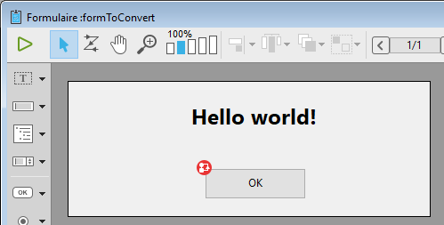
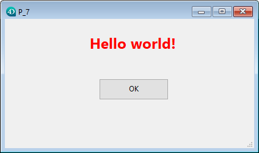

<!--REF #_command_.FORM Convert to dynamic.Syntax-->**FORM Convert to dynamic** ( {*aTable* ;} *formName* ) : Object<!-- END REF-->
<!--REF #_command_.FORM Convert to dynamic.Params-->
| Parameter | Type |  | Description |
| --- | --- | --- | --- |
| aTable | Table | &#8594;  | Form table |
| formName | Text | &#8594;  | Name of a "classic" project or table form |
| Function result | Object | &#8592; | formName converted to dynamic form |

<!-- END REF-->

*This command is not thread-safe, it cannot be used in preemptive code.*


#### Description 

<!--REF #_command_.FORM Convert to dynamic.Summary-->The **FORM Convert to dynamic** command converts the *formName* (classic form) to a dynamic form and returns it in an object.<!-- END REF-->

*Classic forms* are 4D forms stored within the structure file in binary format. *Dynamic forms* are forms whose structures are defined in a 4D object (or a .json file). For more information, please refer to the *Dynamic Forms* section.

If you want to convert a table form, pass the form table in the *aTable* parameter and then pass its name as a string in *formName*. For a project form, pass the form name directly in *formName*.

In order to be able to run the form directly by passing the resulting object to the [DIALOG](../commands/dialog.md) command, **FORM Convert to dynamic** applies specific rules when converting the form:

* References to lists are exported by name instead of a JSON pointer referencing the lists.json file.
* References to named filters and named display formats (using the '|' prefix character) are exported by value instead of a JSON pointer referencing the filters.json file.
* Since pictures from the picture library are not exported by the command, objects referencing a picture from the picture library still reference the library after the conversion. In their "icon" property, they use a special "pictlib:xx" url, where *xx* is the id in the library.
* Static pictures are converted as picture type object properties.
* Deprecated objects are ignored. Refer to the paragraph to see the list of objects or properties that are not supported in dynamic forms.

**Note:** References to the form method and form object methods are exported with internal IDs, which will be valid only in the current database while *formName* methods are not modified. If you want to use the exported form in another context, you need to assign project method names to the form or form object "method" property (see example).

#### Example 

You want to convert a classic form, modify it, and display it. 

The original form:

  


  
```4d
 var $dynForm : Object
 $dynForm:=FORM Convert to dynamic("FormToConvert")
 $dynForm.pages[1].objects.TitleArea.stroke:="red"
 $dynForm.pages[1].objects.bOK.method:="myMethod" //associate a project method
 DIALOG($dynForm)
```

  
If you execute the code: 

  


#### See also 

[DIALOG](../commands/dialog.md)  
[Export structure file](export-structure-file.md)  