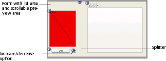

<!--REF #_command_.FORM SET SIZE.Syntax-->**FORM SET SIZE** ( {*object* ;} *horizontal* ; *vertical* {; *} )<!-- END REF-->
<!--REF #_command_.FORM SET SIZE.Params-->
| Parameter | Type |  | Description |
| --- | --- | --- | --- |
| object | String | &rarr; | Object name indicating form limits |
| horizontal | Longint | &rarr; | If * passed: horizontal margin (pixels)If * omitted: width (pixels) |
| vertical | Longint | &rarr; | If * passed: vertical margin (pixels)If * omitted: height (pixels) |
| * | Operator | &rarr; | • If passed, use horizontal and vertical as form margins• If omitted, use horizontal and vertical as width and height of the form
This parameter cannot be passed if the object parameter is passed. |

<!-- END REF-->

#### Description 

<!--REF #_command_.FORM SET SIZE.Summary-->The **FORM SET SIZE** command allows you to change the size of the current form by programming.<!-- END REF--> The new size is defined for the current process; it is not saved with the form.  
  
As in the Design environment, you can use this command to set the form size in three ways:

* Automatically — 4D determines the size of the form based on the notion that all objects must be visible — and possibly adding a horizontal and vertical margin,
* On the place where a form object is found, where a horizontal and vertical margin may be added,
* By entering “fixed” sizes (width and height).  
For more information on resizing forms, refer to the 4D *Design Reference* manual.
**Automatic size**

If you want the size of the form to be set automatically, you must use the following syntax: 

```4d
 FORM SET SIZE(horizontal;vertical;*)
```

In this case, you must pass the margins (in pixels) that you want to add to the right and bottom of the form in *horizontal* and *vertical*. 

**Object-based size**

If you want the form size to be based on an object, you must use the following syntax: 

```4d
 FORM SET SIZE(object;horizontal;vertical)
```

In this case, you must pass the margins (in pixels) that you want to add to the right and bottom of the object in *horizontal* and *vertical*. You cannot pass the *\** parameter.

**Fixed size**

In you want to have a fixed form size, you must use the following syntax: 

```4d
 FORM SET SIZE(horizontal;vertical)
```

In this case, you must pass the width and height (in pixels) of the form in *horizontal* and *vertical*. 

The **FORM SET SIZE** command changes the size of the form, but also takes into account the resizing properties. For example, if the minimum width of a form is 500 pixels and if the command sets a width of 400 pixels, the new form width will be 500 pixels.   
Also note that this command does not change the size of the form window (you can resize a form without changing the size of the window and vice versa). To change the size of the form window, refer to the [RESIZE FORM WINDOW](resize-form-window.md) command. 

#### Example 

The following example shows how an Explorer type window is set up. The following form is created in the Design environment :



The size of the form is “automatic”.

The window is displayed using the following code:

```4d
 $ref:=Open form window([Table 1];"Form1";Plain form window;Horizontally centered;Vertically centered;*)
 DIALOG([Table 1];"Form1")
 CLOSE WINDOW
```

The right part of the window can be displayed or hidden by clicking on the increase/decrease option:


The object method associated with this button is as follows:

```4d
 Case of
    :(FORM Event.code=On Load)
       var b1;<>collapsed : Boolean
       var margin : Integer
       margin:=15
       b1:=<>collapsed
       If(<>collapsed)
          FORM SET HORIZONTAL RESIZING(False)
          FORM SET SIZE("b1";margin;margin)
       Else
          FORM SET HORIZONTAL RESIZING(True)
          FORM SET SIZE("tab";margin;margin)
       End if
 
    :(FORM Event.code=On click)
       <>collapsed:=b1
       If(b1)
  //collapsed
          OBJECT GET COORDINATES(*;"b1";$l;$t;$r;$b)
          GET WINDOW RECT($lf;$tf;$rf;$bf;Current form window)
          SET WINDOW RECT($lf;$tf;$lf+$r+margin;$tf+$b+margin;Current form window)
          SET FORM HORIZONTAL RESIZING(False)
          SET FORM SIZE("b1";margin;margin)
 
       Else
  //expanded
          OBJECT GET COORDINATES(*;"tab";$l;$t;$r;$b)
          GET WINDOW RECT($lf;$tf;$rf;$bf;Current form window)
          SET WINDOW RECT($lf;$tf;$lf+$r+margin;$tf+$b+margin;Current form window)
          FORM SET HORIZONTAL RESIZING(True)
          FORM SET SIZE("tab";margin;margin)
       End if
 
 End case
```

#### See also 

[FORM SET HORIZONTAL RESIZING](form-set-horizontal-resizing.md)  
[FORM SET VERTICAL RESIZING](form-set-vertical-resizing.md)  