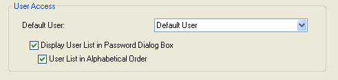

<!--REF #_command_.Get default user.Syntax-->**Get default user**  -> Function result<!-- END REF-->
<!--REF #_command_.Get default user.Params-->
| Parameter | Type |  | Description |
| --- | --- | --- | --- |
| Function result | Longint | &#x1F850; | Unique user ID number |

<!-- END REF-->

#### Description 

The Get default user command returns the unique user ID of the user set as “Default user” in the database Settings dialog box:

If no default user has been set, the command returns 0.
