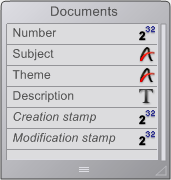

<!--REF #_command_.GET DOCUMENT PROPERTIES.Syntax-->**GET DOCUMENT PROPERTIES** ( *document* ; *locked* ; *invisible* ; created on ; created at ; modified on ; modified at )<!-- END REF-->
<!--REF #_command_.GET DOCUMENT PROPERTIES.Params-->
| Parameter | Type |  | Description |
| --- | --- | --- | --- |
| document | Text | &#8594;  | Document name |
| locked | Boolean | &#8592; | Locked (True) or unlocked (False) |
| invisible | Boolean | &#8592; | Invisible (True) or visible (False) |
| created on | Date | &#8592; | Creation date |
| created at | Time | &#8592; | Creation time |
| modified on | Date | &#8592; | Last modification date |
| modified at | Time | &#8592; | Last modification time |

<!-- END REF-->

#### Description 

<!--REF #_command_.GET DOCUMENT PROPERTIES.Summary-->The **GET DOCUMENT PROPERTIES** command returns information about the document whose name or pathname you pass in *document*.<!-- END REF-->

After the call:

* *locked* returns True if the document is locked. A locked document cannot be modified.
* *invisible* returns True if the document is hidden.
* *created on* and *created at* return the date and time when the document was created.
* *modified on* and *modified at* return the date and time when the document modified for the last time.

#### Example 

You have created a documentation database and you would like to export all the records you created in the database to documents on disk. Because the database is regularly updated you want to write an export algorithm that create or recreate each document on disk if the document does not exist or if the corresponding record has been modified after the document was saved for the last time. Consequently, you need to compare the date and time of modification of a document (if it exists) with its corresponding record. For illustrating this example, we use the table whose definition is shown below:



Rather than saving both a date and time values into each record, you can save a “time stamp” value which expresses the number of seconds elapsed between an arbitrary anterior date and time (in this example we use Jan, 1st 1995 at 00:00:00) and the date and time when the record was saved.

In our example, the field *\[Documents\]Creation Stamp* holds the time stamp when the record was first created and the field *\[Documents\]Modification Stamp* holds the time stamp when the record was last modified.

The Time stamp project method listed below calculates the time stamp for a specific date and time or for the current date and time if no parameters are passed:

```4d
 [ // Time stamp Project Method
  // Time stamp { ( date ; Time ) } -> Long
  // Time stamp { ( date ; Time ) } -> Number of seconds since Jan, 1st 1995
 
 var $1;$vdDate : Date
 var $2;$vhTime : Time
 var $0 : Integer
 
 If(Count parameters=0)
    $vdDate:=Current date
    $vhTime:=Current time
 Else
    $vdDate:=$1
    $vhTime:=$2
 End if
 $0:=(($vdDate-!01/01/95!)*86400)+$vhTime
```

**Note:** Using this method, you can encode dates and times from the *01/01/95* at *00:00:00* to the *01/19/2063* at *03:14:07* which cover the long integer range *0* to *2^31* minus one.

Conversely, the Time stamp to date and Time stamp to time project methods listed below allow extracting the date and the time stored into a time stamp:

```4d
  // Time stamp to date Project Method
  // Time stamp to date ( Long ) -> Date
  // Time stamp to date ( Time stamp ) -> Extracted date
 
 var $0 : Date
 var $1 : Integer
 
 $0:=!01/01/95!+($1\86400)
 
  // Time stamp to time Project Method
  // Time stamp to time ( Long ) -> Date
  // Time stamp to time ( Time stamp ) -> Extracted time
 
 var $0 : Time
 var $1 : Integer
 
 $0:=Time(Time string(†00:00:00†+($1%86400)))
```

For ensuring that the records have their time stamps correctly updated no matter the way they are created or modified, we just need to enforce that rule using the trigger of the table *\[Documents\]*:

```4d
  // Trigger for table [Documents]
 Case of
    :(Trigger event=Save New Record Event)
       [Documents]Creation Stamp:=Time stamp
       [Documents]Modification Stamp:=Time stamp
    :(Trigger event=Save Existing Record Event)
       [Documents]Modification Stamp:=Time stamp
 End case
```

Once this is implemented in the database, we have all we need to write the project method CREATE DOCUMENTATION listed below. We use of **GET DOCUMENT PROPERTIES** and [SET DOCUMENT PROPERTIES](set-document-properties.md) for handling the date and time of creation and modification of the documents.

```4d
  // CREATE DOCUMENTATION Project Method
 
 C_STRING(255;$vsPath;$vsDocPathName;$vsDocName)
 var $vlDoc : Integer
 var $vbOnWindows;$vbDoIt;$vbLocked;$vbInvisible : Boolean
 var $vhDocRef;$vhCreatedAt;$vhModifiedAt : Time
 var $vdCreatedOn;$vdModifiedOn : Date
 
 If(Application type=4D Client)
  // If we are running 4D Client, save the documents
  // locally on the Client machine where 4D Client is located
    $vsPath:=Long name to path name(Application file)
 Else
  // Otherwise, save the documents where the data file is located
    $vsPath:=Long name to path name(Data file)
 End if
  // Save the documents in a directory we arbitrarily name "Documentation"
 $vsPath:=$vsPath+"Documentation"+Char(Directory symbol)
  // If this directory does not exist, create it
 If(Test path name($vsPath)#Is a folder)
    CREATE FOLDER($vsPath)
 End if
  // Establish the list of the already existing documents
  // because we'll have to delete the obsolete ones, in other words,
  // the documents whose corresponding records have been deleted.
 ARRAY STRING(255;$asDocument;0)
 DOCUMENT LIST($vsPath;$asDocument)
  // Select all the records from the [Documents] table
 ALL RECORDS([Documents])
  // For each record
 $vlNbRecords:=Records in selection([Documents])
 $vlNbDocs:=0
 $vbOnWindows:=On Windows
 For($vlDoc;1;$vlNbRecords)
  // Assume we will have to (re)create the document on disk
    $vbDoIt:=True
  // Calculate the name and the path name of the document
    $vsDocName:="DOC"+String([Documents]Number;"00000")
    $vsDocPathName:=$vsPath+$vsDocName
  // Does this document already exist?
    If(Test path name($vsDocPathName+".HTM")=Is a document)
  // If so, remove the document from the list of the documents
  // that may end up deleted
       $vlElem:=Find in array($asDocument;$vsDocName+".HTM")
       If($vlElem>0)
          DELETE FROM ARRAY($asDocument;$vlElem)
       End if
  // Was the document saved after the last time the record was modified?
       GET DOCUMENT PROPERTIES($vsDocPathName+".HTM";$vbLocked;$vbInvisible;$vdCreatedOn;$vhCreatedAt;
       $vdModifiedOn;$vhModifiedAt)
       If(Time stamp($vdModifiedOn;$vhModifiedAt)>=[Documents]Modification Stamp)
  // If so, we do not need to recreate the document
          $vbDoIt:=False
       End if
    Else
  // The document does not exist, reset these two variables so
  // we know we'll have to compute them before setting the final properties
  // of the document
       $vdModifiedOn:=!00/00/00!
       $vhModifiedAt:=†00:00:00†
    End if
  // Do we need to (re)create the document?
    If($vbDoIt)
  // If so, increment the number of updated documents
       $vlNbDocs:=$vlNbDocs+1
  // Delete the document if it already exists
       DELETE DOCUMENT($vsDocPathName+".HTM")
  // And create it again
       If($vbOnWindows)
          $vhDocRef:=Create document($vsDocPathName;"HTM")
       Else
          $vhDocRef:=Create document($vsDocPathName+".HTM")
       End if
       If(OK=1)
  // Here write the contents of the document
          CLOSE DOCUMENT($vhDocRef)
          If($vdModifiedOn=!00/00/00!)
  // The document did not exist, set the modification date and time
  // to their right values
             $vdModifiedOn:=Current date
             $vhModifiedAt:=Current time
          End if
  // Change the properties of the document so its date and time of creation
  // are made equal to those of the corresponding record
          SET DOCUMENT PROPERTIES($vsDocPathName+".HTM";$vbLocked;$vbInvisible;
          Time stamp to date([Documents]Creation Stamp);
          Time stamp to time([Documents]Creation Stamp);
          $vdModifiedOn;$vhModifiedAt)
       End if
    End if
  // Just to know what's going on
    SET WINDOW TITLE("Processing Document "+String($vlDoc)+" of "+String($vlNbRecords))
    NEXT RECORD([Documents])
 End for
  // Delete the obsolete documents, in other words
  // those which are still in the array $asDocument
 For($vlDoc;1;Size of array($asDocument))
    DELETE DOCUMENT($vsPath+$asDocument{$vlDoc})
    SET WINDOW TITLE("Deleting obsolete document: "+Char(34)+$asDocument{$vlDoc}+Char(34))
 End for
  // We're done
 ALERT("Number of documents processed: "+String($vlNbRecords)+Char(13)+"Number of documents updated: "+String($vlNbDocs)+Char(13)+"Number of documents deleted: "+String(Size of array($asDocument)))
```

#### See also 

[SET DOCUMENT PROPERTIES](set-document-properties.md)  