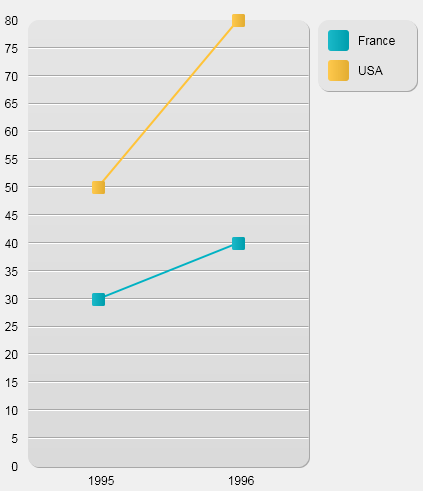

<!--REF #_command_.GRAPH.Syntax-->**GRAPH** ( *graphPicture* ; graphNumber | graphSettings ; *xLabels* {; *yElements*} {; *yElements2* ; ... ; *yElementsN*} )<!-- END REF-->
<!--REF #_command_.GRAPH.Params-->
| Parameter | Type |  | Description |
| --- | --- | --- | --- |
| graphPicture | Picture | &#8594;  | Picture variable |
| graphNumber &#124; graphSettings | Longint, Object | &#8594;  | Longint: Graph type number, Object: Graph settings |
| xLabels | Array | &#8594;  | Labels for the x-axis |
| yElements | Array | &#8594;  | Data to graph (up to eight allowed) |

<!-- END REF-->

#### Description 

<!--REF #_command_.GRAPH.Summary-->**GRAPH** draws a graph for a picture variable on the basis of values coming from arrays.<!-- END REF--> 

The graphs generated by this command are drawn using the integrated SVG rendering engine. They have interface functions associated with picture variables: a context menu in Application mode (to let you choose, more particularly, the display format), scrollbars, and so on.

**Note:** SVG (Scalable Vector Graphics) is a graphics file format (.svg extension). Based on XML, this format is widespread and can be displayed more particularly in Web browsers. For more information, please refer to the following address: [http://www.w3.org.Graphics/SVG](http://www.w3.org.graphics/SVG/)/. The [SVG EXPORT TO PICTURE](svg-export-to-picture.md) command can also be used to take advantage of the integrated SVG engine.

In the *graphPicture* parameter, pass the name of the picture variable that displays the graph in the form.

The second parameter specifies the type of graph that will be drawn. You have two options:

* pass a *graphNumber* parameter of the [Longint](# "Number between -2^31..(2^31)-1 (4-byte Integer)") type (all versions of 4D): In this case, you must pass a number from 1 to 8\. The graph types are described in Example 1\. After a graph has been drawn, you can change the type by changing *graphNumber* and executing the **GRAPH** command again. You can then modify certain graph characteristics by calling the [GRAPH SETTINGS](graph-settings.md) command. See Example 1.
* pass a *graphSettings* parameter of the [Object](# "Data structured as a native 4D object") type (not supported on 4D Server on Windows): In this case, you must pass an object that contains the various graph properties to define. To do this, you can use the constants found in the "*Graph Parameters*" theme (see below). This syntax allows you to define the graph type along with its specific settings (legend, xmin, etc.) in a single call. This allows users to save the generated graphs as regular SVG pictures and makes it possible to display them using a standard browser like FireFox, Chrome, IE, or Safari (the graphs generated have better compliance with the SVG standard implemented in browsers). Furthermore, this syntax gives you access to various extra settings, which allow you to customize, for example, spacing between bars, margins, bar colors, etc. See Examples 2, 3 and 4\. **Warning**: If you use this syntax, the [GRAPH SETTINGS](graph-settings.md) command must NOT be called.

The *xLabels* parameter defines the labels that will be used to label the x-axis (the bottom of the graph). This data can be of string, date, time, or numeric type. There should be the same number of array elements in *xLabels* as there are subrecords or array elements in each of the *yElements*.

The data specified by *yElements* is the data to graph. The data must be numeric. Up to eight data sets can be graphed. Pie charts graph only the first *yElements*.

##### Automatic IDs 

Specific IDs are assigned automatically to elements found in the SVG graph:

| **IDs**                                      | **Description**                          |
| -------------------------------------------- | ---------------------------------------- |
| ID\_graph\_1 to ID\_graph\_8                 | Columns, lines, areas...                 |
| ID\_graph\_shadow\_1 to ID\_graph\_shadow\_8 | Shadows for columns, lines, areas...     |
| ID\_bullet\_1 to ID\_bullet\_8               | Points (Line and Scatter graphs only)    |
| ID\_pie\_label\_1 to ID\_pie\_label\_8       | Pie chart labels (Pie chart graphs only) |
| ID\_legend                                   | Legend                                   |
| ID\_legend\_1 to ID\_legend\_8               | Legend titles                            |
| ID\_legend\_border                           | Legend borders                           |
| ID\_legend\_border\_shadow                   | Shadows for legend borders               |
| ID\_x\_values                                | Values of X axis                         |
| ID\_y\_values                                | Values of Y axis                         |
| ID\_y0\_axis                                 | Values of Z axis                         |
| ID\_background                               | Background                               |
| ID\_background\_shadow                       | Background shadow                        |
| ID\_x\_grid                                  | Grid on X axis                           |
| ID\_x\_grid\_shadow                          | Shadow for grid on X axis                |
| ID\_y\_grid                                  | Grid on Y axis                           |
| ID\_y\_grid\_shadow                          | Shadow for grid on Y axis                |

##### graphSettings attributes 

When you use the *graphSettings* parameter, you pass an object that contains the various graph properties to define. You can use the following constants, found in the "*Graph Parameters*" constant theme:

| Constant                          | Type   | Value                      | Comment                                                                                                                                                                                                                                                                                                                                                                                                                                                                                                                                                                                                                                                                                                                                                                                                             |
| --------------------------------- | ------ | -------------------------- | ------------------------------------------------------------------------------------------------------------------------------------------------------------------------------------------------------------------------------------------------------------------------------------------------------------------------------------------------------------------------------------------------------------------------------------------------------------------------------------------------------------------------------------------------------------------------------------------------------------------------------------------------------------------------------------------------------------------------------------------------------------------------------------------------------------------- |
| Graph background color            | Text | graphBackgroundColor       | **Possible values:** SVG compliant color expression (text), for example "#7F8E00", "Pink", or "#0a1414"                                                                                                                                                                                                                                                                                                                                                                                                                                                                                                                                                                                                                                                                                                             |
| Graph background opacity          | Text | graphBackgroundOpacity     | **Possible values**: Integers, range 0-100<br/>**Default value**: 100                                                                                                                                                                                                                                                                                                                                                                                                                                                                                                                                                                                                                                                                                                                                       |
| Graph background shadow color     | Text | graphBackgroundShadowColor | **Possible values**: SVG compliant color expression (text), for example "#7F8E00", "Pink", or "#0a1414"                                                                                                                                                                                                                                                                                                                                                                                                                                                                                                                                                                                                                                                                                                             |
| Graph bottom margin               | Text | bottomMargin               | **Possible values**: Real numbers<br/>**Default value**: 12                                                                                                                                                                                                                                                                                                                                                                                                                                                                                                                                                                                                                                                                                                                                                 |
| Graph colors                      | Text | colors                     | **Possible values**: Text array. Colors for each graph series.<br/>**Default values**: Blue-green (#19BAC9), Yellow (#FFC338), Purple (#573E82), Green (#4FA839), Orange (#D95700), Blue (#1D9DF2), Yellow-green (#B5CF32), Red (#D43A26)                                                                                                                                                                                                                                                                                                                                                                                                                                                                                                                                                                   |
| Graph column gap                  | Text | columnGap                  | **Possible value**s: Longints<br/>**Default value**: 12<br/>Sets spacing between bars<br/>Types 1, 2, 3 only                                                                                                                                                                                                                                                                                                                                                                                                                                                                                                                                                                                                                                                                                |
| Graph column width max            | Text | columnWidthMax             | **Possible values**: Real numbers<br/>**Default value**: 200<br/>Types 1, 2, 3 only                                                                                                                                                                                                                                                                                                                                                                                                                                                                                                                                                                                                                                                                                                                 |
| Graph column width min            | Text | columnWidthMin             | **Possible values**: Real numbers<br/>**Default value**: 10<br/>Types 1, 2, 3 only                                                                                                                                                                                                                                                                                                                                                                                                                                                                                                                                                                                                                                                                                                                  |
| Graph default height              | Text | defaultHeight              | **Possible values**: Real numbers<br/>**Default value**: 400\. If graphType=7 (Pie), then default value = 600                                                                                                                                                                                                                                                                                                                                                                                                                                                                                                                                                                                                                                                                                               |
| Graph default width               | Text | defaultWidth               | **Possible values**: Real numbers**<br/>Default value**: 600\. If graphType=7 (Pie), then default value = 800                                                                                                                                                                                                                                                                                                                                                                                                                                                                                                                                                                                                                                                                                               |
| Graph display legend              | Text | displayLegend              | **Possible value**s: Boolean<br/>**Default value**: True                                                                                                                                                                                                                                                                                                                                                                                                                                                                                                                                                                                                                                                                                                                                                    |
| Graph document background color   | Text | documentBackgroundColor    | **Possible values**: SVG compliant color expression (text), for example "#7F8E00", "Pink", or "#0a1414". When a graph saved as an SVG picture is opened elsewhere, the document background color is only displayed if the SVG rendering engine supports the *SVG tiny 1.2* norm (supported on IE, Firefox, but not on Chrome).                                                                                                                                                                                                                                                                                                                                                                                                                                                                                      |
| Graph document background opacity | Text | documentBackgroundOpacity  | **Possible values**: Integer, range 0-100 (default value: 100). When a graph saved as an SVG picture is opened elsewhere, the document background opacity is only displayed if the SVG rendering engine supports the *SVG tiny 1.2* norm (supported on IE, Firefox, but not on Chrome).                                                                                                                                                                                                                                                                                                                                                                                                                                                                                                                             |
| Graph font color                  | Text | fontColor                  | **Possible values:** SVG compliant color expression (text), for example "#7F8E00", "Pink", or "#0a1414"                                                                                                                                                                                                                                                                                                                                                                                                                                                                                                                                                                                                                                                                                                             |
| Graph font family                 | Text | fontFamily                 | **Possible values**: Font family name<br/>**Default value**: "Arial"                                                                                                                                                                                                                                                                                                                                                                                                                                                                                                                                                                                                                                                                                                                                        |
| Graph font size                   | Text | fontSize                   | **Possible values**: Longints<br/>**Default value**: 12\. If graphType=7 (Pie), see Graph pie font size                                                                                                                                                                                                                                                                                                                                                                                                                                                                                                                                                                                                                                                                                                     |
| Graph left margin                 | Text | leftMargin                 | **Possible values**: Real numbers<br/>**Default value**: 12                                                                                                                                                                                                                                                                                                                                                                                                                                                                                                                                                                                                                                                                                                                                                 |
| Graph legend font color           | Text | legendFontColor            | **Possible values**: SVG compliant color expression (text), for example "#7F8E00", "Pink", or "#0a1414"                                                                                                                                                                                                                                                                                                                                                                                                                                                                                                                                                                                                                                                                                                             |
| Graph legend icon gap             | Text | legendIconGap              | **Possible values**: Real numbers<br/>**Default value**: Graph legend icon height/2                                                                                                                                                                                                                                                                                                                                                                                                                                                                                                                                                                                                                                                                                                                         |
| Graph legend icon height          | Text | legendIconHeight           | **Possible values**: Real numbers<br/>**Default value**: 20                                                                                                                                                                                                                                                                                                                                                                                                                                                                                                                                                                                                                                                                                                                                                 |
| Graph legend icon width           | Text | legendIconWidth            | **Possible values**: Real numbers<br/>**Default value**: 20                                                                                                                                                                                                                                                                                                                                                                                                                                                                                                                                                                                                                                                                                                                                                 |
| Graph legend labels               | Text | legendLabels               | **Possible values**: Text array. If missing, 4D displays icons without text.                                                                                                                                                                                                                                                                                                                                                                                                                                                                                                                                                                                                                                                                                                                                        |
| Graph line width                  | Text | lineWidth                  | **Possible values**: Real numbers<br/>**Default value**: 2<br/>Type 4 only                                                                                                                                                                                                                                                                                                                                                                                                                                                                                                                                                                                                                                                                                                                          |
| Graph number format               | Text | numberFormat               | **Possible values**: Number format string, for example: "###,###,##0"<br/>**Default value**: "" (no format).                                                                                                                                                                                                                                                                                                                                                                                                                                                                                                                                                                                                                                                                                                |
| Graph pie direction               | Text | pieDirection               | **Possible values**: 1 or -1<br/>**Default value**: 1<br/>1 indicates the clockwise direction, -1 indicates the anticlockwise direction                                                                                                                                                                                                                                                                                                                                                                                                                                                                                                                                                                                                                                                             |
| Graph pie font size               | Text | pieFontSize                | **Possible values**: Real numbers<br/>**Default value**: 16<br/>Type 7 only                                                                                                                                                                                                                                                                                                                                                                                                                                                                                                                                                                                                                                                                                                                         |
| Graph pie shift                   | Text | pieShift                   | **Possible values**: Real numbers<br/>**Default value**: 8<br/>Type 7 only                                                                                                                                                                                                                                                                                                                                                                                                                                                                                                                                                                                                                                                                                                                          |
| Graph pie start angle             | Text | pieStartAngle              | **Possible values**: Real numbers (positive or negative)<br/>**Default value**: 0, which represents a start angle of 0° (upward pointing position)<br/>A positive value represents an angle relatively to the current pie direction. A negative value represents an angle relatively to the opposite of pie direction                                                                                                                                                                                                                                                                                                                                                                                                                                                                               |
| Graph plot height                 | Text | plotHeight                 | **Possible values**: Real numbers<br/>**Default value**: 12<br/>Type 4 only                                                                                                                                                                                                                                                                                                                                                                                                                                                                                                                                                                                                                                                                                                                         |
| Graph plot radius                 | Text | plotRadius                 | **Possible values**: Real numbers<br/>**Default value**: 12<br/>Type 6 only                                                                                                                                                                                                                                                                                                                                                                                                                                                                                                                                                                                                                                                                                                                         |
| Graph plot width                  | Text | plotWidth                  | **Possible values**: Real numbers<br/>**Default value**: 12<br/>Type 4 only                                                                                                                                                                                                                                                                                                                                                                                                                                                                                                                                                                                                                                                                                                                         |
| Graph right margin                | Text | rightMargin                | **Possible values**: Real numbers<br/>**Default value**: 2                                                                                                                                                                                                                                                                                                                                                                                                                                                                                                                                                                                                                                                                                                                                                  |
| Graph top margin                  | Text | topMargin                  | **Possible values**: Real numbers<br/>**Default value**: 2                                                                                                                                                                                                                                                                                                                                                                                                                                                                                                                                                                                                                                                                                                                                                  |
| Graph type                        | Text | graphType                  | **Possible values**: Longints \[1 to 8\] where 1 = bars, 2 = proportional, 3 = stacked, 4 = lines, 5 = surfaces, 6 = scatter, 7 = pie, 8 = pictures. <br/>**Default value**: 1<br/>If null, the graph is not drawn and no error message is displayed. If out of range, the graph is not drawn and an error message is displayed. <br/>If you want to modify picture type graphs (value=8), you must copy the 4D/Resources/GraphTemplates/Graph\_8\_Pictures/ folder into the Resources folder of your database and perform the necessary modifications. Local picture files will be used instead of 4D files. There is no pattern for picture names; 4D sorts the files contained in the folder and assigns the first file to the first graph. These files can be of the SVG or image type. |
| Graph xGrid                       | Text | xGrid                      | **Possible values**: Boolean<br/>**Default value**: True. <br/>For all types except 7                                                                                                                                                                                                                                                                                                                                                                                                                                                                                                                                                                                                                                                                                                               |
| Graph xMax                        | Text | xMax                       | **Possible values**: Number, Date, Time (same type as *xLabels* parameter). <br/>Only values lower than xMax are displayed on the graph. xMax is used only for graph types 4, 5, or 6 if xProp=true and if *xLabels* type is a number, date, or time. If missing or if xMin>xMax, 4D automatically calculates the xMax value.                                                                                                                                                                                                                                                                                                                                                                                                                                                                               |
| Graph xMin                        | Text | xMin                       | **Possible values**: Number, Date, Time (same type as *xLabels* parameter). <br/>Only values higher than xMin are displayed on the graph. xMin is used only for graph types 4, 5, or 6 if xProp=true and if *xLabels* type is a number, date, or time. If missing or if xMin>xMax, 4D automatically calculates the xMin value.                                                                                                                                                                                                                                                                                                                                                                                                                                                                              |
| Graph xProp                       | Text | xProp                      | **Possible values**: Boolean<br/>**Default value**: False<br/>True for proportional x-axis; False for normal x-axis. xProp is used only for graph types 4, 5, or 6                                                                                                                                                                                                                                                                                                                                                                                                                                                                                                                                                                                                                                  |
| Graph yGrid                       | Text | yGrid                      | **Possible values**: Boolean<br/>**Default value**: True<br/>For all types except 7                                                                                                                                                                                                                                                                                                                                                                                                                                                                                                                                                                                                                                                                                                                 |
| Graph yMax                        | Text | yMax                       | **Possible value**s: Numbers <br/>If missing, 4D automatically calculates the yMax value.<br/>For all types except 7                                                                                                                                                                                                                                                                                                                                                                                                                                                                                                                                                                                                                                                                                |
| Graph yMin                        | Text | yMin                       | **Possible values**: Numbers <br/>If missing, 4D automatically calculates the yMin value.<br/>For all types except 7                                                                                                                                                                                                                                                                                                                                                                                                                                                                                                                                                                                                                                                                                |

#### Example 1 

Syntax using *graphNumber*: The following example shows the different types of graphs that you can obtain. The code would be inserted in a form method or object method. It is not intended to be realistic, since the data is constant:

```4d
 var vGraph : Picture //Variable of graph
 ARRAY TEXT(X;2) //Create an array for the x-axis
 X{1}:="1995" //X Label #1
 X{2}:="1996" //X Label #2
 ARRAY REAL(A;2) //Create an array for the y-axis
 A{1}:=30 //Insert some data
 A{2}:=40
 ARRAY REAL(B;2) //Create an array for the y-axis
 B{1}:=50 //Insert some data
 B{2}:=80
 vType:=1 //Initialize graph type
 GRAPH(vGraph;vType;X;A;B) //Draw the graph
 GRAPH SETTINGS(vGraph;0;0;0;0;False;False;True;"France";"USA") //Set the legends for the graph
```

The following figures show the resulting graph.

* With *vType* equal to 1, you obtain a **Column** graph:  

* With *vType* equal to 2, you obtain a **Proportional Column** graph:  

* With *vType* equal to 3, you obtain a **Stacked Column** graph:  

* With *vType* equal to 4, you obtain a **Line** graph:  

* With *vType* equal to 5, you obtain a **Area** graph:  

* With *vType* equal to 6, you obtain a **Scatter** graph:  

* With *vType* equal to 7, you obtain a **Pie** graph:  

* With *vType* equal to 8, you obtain a **Picture** graph:  


#### Example 2 

Syntax using *graphSettings*: In the following example, you draw a simple line graph based on time values:

```4d
 var vGraph : Picture //Graph variable
 ARRAY TIME(X;3) //Create array for x-axis
 X{1}:=?05:15:10? //X Label #1
 X{2}:=?07:15:10? //X Label #2
 X{3}:=?12:15:55? //X Label #3
 
 ARRAY REAL(A;3) //Create array for y-axis
 A{1}:=30 //Insert some data
 A{2}:=22
 A{3}:=50
 
 ARRAY REAL(B;3) //Create another array for y-axis
 B{1}:=50 //Insert some data
 B{2}:=80
 B{3}:=10
 
 var vSettings : Object //Initialize graph settings
 
 OB SET(vSettings;Graph type;4) //Line type
 
 ARRAY TEXT(aLabels;2) //Set legends for graph
 aLabels{1}:="Mary"
 aLabels{2}:="John"
 OB SET ARRAY(vSettings;Graph legend labels;aLabels)
 
 GRAPH(vGraph;vSettings;X;A;B) //Draw graph
```


#### Example 3 

With the same values, you can add custom settings to obtain a different view:

```4d
 var vGraph : Picture //Graph variable
 ARRAY TIME(X;3) //Create an array for the x-axis
 X{1}:=?05:15:10? //X Label #1
 X{2}:=?07:15:10? //X Label #2
 X{3}:=?12:15:55? //X Label #3
 
 ARRAY REAL(A;3) //Create an array for the y-axis
 A{1}:=30 //Insert some data
 A{2}:=22
 A{3}:=50
 
 ARRAY REAL(B;3) //Create another array for the y-axis
 B{1}:=50 //Insert some data
 B{2}:=80
 B{3}:=10
 
 var vSettings : Object //initializing graph settings
 
 OB SET(vSettings;Graph type;4) //type Line
 
 ARRAY TEXT(aLabels;2) //Set the legends for the graph
 aLabels{1}:="Mary"
 aLabels{2}:="John"
 OB SET ARRAY(vSettings;Graph legend labels;aLabels)
 
  //options
 OB SET(vSettings;Graph xProp;True) //set proportional
 OB SET(vSettings;Graph xGrid;False) //remove the vertical grid
 OB SET(vSettings;Graph xMin;?03:00:00?) //define boundaries
 OB SET(vSettings;Graph xMax;?20:00:00?)
 
 GRAPH(vGraph;vSettings;X;A;B) //Draw the graph
```


#### Example 4 

In this example, we customize a few settings:

```4d
 var vGraph : Picture //Graph variable
 ARRAY TEXT(X;5) //Create an array for the x-axis
 X{1}:="Monday" //X Label #1
 X{2}:="Tuesday" //X Label #2
 X{3}:="Wednesday" //X Label #3
 X{4}:="Thursday" //X Label #4
 X{5}:="Friday" //X Label #5
 
 ARRAY LONGINT(A;5) //Create an array for the y-axis
 A{1}:=30 //Insert some data
 A{2}:=22
 A{3}:=50
 A{4}:=45
 A{5}:=55
 
 ARRAY LONGINT(B;5) //Create another array for the y-axis
 B{1}:=50 //Insert some data
 B{2}:=80
 B{3}:=10
 B{4}:=5
 B{5}:=72
 
 var vSettings : Object //initializing graph settings
 
 OB SET(vSettings;Graph type;1) //type Bars
 
 ARRAY TEXT(aLabels;2) //Set the legends for the graph
 aLabels{1}:="Mary"
 aLabels{2}:="John"
 OB SET ARRAY(vSettings;Graph legend labels;aLabels)
 
  //options
 OB SET(vSettings;Graph yGrid;False) //remove the vertical grid
 OB SET(vSettings;Graph background color;"#573E82") //set a background color
 OB SET(vSettings;Graph background opacity;40)
 ARRAY TEXT($aTcols;2) //Set the colors for the graph
 $aTcols{1}:="#B5CF32"
 $aTcols{2}:="#D43A26"
 OB SET ARRAY(vSettings;Graph colors;$aTcols)
 GRAPH(vGraph;vSettings;X;A;B) //Draw the graph
```


#### See also 

  
*Graph Parameters*  
[GRAPH SETTINGS](graph-settings.md)  
[SVG EXPORT TO PICTURE](svg-export-to-picture.md)  

#### Properties
|  |  |
| --- | --- |
| Command number | 169 |
| Thread safe | &check; |
| Forbidden on the server ||


