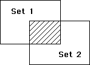

<!--REF #_command_.INTERSECTION.Syntax-->**INTERSECTION** ( *set1* ; *set2* ; *resultSet* )<!-- END REF-->
<!--REF #_command_.INTERSECTION.Params-->
| Parameter | Type |  | Description |
| --- | --- | --- | --- |
| set1 | String | &#x1F852; | First set |
| set2 | String | &#x1F852; | Second set |
| resultSet | String | &#x1F852; | Resulting set |

<!-- END REF-->

#### Description 

<!--REF #_command_.INTERSECTION.Summary-->**INTERSECTION** compares *set1* and *set2* and selects only the records that are in both.<!-- END REF--> The following table lists all possible results of a set Intersection operation.

| **Set1** | **Set2** | **Result Set** |
| -------- | -------- | -------------- |
| Yes      | No       | No             |
| Yes      | Yes      | Yes            |
| No       | Yes      | No             |
| No       | No       | No             |

The graphical result of an Intersection operation is displayed here. The shaded area is the result set.



The *resultSet* is created by **INTERSECTION**. The *resultSet* replaces any existing set having the same name, including *set1* and *set2*. Both *set1* and *set2* must be from the same table. The *resultSet* belongs to the same table as *set1* and *set2*. If the same current record is set in both *set1* and *set2*, it remains memorized in the *resultSet*. Otherwise, *resultSet* does not have a current record. 

**4D Server:** In Client/Server mode, sets are "visible" depending on their type (interprocess, process and local) and where they were created (server or client). **INTERSECTION** requires all three sets to be visible on the same machine. See the *4D Server, Sets and Named Selections* section in the 4D Server Reference manual for more information.

#### Example 

The following example finds the customers who are served by two sales representatives, Joe and Abby. Each sales representative has a set that represents his or her customers. The customers that are in both sets are represented by both Joe and Abby:

```4d
 INTERSECTION("Joe";"Abby";"Both") // Put customers in both sets in Both
 USE SET("Both") // Use the set
 CLEAR SET("Both") // Clear this set but save the others
 DISPLAY SELECTION([Customers]) // Display customers served by both
```

#### See also 

[DIFFERENCE](difference.md)  
[UNION](union.md)  