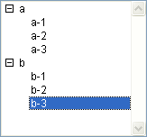

<!--REF #_command_.List item parent.Syntax-->**List item parent** ( {* ;} *list* ; itemRef | * ) : Integer<!-- END REF-->
<!--REF #_command_.List item parent.Params-->
| Parameter | Type |  | Description |
| --- | --- | --- | --- |
| * | Operator | &#8594;  | If specified, list is an object name (string) If omitted, list is a list reference number |
| list | Integer, Text | &#8594;  | List reference number  (if * omitted), or Name of list type object (if * passed) |
| itemRef &#124; * | Operator, Longint | &#8594;  | Item reference number or 0 for the last item added to the list or * for the current item in the list |
| Function result | Integer | &#8592; | Item reference number of parent item or 0 if none |

<!-- END REF-->

#### Description 

<!--REF #_command_.List item parent.Summary-->The **List item parent** command returns the item reference number of a parent item.<!-- END REF-->

Pass the reference number or object name of the list in *list* . 

If you pass the first optional *\** parameter, you indicate that the *list* parameter is an object name (string) corresponding to a representation of the list in the form. If you do not pass this parameter, you indicate that the *list* parameter is a hierarchical list reference ([ListRef](# "A Longint reference to a hierachical list")). If you only use a single representation of the list or work with structural items (the second *\** is omitted), you can use either syntax. Conversely, if you use several representations of the same list and work with the current item (the second *\** is passed), the syntax based on the object name is required since each representation can have its own current item.

**Note:** If you use the @ character in the object name of the list and the form contains several lists matching this name, the **List item parent** command will be applied to the first object whose name corresponds. 

You pass the item reference number of an item in the list or 0 or yet again \*, in *itemRef*. If you pass 0, the command applies to the last item added to the list. If you pass \*, the command applies to the current item of the list. If several items have been selected manually, the current item is the last one selected. 

In return, if the corresponding item exists in the list and if this item is in a sublist (and therefore has a parent item), you obtain the item reference number of the parent item.

If there is no item with the item reference number you passed, or if you have passed \* and no item is selected, or if the item has no parent, **List item parent** returns 0 (zero).

If you work with item reference numbers, be sure to build a list in which the items have unique reference numbers; otherwise you will not be able to distinguish the items. For more information, see the description of the [APPEND TO LIST](append-to-list.md) command.

#### Example 

Given the list named *hList* shown here in the Application environment:



The item reference numbers are set as follows:

| **Item** | **Item Reference Number** |
| -------- | ------------------------- |
| *a*      | *100*                     |
| *a - 1*  | *101*                     |
| *a - 2*  | *102*                     |
| *b*      | *200*                     |
| *b - 1*  | *201*                     |
| *b - 2*  | *202*                     |
| *b - 3*  | *203*                     |

  
* In the following code, if the item “b - 3” is selected, the variable *$vlParentItemRef* gets 200, the item reference number of the item “b”:

```4d
 $vlItemPos:=Selected list items(hList)
 GET LIST ITEM(hList;$vlItemPos;$vlItemRef;$vsItemText)
 $vlParentItemRef:=List item parent(hList;$vlItemRef) // $vlParentItemRef gets 200
```

* If the item “a - 1” is selected, the variable *$vlParentItemRef* gets 100, the item reference number of the item “a”.
* If the item “a” or “b” is selected, the variable *$vlParentItemRef* gets 0, because these items have no parent item.

#### See also 

[GET LIST ITEM](get-list-item.md)  
[List item position](list-item-position.md)  
[SELECT LIST ITEMS BY REFERENCE](select-list-items-by-reference.md)  
[SET LIST ITEM](set-list-item.md)  

#### Properties
|  |  |
| --- | --- |
| Command number | 633 |
| Thread safe | &check; |
| Forbidden on the server ||


