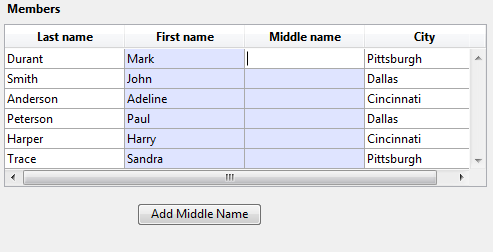

<!--REF #_command_.LISTBOX DUPLICATE COLUMN.Syntax-->**LISTBOX DUPLICATE COLUMN** ( {* ;} *object* ; *colPosition* ; *colName* ; *colVariable* ; *headerName* ; *headerVar* {; *footerName* ; *footerVar*} )<!-- END REF-->
<!--REF #_command_.LISTBOX DUPLICATE COLUMN.Params-->
| Parameter | Type |  | Description |
| --- | --- | --- | --- |
| * | Operator | &#8594;  | If specified, object is an object name (string) If omitted, object is a variable |
| object | any | &#8594;  | Object name (if * is specified) or<br/>Variable (if * is omitted) of the column to be duplicated |
| colPosition | Integer | &#8594;  | Location of new duplicated column |
| colName | Text | &#8594;  | Name of new column |
| colVariable | Array, Field, Variable, Pointer | &#8594;  | Name of the column array variable or field or variable |
| headerName | Text | &#8594;  | Column header object name |
| headerVar | Integer, Pointer | &#8594;  | Column header variable |
| footerName | Text | &#8594;  | Column footer object name |
| footerVar | Variable, Pointer | &#8594;  | Column footer variable |

<!-- END REF-->

#### Description 

<!--REF #_command_.LISTBOX DUPLICATE COLUMN.Summary-->The **LISTBOX DUPLICATE COLUMN** command duplicates the column designated by the *object* and *\** parameters by programming in the context of the form being executed (Application mode).<!-- END REF--> The original form, generated in the Design mode, is not modified. 

**Note:** This functionality was already found in 4D, in Design mode only, using the **Duplicate Column** command found in the context menu of the Form editor.

By default, all style options (size, color, formats, etc.) set for the source column by means of the Property list or using object management commands (*\_o\_OBJECT SET COLOR*, etc.) are applied to the copy. The object method and the settings of the form events are also duplicated.   
However, the data source (array or selection, depending on the source type set for the list box) as well as the style and color arrays are not duplicated. It is your responsibility to define them for each new column after duplication. 

The *object* and *\** parameters designate the column to duplicate. Passing the optional *\** parameter indicates that the object parameter is an column name (string). If you do not pass this parameter, it indicates that the *object* parameter is a column variable. In this case, you pass a variable reference instead of a string. 

**Note:** This command does nothing when it is applied to the first column of a list box displayed in hierarchical mode.

The new duplicated column is placed just before the column designated by the *colPosition* parameter. If the *colPosition* parameter is greater than the total number of columns, then the duplicated column is placed after the last column.

In the *colName* and *colVariable* parameters, pass the object name and the variable of the new duplicated column.

* For array type list boxes, the *colVariable* corresponds to the name of the array whose contents will be displayed in the column. You can pass a Nil (->\[\]) pointer in a dynamic context (see below).
* For selection type list boxes, you can pass a field or variable in the *colVariable* parameter. So the contents of the column will be the value of this field or variable, evaluated for each record of the selection associated with the list box. This type of content can only be used when the "Data Source" property of the list box is set to Current Selection or Named Selection.
* For collection or entity selection type list boxes, pass a Nil (->\[\]) pointer in *colVariable*; you will need to call [LISTBOX SET COLUMN FORMULA](listbox-set-column-formula.md) afterwards to specify the data source expression.

Remember that the data source of the original column is not duplicated: you must set a source variable, array, field, or expression for the new duplicated column.

In the *headerName* and *headerVariable* parameters, pass the object name and variable for the header of the new duplicated column. You can also pass the object name and variable for the footer of the inserted column in the *footerName* and *footerVariable* parameters. If you omit the *footerVariable* parameter, 4D uses a dynamic variable. 

**Note:** Object names must be unique in a form. You must make sure that the names passed in the *colName*, *headerName* and *footerName* parameters have not already been used. Otherwise, the column is not duplicated and an error is generated. 

This command must be used in the context of displaying a form. It is usually called in the On Load form event or following a user action (On Clicked event).

##### Dynamic duplication 

You can duplicate list box columns dynamically and 4D will automatically handle the definition of the necessary variables (column, footer and header).

To do this, **LISTBOX DUPLICATE COLUMN** accepts a **Nil** (**\->\[\]**) pointer as a value for the *colVariable* (with array and collection/entity selection type list boxes), *headerVar* and *footerVar* parameters. In this case, when the command is executed, 4D creates the required variables dynamically (for more information, refer to the section). 

Note that header and footer variables are always created with a specific type (longint and text, respectively). Conversely, column variables cannot be typed when created because list boxes accept different types of arrays for these variables (text array, integer array, and so on). This means you have to set the array type manually (see example 2). It is important to perform this typing before calling commands such as [LISTBOX INSERT ROWS](listbox-insert-rows.md) to insert new elements in the array. Alternatively, you can use [APPEND TO ARRAY](append-to-array.md) both for setting the type of the array and inserting elements. 

#### Example 1 

In an array type list box, we want to duplicate the "First Name" column, ready for input:


Here is the code of the button:

```4d
 ARRAY TEXT(arrFirstNames2;Records in table([Members]))
 LISTBOX DUPLICATE COLUMN(*;"column2";3;"col2bis";arrFirstNames2;"FirstNameA";vHead2A)
 OBJECT SET TITLE(*;"FirstNameA";"Middle Name")
 EDIT ITEM(*;"col2A";0)
```

When you click on the button, the list box appears as follows:



#### Example 2 

You want to duplicate a Boolean column and change its title:

```4d
 var $ptr : Pointer
 LISTBOX DUPLICATE COLUMN(*;"boolCol";3;"duplBoolCol";$ptr;"duplBoolHeader";$ptr;"duplBoolFooter";$ptr)
 colprt:=OBJECT Get pointer(Object named;"duplBoolCol")
 ARRAY BOOLEAN(colprt->;10)
 headprt:=OBJECT Get pointer(Object named;"duplBoolHeader")
 OBJECT SET TITLE(headprt->;"New duplicated column")
```

#### See also 

[LISTBOX MOVE COLUMN](listbox-move-column.md)  

#### Properties
|  |  |
| --- | --- |
| Command number | 1273 |
| Thread safe | &check; |
| Forbidden on the server ||


