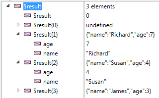

<!--REF #_command_.OB GET ARRAY.Syntax-->**OB GET ARRAY** ( *object* ; *property* ; *array* )<!-- END REF-->
<!--REF #_command_.OB GET ARRAY.Params-->
| Parameter | Type |  | Description |
| --- | --- | --- | --- |
| object | Object, Object | &#8594;  | Structured object |
| property | Text | &#8594;  | Name of property to read |
| array | Text array, Real array, Boolean array, Object array, Pointer array, Array integer | &#8592; | Value array of property |

<!-- END REF-->

#### Description 

<!--REF #_command_.OB GET ARRAY.Summary-->The **OB GET ARRAY** command retrieves, in *array*, the array of values stored in the *property* of the language object designated by the *object* parameter.<!-- END REF-->can be an object variable or a 4D object field.

In the *property* parameter, pass the label of the property to be read. Note that the *property* parameter is case sensitive.

#### Example 1 

Given an object array defined in the example of the [OB SET ARRAY](ob-set-array.md) command:


We want to retrieve these values:

```4d
 ARRAY OBJECT($result;0)
 OB GET ARRAY($Children;"Children";$result)
```



#### Example 2 

We want to change a value in the first element of the array:

```4d
  // Change the value of "age":
 ARRAY OBJECT($refs)
 OB GET ARRAY($refEmployees;"__ENTITIES";$refs)
 OB SET($refs{1};"age";25)
```

#### See also 

[OB SET ARRAY](ob-set-array.md)  
*Type conversions between collections and 4D arrays*  

#### Properties
|  |  |
| --- | --- |
| Command number | 1229 |
| Thread safe | &check; |
| Forbidden on the server ||


