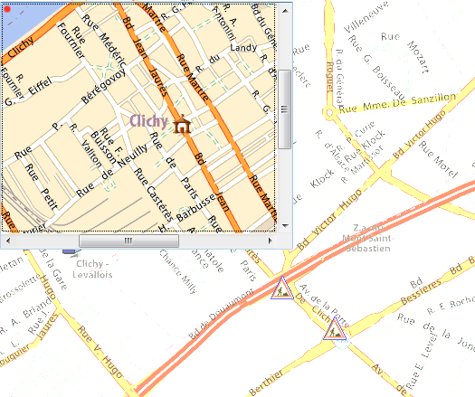

<!--REF #_command_.OBJECT SET SCROLL POSITION.Syntax-->**OBJECT SET SCROLL POSITION** ( * ; *object* {; *vPosition* {; *hPosition*}}{; *} )<!-- END REF-->
<!--REF #_command_.OBJECT SET SCROLL POSITION.Params-->
| Parameter | Type |  | Description |
| --- | --- | --- | --- |
| * | Operator | &#8594;  | If specified, object is an object name (string) If omitted, object is a table, a field or a variable |
| object | any | &#8594;  | Object name (if * is specified) or Table or field or variable (if * is omitted) |
| vPosition | Integer | &#8594;  | Line number to display or Vertical scrolling in pixels (pictures) |
| hPosition | Integer | &#8594;  | Column number to display (list box) or<br/>Horizontal scrolling in pixels (pictures) |
| * | Operator | &#8594;  | Display of line (and column if the hPosition parameter is passed) in first position after scroll |

<!-- END REF-->

*This command is not thread-safe, it cannot be used in preemptive code.*


#### Description 

<!--REF #_command_.OBJECT SET SCROLL POSITION.Summary-->The **OBJECT SET SCROLL POSITION** command allows scrolling the contents of several types of objects: the lines of a subform, of a list form (displayed using the [MODIFY SELECTION](modify-selection.md) or [DISPLAY SELECTION](display-selection.md) commands), or of a hierarchical list, the rows and columns of a list box or even the pixels of a picture.<!-- END REF-->

**Note:** Scrolling via programming remains possible even if scrollbars have been hidden in the form.

If you pass the first optional *\** parameter, you indicate that the *object* parameter is the name of a subform, a hierarchical list, a list box object or a picture field/variable (in this case, pass a string in *object*). If you do not pass anything in this parameter, you indicate that the *object* parameter is a table (list form table or subform table), a variable ([ListRef](# "A Longint reference to a hierachical list") of a hierarchical list or list box or picture) or a field.

The *vPosition* parameter can be used to specify the number of the row to display or, in the case of a picture, the vertical coordinate of the pixel to display.   
If you do not pass this parameter, the command provokes the vertical scroll of lines of the list so that the first highlighted line in the list is visible. In this case, if no line is selected or if at least one selected line is already visible, no vertical scrolling is applied.  
If you pass this parameter, the command provokes the vertical scroll of lines of the list so that the set line is visible (highlighted or not). If the line is already visible, the command does nothing, unless the second *\** parameter is passed (see below). 

* For list forms and subforms, this number is the number of the line among the current selection (its position).
* In the case of hierarchical lists, the command takes the expanded/collapsed state of the items into account.
* For list boxes, this number is the number of the row among all the object rows (including hidden rows). If the number passed in *vPosition* corresponds to a hidden row in the list box, the command displays the first visible row that follows.  
**Note:** Keep in mind that this command goes by the "standard" representation (non-hierarchical) of a list box, even if it is displayed in hierarchical mode. Therefore, the result may be different depending on whether the list box is displayed in standard or hierarchical mode (see example).
* For pictures displayed in the form, *vPosition* indicates the vertical coordinate point of the picture to display in the object. Pass 0 in *vPosition* if you do not want to scroll the picture vertically. The value must be expressed in pixels in relation to the origin of the picture. If the vertical coordinate point is already shown in the object, the command does nothing (except when you pass the second *\** parameter. see below). The picture must be displayed in the "Truncated (non-centered)" format.

The *hPosition* parameter can be used in the context of a list box or a picture. 

* For list boxes, you can pass a column number in *hPosition*. Executing the command causes horizontal scrolling of the list box so that this column will be shown. If the column is already visible, the command does nothing. As with vertical scrolling, if you pass the second optional *\** parameter, the column made visible by the command (if the list box is actually scrolled) will be placed in the first position (see below).
* For a picture displayed in a form, *hPosition* indicates the horizontal coordinate point to display in the object. The value must be expressed in pixels in relation to the origin of the picture. If the horizontal coordinate point is already shown in the object, the command does nothing (except when you pass the second *\** parameter. see below).

If you pass the second optional *\** parameter:

* the line made visible using the command (if the list was scrolled) will be placed in the first position of the list. If the line is situated at the end of the list, this option has no effect.
* in the context of a picture, the coordinates requested will be placed at the origin of the picture variable (0,0), even if these coordinates were already shown in the object.

**Note:** The [HIGHLIGHT RECORDS](highlight-records.md) command features an optional *\** parameter that allows delegating scroll management to the **OBJECT SET SCROLL POSITION** command. 

#### Example 1 

This example illustrates the difference in the way the command functions depending on whether the list box is displayed in standard or hierarchical mode:

```4d
 OBJECT SET SCROLL POSITION(*;"mylistbox";4;2;*) // displays 4th row of 2nd column of list box in the first position
```

If this statement is applied to a list box displayed in standard mode:


... the rows and columns of the list box actually scroll:


On the other hand, if the same statement is applied to a list box displayed in hierarchical mode, the rows scroll but not the columns because the 2nd column is part of the hierarchy:


#### Example 2 

You want to scoll a picture that is included in a form variable. This montage shows the visible part of the picture as well as the point to be displayed (166 pixels vertically and 200 pixels horizontally):


To scroll the visible part and display the red point at the origin of the picture variable, you can just write:

```4d
 OBJECT SET SCROLL POSITION(*;"myVar";166;200;*)
```

You then get the following result:



Make sure that you do not omit the second *\** parameter in this case, otherwise the picture will not scroll because the point defined is already displayed. 

#### See also 

[HIGHLIGHT RECORDS](highlight-records.md)  
[LISTBOX SELECT ROW](listbox-select-row.md)  
[OBJECT GET SCROLL POSITION](object-get-scroll-position.md)  