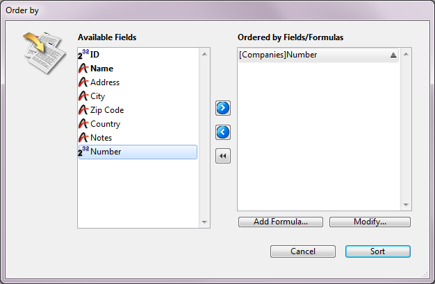
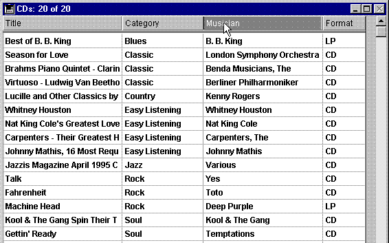

<!--REF #_command_.ORDER BY.Syntax-->**ORDER BY** ( {*aTable* ;}{ *aField* }{; > or < }{; *aField2* ; > or <2 ; ... ; *aFieldN* ; > or <N}{; *} )<!-- END REF-->
<!--REF #_command_.ORDER BY.Params-->
| Parameter | Type |  | Description |
| --- | --- | --- | --- |
| aTable | Table | &#8594;  | Table for which to order selected records, or Default table, if omitted |
| aField | Field | &#8594;  | Field on which to set the order for each level |
| > or < | Operator | &#8594;  | Ordering direction for each level: > to order in ascending order, or < to order in descending order |
| * | Operator | &#8594;  | Continue order flag |

<!-- END REF-->

#### Description 

<!--REF #_command_.ORDER BY.Summary-->**ORDER BY** sorts (reorders) the records of the current selection of *aTable* for the current process.<!-- END REF--> After the sort has been completed, the new first record of the selection becomes the current record.

If you omit the *aTable* parameter, the command applies to the default table, if it has been specified. Otherwise, 4D uses the table of the first field passed as a parameter. If you do not pass a parameter and if no default table has been specified, an error is returned.  

If you do not specify the *aField*, the *\> or <* or the *\** parameters, **ORDER BY** displays the Order By editor for *aTable*. The Order By editor is shown here:



For more information about using the Order By editor, refer to the 4D Design Reference manual. 

If you specify the *aField* and *\> or <* parameters, the standard Order By editor is not presented and the sort is defined programmatically. You can sort the selection on one level or on several levels. For each sort level, you specify a field in *aField* and the sorting order in *\> or <*. If you pass the “greater than” symbol (>), the order is ascending. If you pass the “less than” symbol (<), the order is descending.   
If you omit the sorting order parameter *\> or <*, ascending order is the default. 

If only one field is specified (one level sort) and it is indexed, the index is used for the order. If the field is not indexed or if there is more than one field, the order is performed sequentially (except in the case of composite indexes). The field may belong to the (selection’s) table being reordered or to a One table related to *aTable* with an automatic relation. In this case, the sort is always sequential.  
If the sorted fields are included in a composite index, **ORDER BY** uses the index for the order. 

For multiple sorts (sorts on multiple fields), you can call **ORDER BY** as many times as necessary and specify the optional *\** parameter, except for the last **ORDER BY** call, which starts the actual sort operation. This feature is useful for multiple sorts management in customized user interfaces.   
**Warning:** with this syntax, you can pass only one sort level (field) per **ORDER BY** call.

No matter what way a sort has been defined, if the actual sort operation is going to take some time to be performed, 4D automatically displays a message containing a progress thermometer. These messages can be turned on and off by using the commands [MESSAGES ON](messages-on.md) and [MESSAGES OFF](messages-off.md). If the progress thermometer is displayed, the user can click the Stop button to interrupt the sort. 

If the sort is performed without interruption, the OK variable is set to *1*. If the user clicks Cancel or Stop, the **ORDER BY** terminates with no sort actually performed, and sets the OK variable to *0* (zero).

##### 

**Note:** This command does not support Object type fields.

#### Example 1 

The following line displays the Order By editor for the \[Products\] table:

```4d
 ORDER BY([Products])
```

#### Example 2 

The following line displays the Order By editor for the default table (if it has been set): 

```4d
 ORDER BY
```

#### Example 3 

The following line orders the selection of \[Products\] by name in ascending order:

```4d
 ORDER BY([Products];[Products]Name;>)
```

#### Example 4 

The following line orders the selection of \[Products\] by name in descending order:

```4d
 ORDER BY([Products];[Products]Name;<)
```

#### Example 5 

The following line orders the selection of \[Products\] by type and price in ascending order for both levels:

```4d
 ORDER BY([Products];[Products]Type;>;[Products]Price;>)
```

#### Example 6 

The following line orders the selection of \[Products\] by type and price in descending order for both levels:

```4d
 ORDER BY([Products];[Products]Type;<;[Products]Price;<)
```

#### Example 7 

The following line orders the selection of \[Products\] by type in ascending order and by price in descending order:

```4d
 ORDER BY([Products];[Products]Type;>;[Products]Price;<)
```

#### Example 8 

The following line orders the selection of \[Products\] by type in descending order and by price in ascending order:

```4d
 ORDER BY([Products];[Products]Type;<;[Products]Price;>)
```

#### Example 9 

The following line performs an indexed sort if \[Products\]Name is indexed: 

```4d
 ORDER BY([Products];[Products]Name;>)
```

#### Example 10 

The following line orders the selection of \[Products\] by name in ascending order: 

```4d
 ORDER BY([Products];[Products]Name)
```

#### Example 11 

The following line performs a sequential sort, whether or not the fields are indexed: 

```4d
 ORDER BY([Products];[Products]Type;>;[Products]Price;>)
```

#### Example 12 

The following line performs a sequential sort using a related field

```4d
 SET FIELD RELATION([Employee]Company_ID;Automatic;Do not modify)
 ORDER BY([Employee];[Company]LastName)
 SET FIELD RELATION([Employee]Company_ID;Structure configuration;Do not modify)
```

#### Example 13 

The following example carries out an indexed sort on two levels if a \[Contacts\]LastName + \[Contacts\]FirstName composite index has been specified in the database:

```4d
 ORDER BY([Contacts];[Contacts]LastName;>;[Contacts]FirstName;>)
```

#### Example 14 

In an Output form displayed in the Application environment, you allow the users to order a column in ascending order by simply clicking in the column header.   
If the user holds the **Shift** key down while clicking in other column headers, the sort is performed on several levels:



Each column header contains a highlight button attached with the following object method:

```4d
 MULTILEVEL(->[CDs]Title) //Title column header button
```

Each button calls the MULTILEVEL project method with a pointer to the corresponding column field. The MULTILEVEL project method is the following:

```4d
  // MULTILEVEL Project Method
  // MULTILEVEL (Pointer)
  // MULTILEVEL (->[Table]Field)
 
 var $1)   //Sort level (field : Pointer
 var $lLevelNb : Integer
 
  //Getting sorting levels
 If(Not(Shift down)) //Simple sort (one-level)
    ARRAY POINTER(aPtrSortField;1)
    aPtrSortField{1}:=$1
 Else
    $lLevelNb:=Find in array(aPtrSortField;$1) //Is this field already sorted?
    If($lLevelNb<0) //If not
       INSERT IN ARRAY(aPtrSortField;Size of array(aPtrSortField)+1;1)
       aPtrSortField{Size of array(aPtrSortField)}:=$1
    End if
 End if
  //Performing the sort
 $lLevelNb:=Size of array(aPtrSortField)
 If($lLevelNb>0) //There is at least one order level
    For($i;1;$lLevelNb)
       ORDER BY([CDs];(aPtrSortField{$i})->;>;*) //Building sort definition
    End for
    ORDER BY([CDs]) //No * ends the sort definition and starts the actual sort operation
 End if
```

#### See also 

[ORDER BY FORMULA](order-by-formula.md)  

#### Properties
|  |  |
| --- | --- |
| Command number | 49 |
| Thread safe | &check; |
| Modifies variables | OK |
| Changes current record ||
| Forbidden on the server ||


