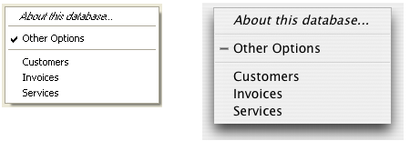

<!--REF #_command_.Pop up menu.Syntax-->**Pop up menu** ( *contents* {; *default* {; *xCoord* ; *yCoord*}} )  : Integer<!-- END REF-->
<!--REF #_command_.Pop up menu.Params-->
| Parameter | Type |  | Description |
| --- | --- | --- | --- |
| contents | Text | &#8594;  | Menu text definition |
| default | Integer | &#8594;  | Number of menu item selected by default |
| xCoord | Integer | &#8594;  | X coordinate of upper left corner |
| yCoord | Integer | &#8594;  | Y coordinate of upper left corner |
| Function result | Integer | &#8592; | Selected menu item number |

<!-- END REF-->

*This command is not thread-safe, it cannot be used in preemptive code.*


#### Description 

<!--REF #_command_.Pop up menu.Summary-->The **Pop up menu** command displays a pop-up menu at the current location of the mouse.<!-- END REF--> 

In order to follow user interface rules, you usually call this command in response to a mouse click and if the mouse button is still down.

You define the items of the pop-up menu with the parameter *contents* as follows:

* Separate each item from the next one with a semi-colon (*;*). For example, *"ItemText1;ItemText2;ItemText3".*
* To disable an item, place an opening parenthesis (*(*) in the item text.
* To specify a separation line, pass "-" or "(-" as item text.
* To specify a font style for a line, place in the item text a less than sign (*<*) followed by one of these characters:
  
| <B | Bold                     |  
| -- | ------------------------ |  
| <I | Italic                   |  
| <U | Underline                |  
| <O | Outline (Macintosh only) |  
| <S | Shadow (Macintosh only)  |
* To add a check mark to an item, place in the item text an exclamation mark (*!*) followed by the character you want as a check mark.  
   * On Macintosh, the character is displayed directly. To display the standard check mark whatever the system version or language, use the following statement: Char(18).  
   * On Windows, a check mark is displayed, no matter what character you passed.
* To add an icon to an item, place in the item text a circumflex accent (^) followed by a character whose code plus 208 is the resource ID of a Mac OS-based icon resource.
* To add a shortcut to an item, place in the item text a slash (*/*) followed by the shortcut character for the item. Note that this last option is purely informative; no shortcut will activate the pop-up menu. However, you may want to include a shortcut if the pop-up menu item has an equivalent in the main menu bar of your application.

**Tip:** It is possible to disable the mechanism for interpreting special characters (!, /, etc.) in a pop up menu item in order, for example, to have these characters included in the wording. To do this, simply have the item definition in the *contents* parameter begin with the Char(1) statement (e.g. **Char*(1)+"1/4 pt"* to define a "1/4 pt" item). 

The optional *default* parameter specifies the default menu item selected when the pop-up menu is displayed. Pass a value between 1 and the number of menu items. If you omit this parameter, the command selects the first menu item as the default.

The optional *xCoord* and *yCoord* parameters designate the location of the pop-up menu to be displayed. In *xCoord* and *yCoord*, pass respectively the horizontal and vertical coordinates of the upper left corner of the menu. These coordinates must be expressed in pixels in the local coordinate system of the current form. These two parameters must be passed together; if only one is passed, it will be ignored.

If you use the *xCoord* and *yCoord* parameters, the *default* parameter is ignored. In this case, the mouse is not necessarily located at the level of the pop-up menu.

These parameters are particularly useful for managing 3D buttons with an associated pop-up menu.

If you select a menu item, the command returns its number; otherwise, it returns zero (0).

**Note:** Use pop-up menus that have a reasonable number of items. If you want to display more than 50 items, you might think about a using scrollable area in a form instead of a pop-up menu.

#### Example 

The project method MY SPEED MENU pulls down a navigation speed menu:

```4d
  // MY SPEED MENU project method
 MOUSE POSITION($vlMouseX;$vlMouseY;$vlButton)
 If(Macintosh control down|($vlButton=2))
    $vtItems:="About this database...<i;(-;!-other options;(-"=""     for($vltable;1;get="" last="" table="" number)=""        if(is="" number="" valid($vltable))=""           $vtitems:="$vtItems+";"+Table" name($vltable)=""        end="" if=""     end="" for=""     $vluserchoice:="Pop" up="" menu($vtitems)=""     case="" of=""        :($vluserchoice="1)"   ="" display="" information="" options=""        else=""           if($vluserchoice="">0)
  // Go to table whose number is $vlUserChoice-4
          End if
    End case
 End if</i;(-;!-other>
```

This project method can be called from:

* The method of a form object that reacts to a mouse click without waiting for the mouse button to be released (i.e., an invisible button)
* A process that “spies” events and communicate with the other processes
* An event-handling method installed using [ON ERR CALL](on-err-call.md).

In the last two cases, the click does not need to occur in any form object. This is one of the advantages of the **Pop up menu** command. Generally, you use form objects to display pop-up menus. Using **Pop up menu**, you can display the menu anywhere.

The pop-up menu is displayed on Windows by pressing the right mouse button; it is displayed on Macintosh by pressing Control-Click. Note, however, that the method does not actually check whether or not there was a mouse click; the caller method tests that.

The following is the pop-up menu as it appears on Windows (left) and Macintosh (right). Note the standard check mark for the Windows version.



#### See also 

[Dynamic pop up menu](dynamic-pop-up-menu.md)  
[MOUSE POSITION](mouse-position.md)  