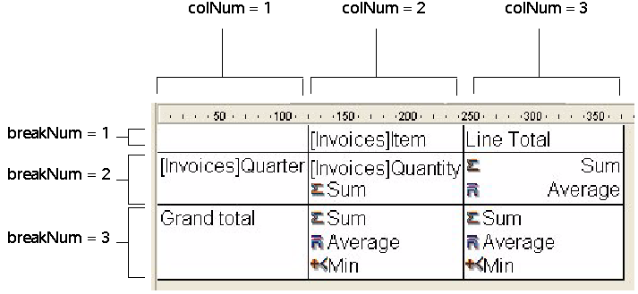

<!--REF #_command_.QR GET TOTALS DATA.Syntax-->**QR GET TOTALS DATA** ( *area* ; *colNum* ; *breakNum* ; *operator* ; *text* )<!-- END REF-->
<!--REF #_command_.QR GET TOTALS DATA.Params-->
| Parameter | Type |  | Description |
| --- | --- | --- | --- |
| area | Longint | &rarr; | Reference of the area |
| colNum | Longint | &rarr; | Column number |
| breakNum | Longint | &rarr; | Break number |
| operator | Longint | <&rarr; | Operator value for the cell |
| text | String | <&rarr; | Contents of the cell |

<!-- END REF-->

#### Description 

##### List Mode 

The **QR GET TOTALS DATA** command retrieves the details of a specific break.  

*area* is the reference of the Quick Report area.

*colNum* is the number of the column whose data will be retrieved.

*breakNum* is the number of the break whose data will be retrieved (subtotal or grand total). For a subtotal row, *breakNum* corresponds to the row number. For a grand total, *breakNum* is -3 (you can also use the *qr grand total* constant from the *QR Rows for Properties* theme).

*operator* returns the sum of all the operators present in the cell. You can use the constants of the *QR Operators* theme to process the returned value:

| Constant              | Type    | Value |
| --------------------- | ------- | ----- |
| qr average            | Longint | 2     |
| qr count              | Longint | 16    |
| qr max                | Longint | 8     |
| qr min                | Longint | 4     |
| qr standard deviation | Longint | 32    |
| qr sum                | Longint | 1     |

If the value returned is 0, there is no operator. 

*text* returns the text present in the cell.

**Note:** *operator* and *text* are mutually exclusive, so you either have a result returned through *operator* or through *text*.

##### Cross-table Mode 

The **QR GET TOTALS DATA** command retrieves the details of a specific cell. 

*area* is the reference of the Quick Report area.

*colNum* is the column number of the cell whose data is going to be retrieved.

*breakNum* is the row number of the cell whose data is going to be retrieved.

*operator* returns the sum of all the operators present in the cell. You can use the constants of the *QR Operators* theme to process the returned value (see above). 

*text* returns the text in the cell.

Here is a depiction of how the parameters *colNum* and *breakNum* have to be combined in cross-table mode:

  
If you pass an invalid *area* number, the error -9850 will be generated.  
If you pass an invalid *colNum* number, the error -9852 will be generated.  
If you pass an invalid *breakNum* number, the error -9853 will be generated.

#### See also 

[QR SET TOTALS DATA](qr-set-totals-data.md)  