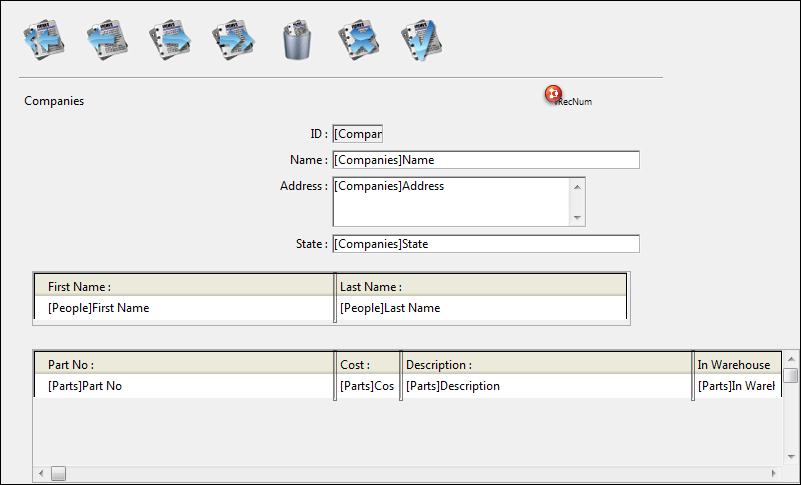

<!--REF #_command_.RELATE MANY.Syntax-->**RELATE MANY** ( oneTable | Field )<!-- END REF-->
<!--REF #_command_.RELATE MANY.Params-->
| Parameter | Type |  | Description |
| --- | --- | --- | --- |
| oneTable &#124; Field | Table, Field | &#8594;  | Table to establish all one-to-many relations, or One Field |

<!-- END REF-->

#### Description 

<!--REF #_command_.RELATE MANY.Summary-->RELATE MANY has two forms.<!-- END REF-->

The first form, RELATE MANY(oneTable), establishes all One-to-Many relations for *oneTable*. It changes the current selection for each table that has a One-to-Many relation to *oneTable*. The current selections in the Many tables depend on the current value of each related field in the One table. Each time this command is executed, the current selections of the Many tables will be regenerated and the first record of the selection is loaded as the current record..

The second form, RELATE MANY(oneField), establishes the One-to-Many relation for *oneField*. It changes the current selection and the current record for only those tables that have relations with *oneField*. This means that the related records become the current selection for the Many table.

**Note:** If the current selection in the One table is empty while the RELATE MANY command is executed, it has no effect.

##### 

**Note:** This command does not support Object type fields.

#### Example 

In the following example, three tables are related with automatic relations. Both the \[People\] table and the \[Parts\] table have a Many-to-One relation to the \[Companies\] table.


This form for the \[Companies\] table will display related records from both the \[People\] and \[Parts\] tables.



When the People and Parts forms are displayed, the related records for both the \[People\] table and the \[Parts\] table are loaded and become the current selections in those tables. 

On the other hand, the related records are not loaded if a record for the \[Companies\] table is selected programmatically. In this case, you must use the RELATE MANY command.

**Notes:**  
* When the RELATE MANY command is applied to an empty selection, the command is not executed and the selection for the MANY table does not change.
* For the command to work, the foreign key fields (Many fields) must be indexed.

For example, the following method moves through each record of the \[Companies\] table. An alert box is displayed for each company. The alert box shows the number of people in the company (the number of related \[People\] records), and the number of parts they supply (the number of related \[Parts\] records). In the example, the argument to the [ALERT](alert.md) command is printed on multiple lines for clarity. 

Note that the RELATE MANY command is needed, even though the relations are automatic.

```4d
 ALL RECORDS([Companies]) // Select all records in the table
 ORDER BY([Companies];[Companies]Name) // Order records in alphabetical order
 For($i;1;Records in table([Companies])) // Loop once for each record
    RELATE MANY([Companies]Name) // Select the related records
    ALERT("Company: "+[Companies]Name+Char(13)+"People in company: "
    +String(Records in selection([People]))+Char(13)+"Number of parts they supply: "+String(Records in selection([Parts])))
    NEXT RECORD([Companies]) // Move to the next record
 End for
```

#### See also 

[OLD RELATED MANY](old-related-many.md)  
[RELATE ONE](relate-one.md)  

#### Properties
|  |  |
| --- | --- |
| Command number | 262 |
| Thread safe | &check; |
| Changes current selection ||
| Forbidden on the server ||


