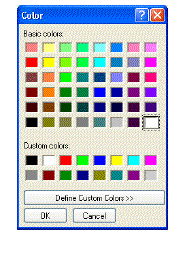

<!--REF #_command_.Select RGB Color.Syntax-->**Select RGB Color** {( *defaultColor* {; *message*} )} : Integer<!-- END REF-->
<!--REF #_command_.Select RGB Color.Params-->
| Parameter | Type |  | Description |
| --- | --- | --- | --- |
| defaultColor | Integer | &#8594;  | Preselected RGB color |
| message | Text | &#8594;  | Title of selection window |
| Function result | Integer | &#8592; | RGB color |

<!-- END REF-->

*This command is not thread-safe, it cannot be used in preemptive code.*

#### Description 

<!--REF #_command_.Select RGB Color.Summary-->The Select RGB Color command displays the system color selection window and returns the RGB value of the color selected by the user.<!-- END REF-->

The system color selection window appears as follows:   

| **Macintosh**                                | **Windows**                                 |
| -------------------------------------------- | ------------------------------------------- |
|  |  |

The optional *defaultColor* parameter preselects a color in the window. This parameter can be used, for example, to restore by default the last color set by the user. Pass an RGB-format color value in this parameter (for more information, refer to the description of the [OBJECT SET RGB COLORS](object-set-rgb-colors.md) command). You can use one of the constants in the *SET RGB COLORS* theme. If the *defaultColor* parameter is omitted or if you pass 0, the color black is selected when the dialog box is opened. 

The optional *message* parameter customizes the title of the system window. By default, if this parameter is omitted, the title “Colors” is displayed.

The effect of validating this dialog box differs depending on the platform:

* Under Windows, when the user clicks on **OK**, the command returns the value of the color selected in RGB format and the system variable *OK* is set to 1\. If the user cancels the dialog box, the command returns -1 and the system variable *OK* is set to 0.
* Under Mac OS, you can only close this dialog box by clicking on the close box or by pressing on the **Esc** key. In both cases, the system variable *OK* is set to 1, regardless of the user actions in the window. The command returns the value of the color selected in RGB format. If the user did not select a color, the value returned is the one passed in *defaultColor* (if any) or 0 if *defaultColor* is not passed.

**Note:** This command must not be executed on the server machine nor within a Web process.

#### See also 

[OBJECT SET RGB COLORS](object-set-rgb-colors.md)  