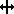
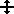
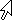

<!--REF #_command_.SET CURSOR.Syntax-->**SET CURSOR** {( *cursor* )}<!-- END REF-->
<!--REF #_command_.SET CURSOR.Params-->
| Parameter | Type |  | Description |
| --- | --- | --- | --- |
| cursor | Integer | &#8594;  | Cursor resource number |

<!-- END REF-->

*This command is not thread-safe, it cannot be used in preemptive code.*


#### Description 

<!--REF #_command_.SET CURSOR.Summary-->The SET CURSOR command changes the mouse cursor to the system cursor whose ID number you pass in *cursor*.<!-- END REF-->

This command must be called in the context of the On Mouse Move [Form event code](../commands/form-event-code.md). 

To restore the standard mouse cursor, call the command without any parameter.

Here are the cursors that can be passed in the *cursor* parameter:

| **Number** | **Cursor**                                    |
| ---------- | --------------------------------------------- |
| 1          |    |
| 2          |    |
| 4          |  |
| 9000       |  |
| 9001       |  |
| 9003       |  |
| 9004       |  |
| 9005       |  |
| 9006       |  |
| 9021       |  |
| 351        |  |
| 9010       |  |
| 9011       |  |
| 9013       |  |
| 9014       |  |
| 9015       |  |
| 9016       |  |
| 9017       |  |
| 9019       |  |
| 9020       |  |
| 559        |  |
| 560        |  |

**Note:** Cursor availability and appearance may vary depending on the operating system.

#### Example 

You want the cursor to be displayed as a  when the mouse moves over a variable area in the form. In the object method of the variable, you can write:

```4d
 If(Form event code=On Mouse Move)
    SET CURSOR(9019)
 End if
```
