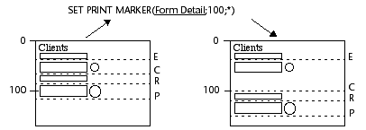
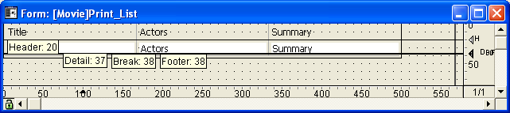

<!--REF #_command_.SET PRINT MARKER.Syntax-->**SET PRINT MARKER** ( *markNum* ; *position* {; *} )<!-- END REF-->
<!--REF #_command_.SET PRINT MARKER.Params-->
| Parameter | Type |  | Description |
| --- | --- | --- | --- |
| markNum | Integer | &#8594;  | Marker number |
| position | Integer | &#8594;  | New position for the marker |
| * | Operator | &#8594;  | If passed = move subsequent markers If omitted = do not move subsequent markers |

<!-- END REF-->

*This command is not thread-safe, it cannot be used in preemptive code.*


#### Description 

<!--REF #_command_.SET PRINT MARKER.Summary-->The **SET PRINT MARKER** command enables the definition of the marker position during printing.<!-- END REF--> Combined with the [Get print marker](get-print-marker.md), [OBJECT MOVE](object-move.md) or [Print form](../commands/print-form.md) commands, this command allows you to adjust the size of the print areas. 

**SET PRINT MARKER** can be used in two contexts:

* during the On Header form event, in the context of [PRINT SELECTION](print-selection.md) and [PRINT RECORD](print-record.md) commands.
* during the On Printing Detail form event, in the context of the [Print form](../commands/print-form.md) command. This operation facilitates the printing of customized reports (see example).
The effect of the command is limited to printing; no modification appears on the screen. The modifications made to the forms are not saved. 

Pass one of the constants of the *Form Area* theme in the *markNum* parameter:

| Constant      | Type    | Value |
| ------------- | ------- | ----- |
| Form break0   | Integer | 300   |
| Form break1   | Integer | 301   |
| Form break2   | Integer | 302   |
| Form break3   | Integer | 303   |
| Form break4   | Integer | 304   |
| Form break5   | Integer | 305   |
| Form break6   | Integer | 306   |
| Form break7   | Integer | 307   |
| Form break8   | Integer | 308   |
| Form break9   | Integer | 309   |
| Form detail   | Integer | 0     |
| Form footer   | Integer | 100   |
| Form header   | Integer | 200   |
| Form header1  | Integer | 201   |
| Form header10 | Integer | 210   |
| Form header2  | Integer | 202   |
| Form header3  | Integer | 203   |
| Form header4  | Integer | 204   |
| Form header5  | Integer | 205   |
| Form header6  | Integer | 206   |
| Form header7  | Integer | 207   |
| Form header8  | Integer | 208   |
| Form header9  | Integer | 209   |

In *position*, pass the new position desired, expressed in pixels.

If you pass the optional *\** parameter, all the markers located below the marker specified in *markNum* will be moved the same number of pixels and in the same direction as this marker when the command is executed. **Warning:** in this case, any objects present in the areas located below the marker are also moved. 

When the \* parameter is used, it is possible to position the *markNum* marker beyond the initial position of the markers that follow it — these latter markers will be moved simultaneously.



**Notes:**  
* This command modifies only the existing marker position. It does not allow the addition of markers. If you designate a marker that does not exist in the form, the command will not do anything.
* The print marker mechanism in the Design mode is retained: a marker cannot go any higher than the one that precedes it, nor any lower than the one that follows it (when the \* parameter is not used).

#### Example 

This complete example enables you to generate the printing of a three-column report, the height of each row being calculated on the fly according to the contents of the fields.   
The output form used for printing is as follows:



The On Printing Detail form event was selected for the form (keep in mind that no matter what area is printed, the [Print form](../commands/print-form.md) command only generates this type of form event).   
For each record, the row height must be adapted according to the contents of the "Actors" or "Summary" column (column having the most content). Here is the desired result:


The print project method is as follows:

```4d
 var vLprint_height;$vLheight;vLprinted_height : Integer
 C_STRING(31;vSprint_area)
 PAGE SETUP([Film];"Print_List3")
 GET PRINTABLE AREA(vLprint_height)
 vLprinted_height:=0
 ALL RECORDS([Film])
 
 vSprint_area:="Header" //Printing of header area
 $vLheight:=Print form([Film];"Print_List3";Form header)
 $vLheight:=21 //Fixed height
 vLprinted_height:=vLprinted_height+$vLheight
 
 While(Not(End selection([Film])))
    vSprint_area:="Detail" //Printing of detail area
    $vLheight:=Print form([Film];"Print_List3";Form detail)
  //Detail calculation is carried out in the form method
    vLprinted_height:=vLprinted_height+$vLheight
    If(OK=0) //CANCEL has been carried out in the form method
       PAGE BREAK
       vLprinted_height:=0
       vSprint_area:="Header" //Reprinting of the header area
       $vLheight:=Print form([Film];"Print_List3";Form header)
       $vLheight:=21
       vLprinted_height:=vLprinted_height+$vLheight
       vSprint_area:="Detail"
       $vLheight:=Print form([Film];"Print_List3";Form detail)
       vLprinted_height:=vLprinted_height+$vLheight
    End if
    NEXT RECORD([Film])
 End while
 PAGE BREAK //Make sure that the last page is printed
```

The Print\_List3 form method is as follows:

```4d
 var $l;$t;$r;$b;$fixed_wdth;$exact_hght;$l1;$t1;$r1;$b1 : Integer
 var $final_pos;$i : Integer
 var $detail_pos;$header_pos;$hght_to_print;$hght_remaining : Integer
 
 Case of
    :(vSprint_area="Detail") //Printing of detail underway
       OBJECT GET COORDINATES([Film]Actors;$l;$t;$r;$b)
       $fixed_wdth:=$r-$l  //Calculation of the Actors text field size
       $exact_hght:=$b-$t
       OBJECT GET BEST SIZE([Film]Actors;$wdth;$hght;$fixed_wdth)
  //Optimal size of the field according to its contents
       $movement:=$hght-$exact_hght
 
       OBJECT GET COORDINATES([Film]Summary;$l1;$t1;$r1;$b1)
       $fixed_wdth1:=$r1-$l1  //Calculation of the Summary text field size
       $exact_hght1:=$b1-$t1
       OBJECT GET BEST SIZE([Film]Summary;$wdth1;$hght1;$fixed_wdth1)
  //Optimal size of the field according to its contents
       $movement1:=$hght1-$exact_hght1
       If($movement1>$movement)
  //We determine the highest field
          $movement:=$movement1
       End if
 
       If($movement>0)
          $position:=Get print marker(Form detail)
          $final_pos:=$position+$movement
  //We move the Detail marker and those that follow it
          SET PRINT MARKER(Form detail;$final_pos;*)
  //Resizing of text areas
          OBJECT MOVE([Film]Actors;$l;$t;$r;$hght+$t;*)
          OBJECT MOVE([Film]Summary;$l1;$t1;$r1;$hght1+$t1;*)
 
  //Resizing of dividing lines
          OBJECT GET COORDINATES(*;"H1Line";$l;$t;$r;$b)
          OBJECT MOVE(*;"H1Line";$l;$final_pos-1;$r;$final_pos;*)
          For($i;1;4;1)
             OBJECT GET COORDINATES(*;"VLine"+String($i);$l;$t;$r;$b)
             OBJECT MOVE(*;"VLine"+String($i);$l;$t;$r;$final_pos;*)
          End for
       End if
 
  //Calculation of available space
       $detail_pos:=Get print marker(Form detail)
       $header_pos:=Get print marker(Form header)
       $hght_to_print:=$detail_pos-$header_pos
       $hght_remaining:=printing_height-vLprinted_height
       If($hght_remaining<$hght_to_print) //Insufficient height
          CANCEL //Move form to the next page
       End if
 End case
```

#### See also 

[Get print marker](get-print-marker.md)  
[OBJECT GET BEST SIZE](object-get-best-size.md)  
[OBJECT GET COORDINATES](object-get-coordinates.md)  
[OBJECT MOVE](object-move.md)  
[PAGE BREAK](page-break.md)  
[Print form](../commands/print-form.md)  
[PRINT RECORD](print-record.md)  
[PRINT SELECTION](print-selection.md)  