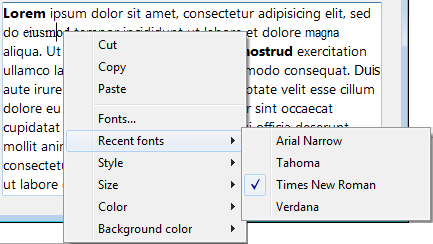

<!--REF #_command_.SET RECENT FONTS.Syntax-->**SET RECENT FONTS** ( *fontsArray* )<!-- END REF-->
<!--REF #_command_.SET RECENT FONTS.Params-->
| Parameter | Type |  | Description |
| --- | --- | --- | --- |
| fontsArray | Text array | &#8594;  | Array of font names |

<!-- END REF-->

#### Description 

<!--REF #_command_.SET RECENT FONTS.Summary-->The **SET RECENT FONTS** command modifies the list of fonts displayed in the context menu of the "recent fonts".<!-- END REF-->

This menu contains the names of the last fonts selected during the session. It is used in particular by *Programming Notes* areas. 

#### Example 

You want to add a font to the menu of recent fonts:



You execute the following code:

```4d
 ARRAY TEXT($arrRecent;0)
 FONT LIST($arrRecent;2)
 APPEND TO ARRAY($arrRecent;"Segoe Script")
 APPEND TO ARRAY($arrRecent)
```

Then the menu contains:


#### See also 

[FONT LIST](font-list.md)  

#### Properties
|  |  |
| --- | --- |
| Command number | 1305 |
| Thread safe | &check; |
| Forbidden on the server ||


