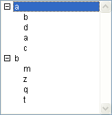

<!--REF #_command_.SORT LIST.Syntax-->**SORT LIST** ( *list* {; > or <} )<!-- END REF-->
<!--REF #_command_.SORT LIST.Params-->
| Parameter | Type |  | Description |
| --- | --- | --- | --- |
| list | Integer | &#8594;  | List reference number |
| > or < | Operator | &#8594;  | Sorting order: > to sort in ascending order, or < to sort in descending order |

<!-- END REF-->

#### Description 

<!--REF #_command_.SORT LIST.Summary-->The **SORT LIST** command sorts the list whose reference number is passed in *list*.<!-- END REF-->

To sort in ascending order, pass *\>*. To sort in descending order, pass <. If you omit the sorting order parameter, **SORT LIST** sorts in ascending order by default.

**SORT LIST** sorts all levels of the list; it first sorts the items of the list, then it sorts the items in each sublist (if any), and so on, through all the levels of the list. This is why you will usually apply **SORT LIST** to a list in a form. Sorting a sublist is of little interest because the order will be changed by a call to a higher level.

**SORT LIST** does not change the current list item nor the current expanded/collapsed state of the list and sublists. However, because the current item can be moved by the sorting operation, [Selected list items](selected-list-items.md) may return a different position before and after the sort.

#### Example 

Given the list named *hList,* shown here in the Application environment:



 After the execution of this code:

```4d
  // Sort the list and it sublists in ascending order
 SORT LIST(hList;>)
```

The list looks like:


After the execution of this code:

```4d
  // Sort the list and it sublists in descending order
 SORT LIST(hList;<)
```

The list looks like:


#### See also 

[Selected list items](selected-list-items.md)  

#### Properties
|  |  |
| --- | --- |
| Command number | 391 |
| Thread safe | &check; |
| Forbidden on the server ||


