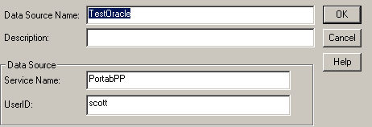

<!--REF #_command_.SQL End selection.Syntax-->**SQL End selection**  : Boolean<!-- END REF-->
<!--REF #_command_.SQL End selection.Params-->
| Parameter | Type |  | Description |
| --- | --- | --- | --- |
| Function result | Boolean | &#8592; | Result set boundaries reached |

<!-- END REF-->

#### Description 

<!--REF #_command_.SQL End selection.Summary-->The SQL End selection command is used to determine if the boundaries of the result set have been reached.<!-- END REF--> 

#### Example 

The code below connects to an external data source (Oracle) using the following parameters:



```4d
 var vName : Text
 
 SQL LOGIN("TestOracle";"scott";"tiger")
 If(OK=1)
    SQL EXECUTE("SELECT ename FROM emp";vName)
    While(Not(SQL End selection))
       SQL LOAD RECORD
    End while
    SQL LOGOUT
 End if
```

This code will return in the 4D *vName* variable the emp names (ename) stored in the table named emp.


#### Properties
|  |  |
| --- | --- |
| Command number | 821 |
| Thread safe | &check; |
| Forbidden on the server ||


