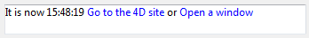

<!--REF #_command_.ST Get plain text.Syntax-->**ST Get plain text** ( {* ;} *object* {; *refMode*} ) : Text<!-- END REF-->
<!--REF #_command_.ST Get plain text.Params-->
| Parameter | Type |  | Description |
| --- | --- | --- | --- |
| * | Operator | &#8594;  | If specified, object is an object name (string) <br/>If omitted, object is a variable or a field |
| object | any | &#8594;  | Object name (if * is specified) or <br/>Variable or field (if * is omitted) |
| refMode | Integer | &#8594;  | Mode for handling references found in the text |
| Function result | Text | &#8592; | Text without tags |

<!-- END REF-->

#### Description 

<!--REF #_command_.ST Get plain text.Summary-->The ST Get plain text command removes any style tags from the text variable or field designated by the *\** and *object* parameters and returns the plain text.<!-- END REF--> 

##### 

If you pass the optional *\** parameter, this indicates that the *object* parameter is an object name (string). During execution, if the object has the focus, the command returns information about the object being edited; however, when the object does not have the focus, the command returns information about the data source (field or variable) of the object.  
If you omit the *\** parameter, this indicates that the *object* parameter is a field or a variable. In this case, you pass a field or variable reference instead of a string and during execution, the command returns information about this field or variable.

##### 

The optional *refMode* parameter indicates the way that references found in *object* must be returned. In *refMode*, pass one of the following constants, found in the "*Multistyle Text*" theme (you can pass a single constant or a combination):

| Constant                                     | Type    | Value | Comment                                                                                                                                                                                                 |
| -------------------------------------------- | ------- | ----- | ------------------------------------------------------------------------------------------------------------------------------------------------------------------------------------------------------- |
| ST 4D Expressions as sources                 | Integer | 2     | The original string of 4D expression references is returned                                                                                                                                             |
| ST 4D Expressions as values                  | Integer | 1     | 4D expression references are returned in their evaluated form (default functioning in forms)                                                                                                            |
| ST References as spaces                      | Integer | 0     | Each reference is returned as a non-breaking space character (default operation, used by other commands)                                                                                                |
| ST Tags as plain text                        | Integer | 64    | The label of the tag is returned in plain text. For example for the tag 'my picture</img>', the plain text is "my picture" (default functioning in forms)             |
| ST Tags as XML code                          | Integer | 128   | The XML code of the tag is returned in plain text. For example for the tag 'my picture</img>', the plain text is 'my picture</img>' |
| ST Text displayed with 4D Expression sources | Integer | 86    | Returns the text as it is shown in the forms with the original string of the 4D expressions.<br/>Corresponds a predefined combination of constants 2+4+16+64.                                   |
| ST Text displayed with 4D Expression values  | Integer | 85    | Returns the text as it is shown in the forms with the 4D expressions in their evaluated form.<br/>Corresponds to a predefined combination of constants 1+4+16+64.                               |
| ST URL as labels                             | Integer | 4     | The visible label of URLs is returned, for example "Visit our Web site" (default functioning in forms)                                                                                                  |
| ST URL as links                              | Integer | 8     | The link is returned, for example "http://www.4d.com"                                                                                                                                                   |
| ST User links as labels                      | Integer | 16    | The visible label of the user link is returned (default functioning in forms)                                                                                                                           |
| ST User links as links                       | Integer | 32    | The contents of the user link is returned                                                                                                                                                               |

**Note:** 

* Since plain text remains the same regardless of the values passed in the *refMode* parameter, the optional *refMode* parameter is only useful when the text contains references.
* If a 4D Write Pro document contains tables, the content of each cell is treated as individual paragraphs and returned as text separated by tabs. Rows are separated by carriage returns.

#### Example 1 

You are looking for the text "very nice" among the values of a multistyle text field. The value was stored in the following form: "The weather is very nice **today**".

```4d
 QUERY BY FORMULA([Comments];ST Get plain text([Comments]Weather)="@very nice@")
```

**Note:** In this context, the following statement will not give the desired result because the text is saved with style tags:   

```4d
 QUERY([Comments];[Comments]Weather="@very nice@")
```

#### Example 2 

Given the following text placed in the multi-style area entitled "MyArea":

```RAW
It is now   Go to the 4D site or Open a window
```

This text is displayed:



If you execute the following code:

```4d
 $txt :=ST Get plain text(*;"myArea";ST References as spaces)
  // $txt = "It is now    or " (spaces)
 $txt :=ST Get plain text(*;"myArea";ST 4D Expressions as values)
  // $txt = "It is now 15:48:19  or  "
 $txt :=ST Get plain text(*;"myArea";ST 4D Expressions as sources)
  // $txt = "It is now Current time  or  "
 $txt :=ST Get plain text(*;"myArea";ST URL as links)
  //$txt = "It is now   http://www.4d.com or  "
 $txt :=ST Get plain text(*;"myArea";ST Text displayed with 4D Expression values)
  //$txt = "It is now 15:48:19 Go to the 4D site or Open a window"
 $txt :=ST Get plain text(*;"myArea";ST Text displayed with 4D Expression sources)
  //$txt = "It is now Current time Go to 4D site or Open a window"
 $txt :=ST Get plain text(*;"myArea";ST User links as labels)
  //$txt = "It is now    or Open a window"
 $txt :=ST Get plain text(*;"myArea";ST User links as links)
  //$txt = "It is now    or openW"
```

#### System variables and sets 

After this command is executed, the OK variable is set to 1 if no error occurred; otherwise, it is set to 0\. This is the case more particularly when style tags are not evaluated properly (incorrect or missing tags).   

In the case of an error, the variable is not changed. When an error occurs on a variable when text is being evaluated, 4D transforms the text into plain text; as a result, the <, > and & characters are converted into HTML entities.

#### See also 

[ST Get text](st-get-text.md)  
[ST SET PLAIN TEXT](st-set-plain-text.md)  
[ST SET TEXT](st-set-text.md)  
[TEXT TO ARRAY](text-to-array.md)  

#### Properties
|  |  |
| --- | --- |
| Command number | 1092 |
| Thread safe | &check; |
| Modifies variables | OK |
| Forbidden on the server ||


