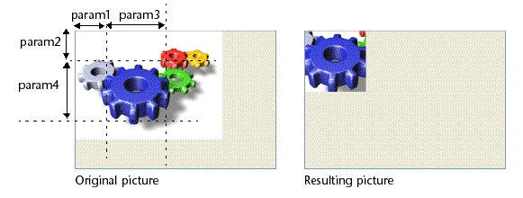

<!--REF #_command_.TRANSFORM PICTURE.Syntax-->**TRANSFORM PICTURE** ( *picture* ; *operator* {; *param1* {; *param2* {; *param3* {; *param4*}}}} )<!-- END REF-->
<!--REF #_command_.TRANSFORM PICTURE.Params-->
| Parameter | Type |  | Description |
| --- | --- | --- | --- |
| picture | Picture | &#8594;  | Source picture to be transformed |
| &#8592; | Resulting picture after transformation |
| operator | Integer | &#8594;  | Type of transformation to be done |
| param1 | Real | &#8594;  | Transformation parameter |
| param2 | Real | &#8594;  | Transformation parameter |
| param3 | Real | &#8594;  | Transformation parameter |
| param4 | Real | &#8594;  | Transformation parameter |

<!-- END REF-->

#### Description 

<!--REF #_command_.TRANSFORM PICTURE.Summary-->The TRANSFORM PICTURE command applies a transformation of the *operator* type to the picture passed in the *picture* parameter.<!-- END REF-->

**Note:** This command extends the functionalities offered by conventional picture transformation operators. These operators remain entirely usable in 4D.

The source *picture* is modified directly after execution of the command. Note that certain operations are not destructive and can be reversed by performing the opposite operation or by means of the “Reset” operation. For example, a picture reduced to 1% will regain its original size with no alteration if it is enlarged by a factor of 100 subsequently. Transformations do not modify the original picture type: for example, a vectorial picture will remain vectorial after its transformation.

In *operator*, pass the number of the operation to be carried out and in *param*, the parameter(s) needed for this operation (the number of parameters depends on the operation). You can use one of the constants of the "*Picture Transformation*" theme in *operator*. These operators and their parameters are described in the following table:

| **operator (value)**     | **param1** | **param2** | **param3** | **param4** | **Values**  | **Cancellable** |
| ------------------------ | ---------- | ---------- | ---------- | ---------- | ----------- | --------------- |
| Reset (0)                | \-         | \-         | \-         | \-         | \-          | \-              |
| Scale (1)                | Width      | Height     | \-         | \-         | Factors     | Yes             |
| Translate (2)            | X axis     | Y axis     | \-         | \-         | Pixels      | Yes             |
| Flip horizontally (3)    | \-         | \-         | \-         | \-         | Yes         |                 |
| Flip vertically (4)      | \-         | \-         | \-         | \-         | Yes         |                 |
| Crop (100)               | X Orig.    | Y Orig.    | Width      | Height     | Pixels      | No              |
| Fade to grey scale (101) | \-         | \-         | \-         | \-         | No          |                 |
| Transparency (102)       | RGB color  | \-         | \-         | \-         | Hexadecimal | No              |

* Reset: All matrix operations carried out on the picture (scale, flip, and so on) are undone.
* Scale: The picture is resized horizontally and vertically according to the values passed respectively in *param1* and *param2*. These values are factors: for example, to enlarge the width by 50%, pass 1.5 in *param1* and to reduce the height by 50%, pass 0.5 in *param2*.
* Translate: The picture is moved by *param1* pixels horizontally and by *param2* pixels vertically. Pass a positive value to move to the right or towards the bottom and a negative value to move to the left or towards the top.
* Flip horizontally and Flip vertically: The original picture is flipped. Any movement that was carried out beforehand will not be taken into account.
* Crop: The picture is cropped starting from the point of the *param1* and *param2* coordinates (expressed in pixels). The width and height of the new picture is determined by the *param3* and *param4* parameters. This transformation cannot be undone.
* Fade to grey scale: The picture is switched to gray scale (no parameter is required). This transformation cannot be undone.
* Transparency: A transparency mask is applied to the picture based on the color passed in *param1*. For example, if you pass 0x00FFFFFF (white color) in *param1*, all the white pixels in the original picture will be transparent in the transformed picture. This operation can be applied to bitmap or vector pictures. By default, if the *param1* parameter is omitted, the color white (0x00FFFFFF) is set as the target color. This function is specially designed to handle transparency in pictures converted from the deprecated PICT format pictures, but can be used with pictures of any type. This transformation cannot be undone.

#### Example 1 

You want to set the white parts of a picture to transparent. To do this, you can use the following code:

```4d
 TRANSFORM PICTURE(Pict1;Transparency;0x00FFFFFF) //0x00FFFFFF is white
```

You will get the following result:


#### Example 2 

Here is an example of cropping a picture (the picture is displayed in the form with the “Truncated (non-centered)” format): 

```4d
 TRANSFORM PICTURE($vpGears;Crop;50;50;100;100)
```



#### See also 

[COMBINE PICTURES](combine-pictures.md)  