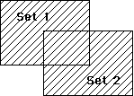

<!--REF #_command_.UNION.Syntax-->**UNION** ( *set1* ; *set2* ; *resultSet* )<!-- END REF-->
<!--REF #_command_.UNION.Params-->
| Parameter | Type |  | Description |
| --- | --- | --- | --- |
| set1 | Text | &rarr; | First set |
| set2 | Text | &rarr; | Second set |
| resultSet | Text | &rarr; | Resulting set |

<!-- END REF-->

#### Description 

<!--REF #_command_.UNION.Summary-->**UNION** creates a set that contains all records from *set1* and *set2*.<!-- END REF--> The following table shows all possible results of a set Union operation.

| **Set1** | **Set2** | **Result Set** |
| -------- | -------- | -------------- |
| Yes      | No       | Yes            |
| Yes      | Yes      | Yes            |
| No       | Yes      | Yes            |
| No       | No       | No             |

The result of a Union operation is depicted here. The shaded area is the result set.



The *resultSet* is created by **UNION**. The *resultSet* replaces any existing set having the same name, including *set1* and *set2*. Both *set1* and *set2* must be from the same table. The *resultSet* belongs to the same table as *set1* and *set2*. The current record for the *resultSet* is the current record from Set1.

**4D Server:** In Client/Server mode, sets are "visible" depending on their type (interprocess, process and local) and where they were created (server or client). **UNION** requires that all three sets be visible on the same machine. See the paragraph *4D Server, Sets and Named Selections* in the 4D Server Reference manual for more information.

#### Example 

This example adds records to a set of best customers. The records are displayed on screen with the first line. After the records are displayed, a set of the best customers is loaded from disk, and any records that the user selected (the set named “UserSet”) are added to the set. Finally, the new set is saved on disk:

```4d
 ALL RECORDS([Customers]) // Select all the customers
 DISPLAY SELECTION([Customers]) // Display all the customers in a list
 LOAD SET("$Best";"$SaveBest") // Load the set of best customers
 UNION("$Best";"UserSet";"$Best") // Add any selected to the set
 SAVE SET("$Best";"$SaveBest") // Save the set of best customers
```

#### See also 

[DIFFERENCE](difference.md)  
[INTERSECTION](intersection.md)  