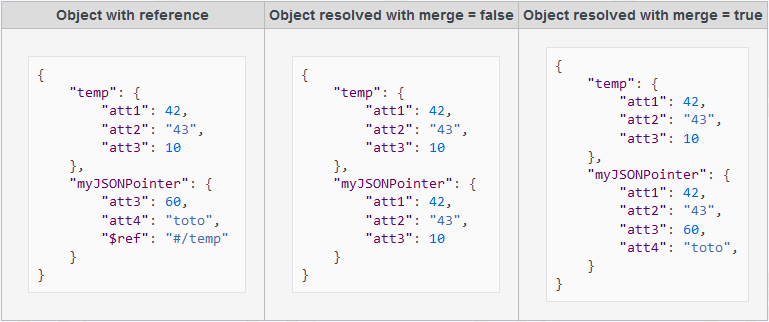

<!--REF #_command_.JSON Resolve pointers.Syntax-->**JSON Resolve pointers** ( *object* {; *options*} ) -> Function result<!-- END REF-->
<!--REF #_command_.JSON Resolve pointers.Params-->
| Parameter | Type |  | Description |
| --- | --- | --- | --- |
| object | Object | -> | Object containing JSON pointers to resolve |
| <-> | Object with JSON pointers resolved (only if result is an object) |
| options | Object | -> | Options for pointer resolution |
| Function result | Object | <- | Object containing the result of the processing |

<!-- END REF-->

#### Description 

<!--REF #_command_.JSON Resolve pointers.Summary-->The **JSON Resolve pointers** command resolves all the JSON pointers found in the *object*, with regards to *options* settings (if any).<!-- END REF-->

JSON pointers are particularily useful to:

* embed some part of an external JSON document or reuse a part of a JSON document in other places in the same JSON document, in order to factorize information,
* express a cyclic structure in JSON,
* define a template object containing default properties stored in JSON.

Pass in the *object* parameter an object containing JSON pointers to be resolved (for information on JSON pointer syntax, please refer to the [Defining JSON Pointers](/4Dv20R6/4D/20-R6/JSON-Resolve-pointers.301-6958664.en.html#3516585) paragraph below). 

**Note:** The source *object* will be updated with the result of pointer resolution after the command is executed (except if the result is not an object, see below). If you want to keep an original version of *object*, you may consider using the [OB Copy](ob-copy.md) beforehand. 

Optionally, you can pass in *options* an object containing specific properties to be used when resolving pointers. The following properties are supported:

| **Property** | **Value type** | **Description**                                                                                                                                       |
| ------------ | -------------- | ----------------------------------------------------------------------------------------------------------------------------------------------------- |
| rootFolder   | String         | Absolute path (using standard 4D syntax) to the folder to be used to resolve relative pointers in *object*. Default is the database Resources folder. |
| merge        | Boolean        | Merge objects with pointer objects (true) instead of replacing them (false). Default is false            |

After the command is executed: 

* if the result of pointer resolution is an object, *object* is updated and contains the resulting object.
* if the result of pointer resolution is a scalar value (i.e. a text, a number...), *object* is left untouched and the resulting value is returned in the "value" property of the function result.

In any cases, the command returns an object containing the following properties:

| **Property**            | **Value type** | **Description**                                                                                           |
| ----------------------- | -------------- | --------------------------------------------------------------------------------------------------------- |
| value                   | Any            | Result of the command processing on *object*. If the result is an object, it is equal to output *object*. |
| success                 | Boolean        | true if all pointers have been resolved successfully                                                      |
| errors                  | Collection     | Collection of errors if any                                                                               |
| errors\[\].code         | Number         | error code                                                                                                |
| errors\[\].message      | String         | error message                                                                                             |
| errors\[\].pointerURI   | String         | pointer value                                                                                             |
| errors\[\].referredPath | String         | document fullpath                                                                                         |

  
#### Defining JSON Pointers 

```undefined
{
   "$ref":<path>#<json_pointer>
}
```

##### Recursivity and path resolution 

JSON pointers are resolved recursively, which means that if a resolved pointer also contains pointers, they are resolved recursively and so on, until all pointers are resolved. In this context, all file paths found in JSON pointer URIs can be relative or absolute. They must use '/' as path delimiter and are resolved the following way:

* A relative path must not start with '/'. It is resolved relatively to the JSON document where the path string has been found,
* An absolute path starts with '/'. Only [filesystem pathnames](https://developer.4d.com/docs/Concepts/paths/#filesystem-pathnames) are accepted as absolute paths. For example, "/RESOURCES/templates/myfile.json" points to the file "myfile.json" located in the current database resources folder.

**Notes:**

* The name resolution is case sensitive.
* 4D does not resolve a path to a json file located over the network (starting with "http/https").

#### Example 1 

This basic example illustrates how a JSON pointer can be set and replaced in an object:

```4d
  // create an object with some value
 var $o : Object
 $o:=New object("value";42)
 
  // create the JSON pointer object
 var $ref : Object
 $ref:=New object("$ref";"#/value")
 
  // add the JSON pointer object as property
 $o.myJSONPointer:=$ref
 
  // resolve the whole and check that the pointer has been resolved
 var $result : Object
 $options:=New object("rootFolder";Get 4D folder(Current resources folder);"merge";True)
 $result:=JSON Resolve pointers($o;$options)
 If($result.success)
    ALERT(JSON Stringify($result.value))
  //{"value":42,"myJSONPointer":42}
 Else
    ALERT(JSON Stringify($result.errors))
 End if
```

#### Example 2 

```undefined
{
    "lastname": "Doe",
    "firstname": "John",
    "billingAddress": { 
        "street": "95 S. Market Street",
        "city": "San Jose",
        "state": "California" 
    },
    "shippingAddress": { "$ref": "#/billingAddress" }
}
```

#### Example 3 

```undefined
{
    "rights": { 
        "$ref": "defaultSettings.json#/defaultRights",
        "delete": true,
        "id": 456
    }
}
```

#### See also 

  