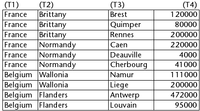
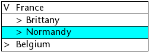

<!--REF #_command_.LISTBOX SELECT BREAK.Syntax-->**LISTBOX SELECT BREAK** ( {* ;} *object* ; *row* ; *column* {; *action*} )<!-- END REF-->
<!--REF #_command_.LISTBOX SELECT BREAK.Params-->
| Parameter | Type |  | Description |
| --- | --- | --- | --- |
| * | Operator | -> | If specified, object is an object name (string)
If omitted, object is a variable |
| object | Form object | -> | Object name (if * is specified) or 
Variable (if * is omitted) |
| row | Longint | -> | Number of break row |
| column | Longint | -> | Number of break column |
| action | Longint | -> | Selection action |

<!-- END REF-->

#### Description 

<!--REF #_command_.LISTBOX SELECT BREAK.Summary-->The **LISTBOX SELECT BREAK** command can be used to select break rows in the list box object designated by the *object* and *\** parameters.<!-- END REF--> The list box must be displayed in hierarchical mode. 

If you pass the optional *\** parameter, you indicate that the *object* parameter is an object name (string). If you do not pass this parameter, you indicate that the *object* parameter is a variable. In this case, you pass a variable reference instead of a string.

Break rows are added to represent the hierarchy but they do not correspond to existing rows in the array. To designate a break row to be selected, in the *row* and *column* parameters, you must pass the row and column number corresponding to the first occurrence in the corresponding array. These values are returned by the [LISTBOX GET CELL POSITION](listbox-get-cell-position.md) command when the user has selected a break row. This principle is described in the “Management of break rows” paragraph of the [Hierarchical list boxes](/4Dv20R6/4D/20-R6/Hierarchical-list-boxes.300-7003329.en.html) section. 

The *action* parameter, if it is passed, can set the selection action to be carried out when a selection of break rows already exists in the list box. You can pass a value or one of the following constants, found in the "[List Box](/4Dv20R6/4D/20-R6/List-Box.302-6958504.en.html)" theme:

| Constant                 | Type    | Value | Comment                                                                                                                                                                                                                                                       |
| ------------------------ | ------- | ----- | ------------------------------------------------------------------------------------------------------------------------------------------------------------------------------------------------------------------------------------------------------------- |
| lk add to selection      | Longint | 1     | The row selected is added to the existing selection. If the row specified already belongs to the existing selection, the command does nothing.                                                                                                                |
| lk remove from selection | Longint | 2     | The row selected is removed from the existing selection. If the row specified does not belong to the existing selection, the command does nothing.                                                                                                            |
| lk replace selection     | Longint | 0     | The row selected becomes the new selection and replaces the existing selection. The command has the same effect as a user click on a row (however, the On Clicked event is not generated). This is the default action (if the *action* parameter is omitted). |

**Note:** If you have checked the **Hide selection highlight** option for a list box:

* you have to make list box selections visible using available interface options. For more information about how to do this, see [Customizing the appearance of selections](/4Dv20R6/4D/20-R6/Managing-List-Box-Objects.300-6958138.en.html#3186993).
* you cannot highlight break rows for hierarchical list boxes in this case (see [Limitation with hierarchical list boxes](/4Dv20R6/4D/20-R6/Managing-List-Box-Objects.300-6958138.en.html#3187002)).

#### Example 

Given the following arrays shown in a list box:



We want to select the "Normandy" break row:

```4d
 $row:=Find in array(T2;"Normandy")
 $column:=2
 LISTBOX COLLAPSE(*;"MyListbox") //collapsing of all levels
 LISTBOX SELECT BREAK(*;"MyListbox";$row;$column)
```

Here is the result:



#### See also 

[LISTBOX GET CELL POSITION](listbox-get-cell-position.md)  
[LISTBOX SELECT ROW](listbox-select-row.md)  