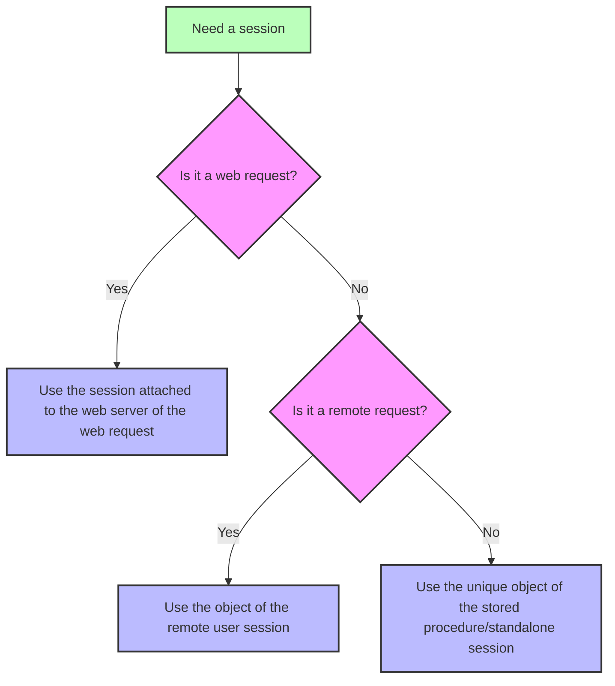

<!-- REF #_command_.Session.Syntax -->**Session** : 4D.Session<!-- END REF -->
<!--REF #_command_.Session.Params-->
| Parameter | Type |  | Description |
| --- | --- | --- | --- |
| Function result | 4D.Session | &#8592; | Session object |

<!-- END REF-->

<details><summary>History</summary>

|Release|Changes|
|---|---|
|20 R8|Support of standalone sessions|
|20 R5|Support of remote client and stored procedure sessions|
|18 R6|Added|

</details>

## Description

The `Session` command <!-- REF #_command_.Session.Summary -->returns the `Session` object corresponding to the current session<!-- END REF -->.

Depending on the process from which the command is called, the current session can be:

- a web session (when [scalable sessions are enabled](WebServer/sessions.md#enabling-web-sessions)),
- a remote client session (on the server),
- a stored procedures session,
- a standalone session.

For more information, see the [Session types](../API/SessionClass.md#session-types) paragraph.

The command returns *Null* if:

- it is called in a web process and scalable sessions are disabled on the web server,
- it is called on a remote 4D.


### Web sessions

The `Session` object of web sessions is available from any web process:

- `On Web Authentication`, `On Web Connection`, and `On REST Authentication` database methods,
- code processed through 4D tags in semi-dynamic pages (4DTEXT, 4DHTML, 4DEVAL, 4DSCRIPT/, 4DCODE)
- project methods with the "Available through 4D tags and URLs (4DACTION...)" attribute and called through 4DACTION/ urls,
- [`On Mobile App Authentication`](https://developer.4d.com/go-mobile/docs/4d/on-mobile-app-authentication) and [`On Mobile App Action`](https://developer.4d.com/go-mobile/docs/4d/on-mobile-app-action) database methods for mobile requests,
- ORDA functions [called with REST requests](../REST/ClassFunctions.md).

For more information on web user sessions, please refer to the [Web Server Sessions](../WebServer/sessions.md) section.

### Remote client sessions

The `Session` object of remote client sessions is available from:

- Project methods that have the [Execute on Server](../Project/code-overview.md#execute-on-server) attribute (they are executed in the "twinned" process of the client process),
- Triggers,
- ORDA [data model functions](../ORDA/ordaClasses.md) (except those declared with the [`local`](../ORDA/ordaClasses.md#local-functions) keyword, 
- `On Server Open Connection` and `On Server Shutdown Connection` database methods.

For more information on remote user sessions, please refer to the [**Remote user sessions**](../Desktop/sessions.md#remote-user-sessions) paragraph.

### Stored procedures session

All stored procedure processes share the same virtual user session. The `Session` object of stored procedures is available from:

- methods called with the [`Execute on server`](../commands-legacy/execute-on-server.md) command,
- `On Server Startup`, `On Server Shutdown`, `On Backup Startup`, `On Backup Shutdown`, and `On System event` database methods

For more information on stored procedures virtual user session, please refer to the [**Stored procedure sessions**](../Desktop/sessions.md#stored-procedure-sessions) paragraph.


### Standalone session

The `Session` object is available from any process in standalone (single-user) applications so that you can write and test your client/server code using the `Session` object in your 4D development environment.

For more information on standalone sessions, please refer to the [**Standalone sessions**](../Desktop/sessions.md#standalone-sessions) paragraph.


### `Session` and components 

When `Session` is called from the code of different [components loaded in the project](../Concepts/components.md), the command returns an object depending on the calling request and the context:

- in case of a web request, `Session` always returns the session attached to the target web server of the request (and not a session of the component's web server),
- in case of a remote request executed on the server, `Session` always returns the session attached to the remote user, 
- in case of a stored procedure session or a standalone session, `Session` always returns the single current session (the same object is used during all the work session).




## Example

You have defined the `action_Session` method with attribute "Available through 4D tags and URLs". You call the method by entering the following URL in your browser:

```
IP:port/4DACTION/action_Session
```

```4d
  //action_Session method
 Case of
    :(Session#Null)
       If(Session.hasPrivilege("CreateInvoices")) //calling the hasPrivilege function
          WEB SEND TEXT("4DACTION --> Session is CreateInvoices")
       Else
          WEB SEND TEXT("4DACTION --> Session is not CreateInvoices")
       End if
    Else
       WEB SEND TEXT("4DACTION --> Session is null")
 End case
```

## See also

[Session storage](session-storage.md)  
[Session API](../API/SessionClass.md) 
[Desktop sessions](../Desktop/sessions.md) 
[Web server user sessions](../WebServer/sessions.md)  
[*Scalable sessions for advanced web applications* (blog post)](https://blog.4d.com/scalable-sessions-for-advanced-web-applications/)


## Properties

|  |  |
| --- | --- |
| Command number | 1714 |
| Thread safe | yes |


