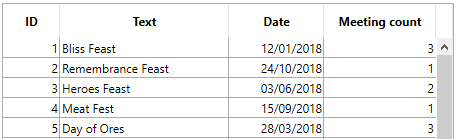

<!--REF #_command_.This.Syntax-->**This** -> Function result<!-- END REF-->
<!--REF #_command_.This.Params-->
| Parameter | Type |  | Description |
| --- | --- | --- | --- |
| Function result | Object | <- | Current element or object |

<!-- END REF-->

#### Description 

<!--REF #_command_.This.Summary-->The **This** command returns a reference to the currently processed object.<!-- END REF-->

The command is designed to be used in the following contexts:

* A list box associated to a collection or an entity selection, during the On Display Detail or the On Data Change events.  
In this context, the command returns a reference to the collection element or entity accessed by the list box to display the current row.  
**Note:** If you use a collection of scalar values in a list box, 4D creates an object for each element with a single **value** property. Thus, the element value is returned by the **This.value** non-assignable expression.
* The execution of a formula object created by the [Formula](formula.md) or [Formula from string](formula-from-string.md) commands.  
In this context, the command returns a reference to the object currently processed by the formula.

In any other context, the command returns **Null**.

Within supported contexts, you will access object/collection element properties or entity attributes through **This.<*propertyPath*\>**. For example, *This.name* or *This.employer.lastName* are valid pathes to object, element or entity properties.

#### Example 1 

A collection of objects, each with this structure:

{  
"ID": 1234
"name": "Xavier",  
"revenues": 47300,  
"employees": [  
             "Allan",  
             "Bob", 
             "Charlie"  
            ] 
},{  
"ID": 2563
"name": "Carla",  
"revenues": 55000,  
"isFemale": true
"employees": [  
             "Igor",  
             "Jane"  
            ] 
},...
 
In the list box, each column refers to one of the properties of the object, either directly (This.name), indirectly (This.employees.length), or through an expression (*getPicture*) in which can be used directly. The list box looks like:


The *GetPicture* project method is automatically executed during the **On display detail** event:

```4d
  //GetPicture Method

 C_PICTURE($0)

 If(This.isFemale)

    $0:=Form.genericFemaleImage

 Else

    $0:=Form.genericMaleImage

 End if
```

Once the form is executed, you can see the result:


#### Example 2 

You want to display entities from the following structure in a list box:


You build a list box of the "Collection or entity selection" type with the following definition:


Note that:

* *This.ID*, *This.Title* and *This.Date* directly refers to the corresponding attributes in the ds.Event dataclass.
* *This.meetings* is a related attribute (based upon the One To Many relation name) that returns an entity selection of the ds.Meeting dataclass.
* **Form.eventList** is the entity selection that is attached to the list box. The initialization code can be put in the on load form event:  
```4d  
 Case of  
    :(Form event code=On Load)  
       Form.eventList:=ds.Event.all() //returns an entity selection with all entities  
 End case  
```

Once the form is executed, the list box is automatically filled with the entity selection:



#### Example 3 

You want to use a project method as a formula encapsulated in an object:

```4d
 C_OBJECT($person)

 $person:=New object

 $person.firstName:="John"

 $person.lastName:="Smith"

 $person.greeting:=Formula(Greeting)

 $g:=$person.greeting("hello") // returns "hello John Smith"

 $g:=$person.greeting("hi") // returns "hi John Smith"
```

With the Greeting project method:

```4d
 C_TEXT($0;$1)

 $0:=$1+" "+This.firstName+" "+This.lastName
```

#### See also 
[Self](self.md)  
[Super](super.md)  