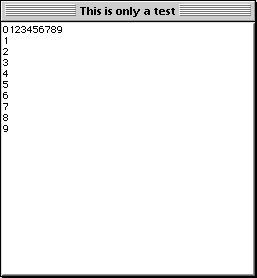

---
id: goto-xy
title: GOTO XY
slug: /commands/goto-xy
displayed_sidebar: docs
---

<!--REF #_command_.GOTO XY.Syntax-->**GOTO XY** ( *x* : Integer ; *y* : Integer )<!-- END REF-->
<!--REF #_command_.GOTO XY.Params-->
<div class="no-index">

| Parameter | Type |  | Description |
| --- | --- | --- | --- |
| x | Integer | &#8594;  | x (horizontal) position of cursor |
| y | Integer | &#8594;  | y (vertical) position of cursor |
</div>
<!-- END REF-->

## Description 

<!--REF #_command_.GOTO XY.Summary-->The **GOTO XY** command is used in conjunction with the [MESSAGE](../commands/message) command when you display messages in a window opened using [Open window](../commands/open-window).<!-- END REF-->  
  
**GOTO XY** positions the character cursor (an invisible cursor) to set the location of the next message in the window.

The upper-left corner is position 0,0\. The cursor is automatically placed at 0,0 when a window is opened and after [ERASE WINDOW](../commands/erase-window) is executed.

After **GOTO XY** positions the cursor, you can use [MESSAGE](../commands/message) to display characters in the window.

## Example 1 

See example for the [MESSAGE](../commands/message) command.

## Example 2 

See example for the [Milliseconds](../commands/milliseconds) command.

## Example 3 

The following example: 

```4d
 Open window(50;50;300;300;5;"This is only a test")
 For($vlRow;0;9)
    GOTO XY($vlRow;0)
    MESSAGE(String($vlRow))
 End for
 For($vlLine;0;9)
    GOTO XY(0;$vlLine)
    MESSAGE(String($vlLine))
 End for
 $vhStartTime:=Current time
 Repeat
 Until((Current time-$vhStartTime)>†00:00:30†)
```

displays the following window (on Macintosh) for 30 seconds:



## See also 

[MESSAGE](../commands/message)  

## Properties

|  |  |
| --- | --- |
| Command number | 161 |
| Thread safe | no |


