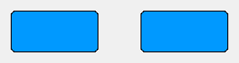
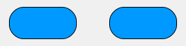
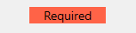
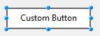
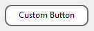

---
id: object-set-corner-radius
title: OBJECT SET CORNER RADIUS
slug: /commands/object-set-corner-radius
displayed_sidebar: docs
---

<!--REF #_command_.OBJECT SET CORNER RADIUS.Syntax-->**OBJECT SET CORNER RADIUS** ( * ; *object* : Text ; *radius* : Integer )<br/>**OBJECT SET CORNER RADIUS** ( *object* : Variable, Field ; *radius* : Integer )<!-- END REF-->
<!--REF #_command_.OBJECT SET CORNER RADIUS.Params-->
<div class="no-index">

| Parameter | Type |  | Description |
| --- | --- | --- | --- |
| * | Operator | &#8594;  | If specified, object is an object name (string)<br/>If omitted, object is a variable or a field |
| object | Text, Variable, Field | &#8594;  | Object name (if * is specified) or <br/>Variable or field (if * is omitted) |
| radius | Integer | &#8594;  | New radius of rounded corners (in pixels) |
</div>
<!-- END REF-->

<div class="no-index">
<details><summary>History</summary>

|Release|Changes|
|---|---|
|21 R5|Support for custom-styled buttons, radio buttons and check boxes |
|19 R7|Modified|
|14 R4|Created|

</details>
</div>

## Description 

<!--REF #_command_.OBJECT SET CORNER RADIUS.Summary-->The **OBJECT SET CORNER RADIUS** command modifies the *radius* of corners for the object(s) you passed in the *object* parameter.<!-- END REF--> The new radius is only set for the process and is not saved in the form itself. 

You can use this command with the following form objects:

- [rectangles](../../FormObjects/shapes_overview.md#rectangle)
- [inputs](../../FormObjects/input_overview.md) (4D projects only)
- [text areas](../../FormObjects/text.md) (4D projects only)
- custom-styled [buttons](../../FormObjects/button_overview.md#custom) with ["custom" Border Line Style](#border-line-style), custom-styled [radio buttons](../../FormObjects/radio_overview.md#custom) and custom-styled [check boxes](../../FormObjects/checkbox_overview.md#custom) (4D projects only)

Passing the optional *\** parameter indicates that the *object* parameter is an object name (string). If you do not pass this parameter, it indicates that the *object* parameter is a field or variable. In this case, you pass a field or variable reference instead of a string (field or variable object only). 

In the *radius* parameter, you pass a new radius value in pixels to be applied to the corners of the object. 

**Note**: With input and text area objects, the corner radius property is only available with "none", "solid", or "dotted" border line styles.

You can modify this value at the form level using the [**Corner radius property**](../../FormObjects/properties_BackgroundAndBorder.md#corner-radius).

## Example 1 

You have the following rectangles in your form, named respectively "Rect1" and "Rect2":



You can execute the following code to change their corners:

```4d
 OBJECT SET CORNER RADIUS(*;"Rect@";20)
```



## Example 2 

You have the following text area in your form, named "required-label":



If you execute the following code:

```4d
 OBJECT SET CORNER RADIUS(*;"required-label";10)
```


Note that for text areas (as well as inputs), unlike for rectangles, the corner roundness is drawn **outside** the initial area of the object.

## Example 3

With custom-styled buttons that have a ["custom" Border Line Style](#border-line-style), the corner radius is drawn inside the initial area of the object:



```4d
 OBJECT SET CORNER RADIUS(*;"custom-button";8)
```




## See also 

[OBJECT Get corner radius](../commands/object-get-corner-radius)  
[OBJECT SET BORDER STYLE](../commands/object-set-border-style)  


## Properties

|  |  |
| --- | --- |
| Command number | 1323 |
| Thread safe | no |


