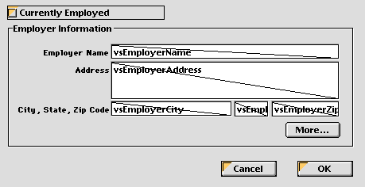
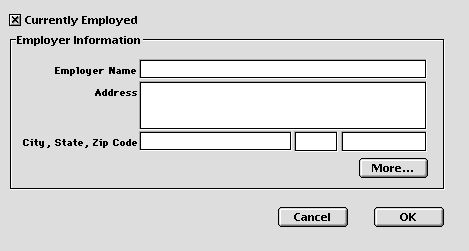
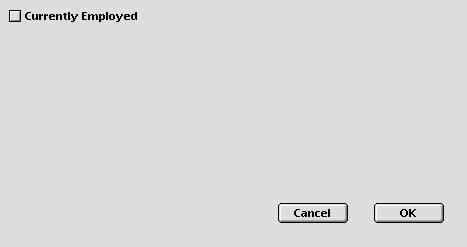

---
id: object-set-visible
title: OBJECT SET VISIBLE
slug: /commands/object-set-visible
displayed_sidebar: docs
---

<!--REF #_command_.OBJECT SET VISIBLE.Syntax-->**OBJECT SET VISIBLE** ( * ; *object* : Text ; *visible* : Boolean )<br/>**OBJECT SET VISIBLE** ( *object* : Variable, Field ; *visible* : Boolean )<!-- END REF-->
<!--REF #_command_.OBJECT SET VISIBLE.Params-->
<div class="no-index">

| Parameter | Type |  | Description |
| --- | --- | --- | --- |
| * | Operator | &#8594;  | If specified, Object is an Object Name (String) If omitted, Object parameter is a Field or a Variable |
| object | Text, Variable, Field | &#8594;  | Object name (if * is specified) or <br/>Variable or field (if * is omitted) |
| visible | Boolean | &#8594;  | True for visible, False for invisible |
</div>
<!-- END REF-->

<div class="no-index">
<details><summary>History</summary>

|Release|Changes|
|---|---|
|12|Renamed|
|6|Created|

</details>
</div>

## Description 

<!--REF #_command_.OBJECT SET VISIBLE.Summary-->The **OBJECT SET VISIBLE** command shows or hides the objects specified by *object*.<!-- END REF-->

If you specify the optional *\** parameter, you indicate an object name (a string) in *object*. If you omit the optional \* parameter, you indicate a field or a variable in *object*. In this case, you specify a field or variable reference (field or variable objects only) instead of a string. For more information about object names, see the section *Object Properties*.

If you pass *visible* equal to **TRUE**, the objects are shown. If you pass *visible* equal to **FALSE**, the objects are hidden.

## Example 

Here is a typical form in the Design environment:



The objects in the **Employer Information** group box each have an object name that contains the expression “employer” (including the group box). When the **Currently Employed** check box is checked, the objects must be visible; when the check box is unchecked, the objects must be invisible.   
Here is the object method of the check box:

```4d
  // cbCurrentlyEmployed Check Box Object Method
 Case of
    :(FORM Event.code=On Load)
       cbCurrentlyEmployed:=1
 
    :(FORM Event.code=On Clicked)
  // Hide or Show all the objects whose name contains "emp"
       OBJECT SET VISIBLE(*;"@emp@";cbCurrentlyEmployed#0)
  // But always keep the check box itself visible
       OBJECT SET VISIBLE(cbCurrentlyEmployed;True)
 End case
```

Therefore, when executed, the form looks like:



or:



## See also 

[OBJECT Get visible](../commands/object-get-visible)  
[OBJECT SET ENTERABLE](../commands/object-set-enterable)  

## Properties

|  |  |
| --- | --- |
| Command number | 603 |
| Thread safe | no |


