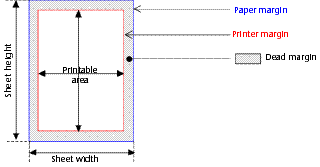

---
id: get-printable-margin
title: GET PRINTABLE MARGIN
slug: /commands/get-printable-margin
displayed_sidebar: docs
---

<!--REF #_command_.GET PRINTABLE MARGIN.Syntax-->**GET PRINTABLE MARGIN** ( *left* : Integer ; *top* : Integer ; *right* : Integer ; *bottom* : Integer )<!-- END REF-->
<!--REF #_command_.GET PRINTABLE MARGIN.Params-->

| Parameter | Type |  | Description |
| --- | --- | --- | --- |
| left | Integer | &#8592; | Left margin |
| top | Integer | &#8592; | Top margin |
| right | Integer | &#8592; | Right margin |
| bottom | Integer | &#8592; | Bottom margin |

<!-- END REF-->

History

|Release|Changes|
|---|---|
|6.8.1|Created|

## Description 

<!--REF #_command_.GET PRINTABLE MARGIN.Summary-->The GET PRINTABLE MARGIN command returns the current values of the different margins defined using the [Print form](../commands/print-form), [PRINT SELECTION](../commands/print-selection) and [PRINT RECORD](../commands/print-record) commands.<!-- END REF--> 

The values are returned in pixels with respect to the paper edges. 

It is possible to obtain the paper size as well as to calculate the printable area using the [GET PRINTABLE AREA](../commands/get-printable-area) function.

### About Printable Margin Management 

By default, the printing calculation in 4D is based on “printable margins”. The advantage of this system is that the forms adapt themselves automatically to the new printers (since they are positioned in the printable area). On the other hand, in the case of pre-printed forms, it was not possible to position the elements to be printed precisely because changing the printer can modify the printable margins.

It is possible to base the form printing carried out using the [Print form](../commands/print-form), [PRINT SELECTION](../commands/print-selection) and [PRINT RECORD](../commands/print-record) commands on a fixed margin which is identical on each printer: the paper margins, i.e. the physical limits of the sheet. To do this, simply use the [GET PRINTABLE MARGIN](../commands/get-printable-margin), [SET PRINTABLE MARGIN](../commands/set-printable-margin) and [GET PRINTABLE AREA](../commands/get-printable-area) commands.

## About Printing Terminology 

**Paper margin**: the paper margin corresponds to the physical limits of the sheet.  
  
**Printer margin**: the printer margin is the margin beyond which the printer is incapable of printing (for material reasons: print rollers, printer head end-of-travel...). It varies from one printer to another and from one format to another.  
  
**Dead margin**:this refers to the area located between the paper margin and the printer margin. 

## See also 

[GET PRINTABLE AREA](../commands/get-printable-area)  
[Print form](../commands/print-form)  
[SET PRINTABLE MARGIN](../commands/set-printable-margin)  

## Properties

|  |  |
| --- | --- |
| Command number | 711 |
| Thread safe | no |

