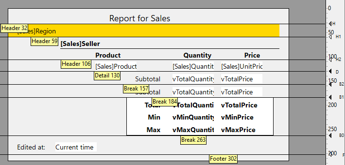
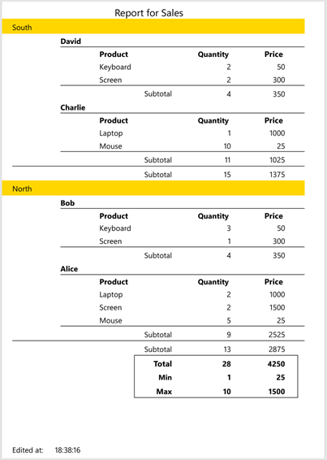

---
id: print-selection
title: PRINT SELECTION
slug: /commands/print-selection
displayed_sidebar: docs
---

<!--REF #_command_.PRINT SELECTION.Syntax-->**PRINT SELECTION** ( {*aTable* : Table} {; *} )<br/>**PRINT SELECTION** ( {*aTable* : Table} {; > : >} )<!-- END REF-->
<!--REF #_command_.PRINT SELECTION.Params-->
<div class="no-index">

| Parameter | Type |  | Description |
| --- | --- | --- | --- |
| aTable | Table | &#8594;  | Table for which to print the selection, or Default table, if omitted |
| *  | Operator | &#8594;  | Suppress the printing dialog box |
| > | > | &#8594;  | Do not reinitialize print settings |
</div>
<!-- END REF-->

<div class="no-index">
<details><summary>History</summary>

|Release|Changes|
|---|---|
|15 R5|Modified|
|2004|Modified|
|<6|Created|

</details>
</div>

## Description 

<!--REF #_command_.PRINT SELECTION.Summary-->**PRINT SELECTION** prints the current selection of *aTable*.<!-- END REF--> The records are printed with the current output form of the table in the current process. **PRINT SELECTION** performs the same action as the **Print** menu command in the Design environment. If the selection is empty, **PRINT SELECTION** does nothing.

By default, **PRINT SELECTION** displays the Print job dialog box before printing. If the user cancels the dialog box, the command is canceled and the report is not printed. You can suppress this dialog box by using either the optional asterisk (*\**) parameter or the optional “greater than” (*\>*) parameter:

* The *\** parameter causes a print job using the current print parameters (default parameters or those defined by the *\_o\_PAGE SETUP* and/or [SET PRINT OPTION](../commands/set-print-option) commands).
* Furthermore, the *\>* parameter causes a print job without reinitializing the current print parameters. This setting is useful for executing several successive calls to **PRINT SELECTION** (e.g., inside a loop) while maintaining previously set customized print parameters. For an example of the use of this parameter, refer to the [PRINT RECORD](../commands/print-record) command description.

During printing, the output form method and/or the form’s object methods are executed depending on the events that are enabled for the form and objects using the Property List window in the Design environment, as well as on the events actually occurring:

* An On Header event is generated just before a header area is printed.
* An On Printing Detail event is generated just before a record is printed.
* An On Printing Break event is generated just before a break area is printed.
* An On Printing Footer event is generated just before a footer is printed.

You can check whether **PRINT SELECTION** is printing the first header by testing [Before selection](../commands/before-selection) during an On Header event. You can also check for the last footer, by testing [End selection](../commands/end-selection) during an On Printing Footer event. For more information, see the description of these commands, as well as those of [Form event code](../commands/form-event-code) and [Level](../commands/level).

To print a sorted selection with subtotals or breaks using **PRINT SELECTION**, you must first sort the selection. Then, in each Break area of the report, include a variable with an object method that assigns the subtotal to the variable. You can also use statistical and arithmetical functions like [Sum](../commands/sum) and [Average](../commands/average) to assign values to variables. For more information, see the descriptions of [Subtotal](../commands/subtotal), [BREAK LEVEL](../commands/break-level) and [ACCUMULATE](../commands/accumulate).

:::warning

 Do not use the [PAGE BREAK](../commands/page-break) command with the **PRINT SELECTION** command. [PAGE BREAK](../commands/page-break) is to be used with the [Print form](../commands/print-form) command.

:::

After a call to **PRINT SELECTION**, the OK variable is set to 1 if the printing has been completed. If the printing was interrupted, the OK variable is set to 0 (zero) (i.e., the user clicked Cancel in the printing dialog box).

:::note 4D Server

This command can be executed on 4D Server in a stored procedure. In this context:

* Make sure that no dialog box appears on the server machine (except for a specific requirement). To do this, it is necessary to call the command with the *\** or *\>* parameter.
* In the case of a problem concerning the printer (out of paper, printer disconnected, etc.), no error message is generated.

:::


## Example 1

The following example selects all the records in the \[People\] table. It then uses the [DISPLAY SELECTION](../commands/display-selection) command to display the records and allows the user to highlight the records to print. Finally, it uses the selected records with the [USE SET](../commands/use-set) command, and prints them with **PRINT SELECTION**:

```4d
 ALL RECORDS([People]) // Select all records
 DISPLAY SELECTION([People];*) // Display the records
 USE SET("UserSet") // Use only records picked by user
 PRINT SELECTION([People]) // Print the records that the user picked
```

## Example 2

You want to print a report with breaks and subtotals, using the following form template:



The method called to build the report:

```4d
ALL RECORDS([Sales])
ORDER BY([Sales]Region; <; [Sales]Seller; <)
BREAK LEVEL(2)
ACCUMULATE([Sales]Quantity; [Sales]UnitPrice)
PRINT SELECTION([Sales])
```

In the form method, you calculate the subtotal values thanks to the built-in **PRINT SELECTION** command features, i.e. values processed in the `On printing break` event can be directly evaluated by [`Subtotal`](../commands/subtotal):

```4d
    //form method
Case of 
	: (FORM Event.code=On Printing Break)
		vBreak:=[Sales]Region
            //Subtotal uses currently processed values
            //it can be used in break variables
		vTotalQuantity:=Subtotal([Sales]Quantity)
		vTotalPrice:=Subtotal([Sales]UnitPrice)
        
            //Min and Max use current selection
            //they are valid at the final break
		vMinQuantity:=Min([Sales]Quantity)
		vMinPrice:=Min([Sales]UnitPrice)
		vMaxQuantity:=Max([Sales]Quantity)
		vMaxPrice:=Max([Sales]UnitPrice)
End case 
```

The resulting printed report:




## See also 

[ACCUMULATE](../commands/accumulate)  
[BREAK LEVEL](../commands/break-level)  
[Level](../commands/level)  
[Print form](../commands/print-form)
[Subtotal](../commands/subtotal)  

## Properties

|  |  |
| --- | --- |
| Command number | 60 |
| Thread safe | no |
| Modifies variables | OK |


