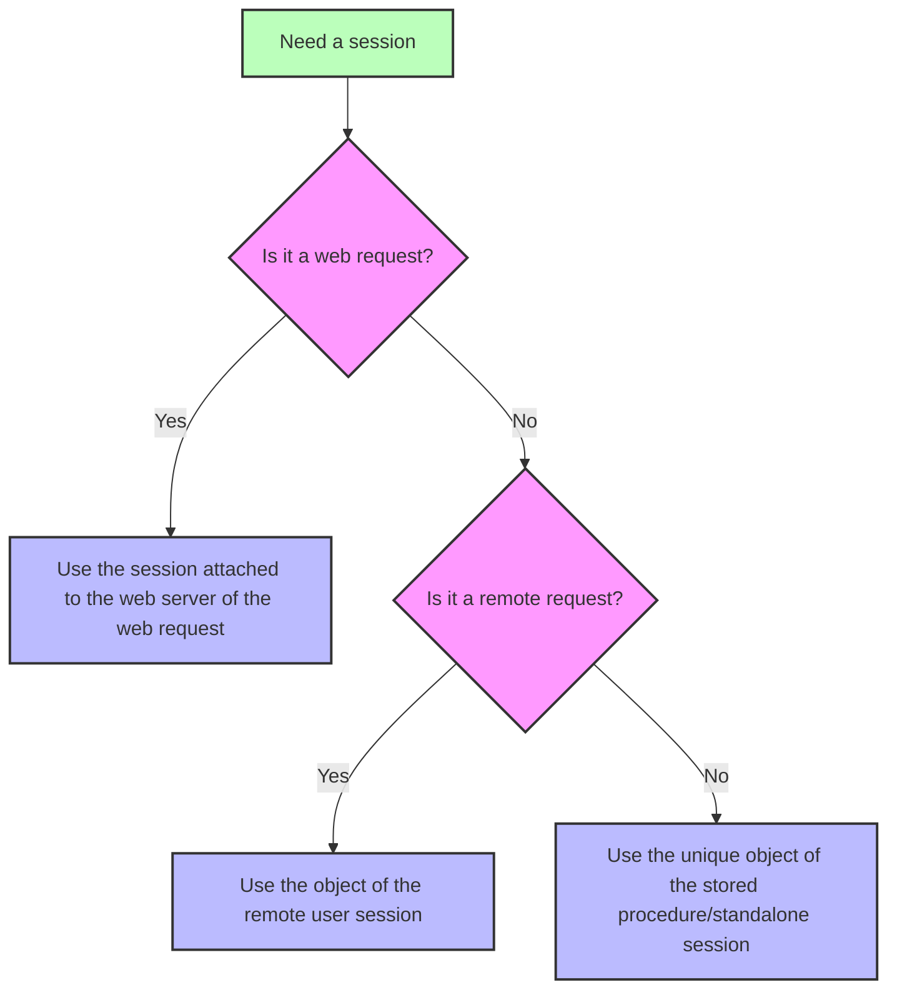

---
id: session
title: Session
slug: /commands/session
displayed_sidebar: docs
---

<!-- REF #_command_.Session.Syntax -->**Session** : 4D.Session<!-- END REF -->
<!--REF #_command_.Session.Params-->
<div class="no-index">

| Parameter | Type |  | Description |
| --- | --- | --- | --- |
| Function result | [4D.Session](../../API/SessionClass.md)  | &#8592; | Session object |
</div>
<!-- END REF-->

<div class="no-index">
<details><summary>History</summary>

|Release|Changes|
|---|---|
|21 R3|Support of remote sessions on the client machine|
|20 R8|Support of standalone sessions|
|20 R5|Support of remote client and stored procedure sessions|
|18 R6|Added|

</details>
</div>

## Description

The `Session` command <!-- REF #_command_.Session.Summary -->returns the `Session` object corresponding to the current session<!-- END REF -->.

Depending on the process from which the command is called, the current session can be:

- a web session (when [scalable sessions are enabled](../../WebServer/sessions.md#enabling-web-sessions)), which includes REST sessions,
- a remote user session (on the server or on the client),
- a stored procedures session,
- a standalone session.

For more information, see the [Session types](../../API/SessionClass.md#session-types) paragraph.

The command returns *Null* if it is called in a web process and scalable sessions are disabled on the web server. 

:::note

There is always at least one REST session on the server, even if [scalable sessions are disabled](../../WebServer/sessions.md#enabling-web-sessions). Thus, the `Session` command always returns a REST session object when called from a REST process. 

:::

### Web sessions

The `Session` object of web sessions is available from any web process:

- `On Web Authentication`, `On Web Connection`, and `On REST Authentication` database methods,
- code processed through 4D tags in semi-dynamic pages (4DTEXT, 4DHTML, 4DEVAL, 4DSCRIPT/, 4DCODE)
- project methods with the "Available through 4D tags and URLs (4DACTION...)" attribute and called through 4DACTION/ urls,
- [`On Mobile App Authentication`](https://developer.4d.com/go-mobile/docs/4d/on-mobile-app-authentication) and [`On Mobile App Action`](https://developer.4d.com/go-mobile/docs/4d/on-mobile-app-action) database methods for mobile requests,
- ORDA functions [called with REST requests](../../REST/ClassFunctions.md).

### Remote user sessions

The [remote user `session`](../../Desktop/sessions.md#remote-user-sessions) object is available on the server and on the client. Both objects are similar, except that they don't share the same [session.`storage`](../../API/SessionClass.md#storage) property and the client session cannot set privileges (see [this paragraph](../../Desktop/sessions.md#comparing-server-side-and-client-side-user-session-objects) for more information).

The `Session` object of a remote user session is available:

- On the server, from code running in the user context, such as project methods that have the [Execute on Server](../../Project/project-method-properties.md#execute-on-server) attribute (they are executed in the "twinned" process of the client process) or ORDA [data model functions](../../ORDA/ordaClasses.md).
- On the client, from code running locally, such as in project methods or ORDA data model functions with the *local* property.

For more information, see the ["Remote user sessions" paragraph in the Desktop sessions](../../Desktop/sessions.md#remote-user-sessions) page. 


### Stored procedures session

All stored procedure processes share the same virtual user session. The `Session` object of stored procedures is available from:

- methods called with the [`Execute on server`](../commands/execute-on-server) command,
- `On Server Startup`, `On Server Shutdown`, `On Backup Startup`, `On Backup Shutdown`, and `On System event` database methods

For more information on stored procedures virtual user session, please refer to the [**Stored procedure sessions**](../../Desktop/sessions.md#stored-procedure-sessions) paragraph.


### Standalone session

The `Session` object is available from any process in standalone (single-user) applications so that you can write and test your client/server code using the `Session` object in your 4D development environment.

For more information on standalone sessions, please refer to the [**Standalone sessions**](../../Desktop/sessions.md#standalone-sessions) paragraph.


### `Session` and components 

When `Session` is called from the code of different [components loaded in the project](../../Concepts/components.md), the command returns an object depending on the calling request and the context:

- in case of a web request, `Session` always returns the session attached to the target web server of the request (and not a session of the component's web server),
- in case of a remote request executed on the server, `Session` always returns the session attached to the remote user, 
- in case of a stored procedure session or a standalone session, `Session` always returns the single current session (the same object is used during all the work session).




## Example

You have defined the `action_Session` method with attribute "Available through 4D tags and URLs". You call the method by entering the following URL in your browser:

```
IP:port/4DACTION/action_Session
```

```4d
  //action_Session method
 Case of
    :(Session#Null)
       If(Session.hasPrivilege("CreateInvoices")) //calling the hasPrivilege function
          WEB SEND TEXT("4DACTION --> Session is CreateInvoices")
       Else
          WEB SEND TEXT("4DACTION --> Session is not CreateInvoices")
       End if
    Else
       WEB SEND TEXT("4DACTION --> Session is null")
 End case
```

## See also

[Session storage](../commands/session-storage)  
[Session API](../../API/SessionClass.md) 
[Desktop sessions](../../Desktop/sessions.md) 
[Web server user sessions](../../WebServer/sessions.md)  
[*Scalable sessions for advanced web applications* (blog post)](https://blog.4d.com/scalable-sessions-for-advanced-web-applications/)  
[*4D remote session object with Client/Server connection and Stored procedure*](https://blog.4d.com/new-4D-remote-session-object-with-client-server-connection-and-stored-procedure)  
[*Client / server – Handle a session when working on a 4D client*](https://blog.4d.com/client-server-handle-a-session-when-working-on-a-4d-client)  


## Properties

|  |  |
| --- | --- |
| Command number | 1714 |
| Thread safe | yes |


