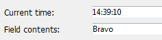
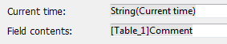

---
id: st-set-options
title: ST SET OPTIONS
slug: /commands/st-set-options
displayed_sidebar: docs
---

<!--REF #_command_.ST SET OPTIONS.Syntax-->**ST SET OPTIONS** ( * ; *object* : Text ; *option* : Integer ; *value* : Integer {; ...(*option* : Integer ; *value* : Integer)} )<br/>**ST SET OPTIONS** ( *object* : Variable, Field ; *option* : Integer ; *value* : Integer {; ...(*option* : Integer ; *value* : Integer)} )<!-- END REF-->
<!--REF #_command_.ST SET OPTIONS.Params-->
<div class="no-index">

| Parameter | Type |  | Description |
| --- | --- | --- | --- |
| * | Operator | &#8594;  | If specified, object is an object name (string) ; if omitted, object is a variable or a field |
| object | Text, Variable, Field | &#8594;  | Object name (if * is specified) or <br/>Variable or field (if * is omitted) |
| option | Integer | &#8594;  | Option to set |
| value | Integer | &#8594;  | New value of option |
</div>
<!-- END REF-->

<div class="no-index">
<details><summary>History</summary>

|Release|Changes|
|---|---|
|14|Created|

</details>
</div>

## Description 

<!--REF #_command_.ST SET OPTIONS.Summary-->The **ST SET OPTIONS** command modifies one or more operating options for the styled text field or variable designated by the *object* parameter.<!-- END REF-->

Passing the optional *\** parameter indicates that the *object* parameter is an object name (string). If you do not pass this parameter, it indicates that the *object* parameter is a field or variable. In this case, you pass a field or variable reference instead of a string (field or variable object only).

Pass the code of the option to modify in *option* and its new value in *value*. 

The *option* parameter supports the following constant found in the "*Multistyle Text*" theme: 

| Constant                    | Type    | Value | Comment                                                      |
| --------------------------- | ------- | ----- | ------------------------------------------------------------ |
| ST Expressions display mode | Integer | 1     | The *value* parameter can contain ST Values or ST References |

In the *value* parameter, you can pass one of the following constants:

| Constant      | Type    | Value | Comment                                |
| ------------- | ------- | ----- | -------------------------------------- |
| ST References | Integer | 1     | Display source strings of expressions  |
| ST Values     | Integer | 0     | Display computed values of expressions |

Display of values:



Display of expressions:



## Example 

The following code lets you switch the display mode of the area:

```4d
 ST GET OPTIONS(*;"StyledText_t";ST Expressions display mode;$exprValue)
 If($exprValue=1)
    ST SET OPTIONS(*;"StyledText_t";ST Expressions display mode;ST Values)
 Else
    ST SET OPTIONS(*;"StyledText_t";ST Expressions display mode;ST References)
 End if
```

## See also 

[ST GET OPTIONS](../commands/st-get-options)  

## Properties

|  |  |
| --- | --- |
| Command number | 1289 |
| Thread safe | no |


