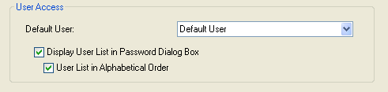

<!--REF #_command_.Get default user.Syntax-->**Get default user**  : Integer<!-- END REF-->
<!--REF #_command_.Get default user.Params-->

| Parameter | Type |  | Description |
| --- | --- | --- | --- |
| Function result | Integer | &#8592; | Unique user ID number |

<!-- END REF-->

History

|Release|Changes|
|---|---|
|2004|Created|

## Description 

<!--REF #_command_.Get default user.Summary-->The Get default user command returns the unique user ID of the user set as “Default user” in the database Settings dialog box<!-- END REF-->:

If no default user has been set, the command returns 0.

## Properties

|  |  |
| --- | --- |
| Command number | 826 |
| Thread safe | no |

