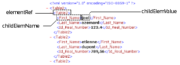

---
id: dom-get-first-child-xml-element
title: DOM Get first child XML element
slug: /commands/dom-get-first-child-xml-element
displayed_sidebar: docs
---

<!--REF #_command_.DOM Get first child XML element.Syntax-->**DOM Get first child XML element** ( *elementRef* : Text {; *childElemName* : Text {; *childElemValue* : any}} ) : Text<!-- END REF-->
<!--REF #_command_.DOM Get first child XML element.Params-->
<div class="no-index">

| Parameter | Type |  | Description |
| --- | --- | --- | --- |
| elementRef | Text | &#8594;  | XML element reference |
| childElemName | Text | &#8592; | Name of child XML element |
| childElemValue | any | &#8592; | Value of child XML element |
| Function result | Text | &#8592; | Child XML element reference |
</div>
<!-- END REF-->

<div class="no-index">
<details><summary>History</summary>

|Release|Changes|
|---|---|
|2004.2|Modified|
|<6|Created|

</details>
</div>

## Description 

<!--REF #_command_.DOM Get first child XML element.Summary-->The DOM Get first child XML element command returns a reference to the first “child” of the XML element passed in *elementRef*.<!-- END REF--> This reference can be used with other XML parsing commands.

The *childElemName* and *childElemValue* parameters, if they are passed, receive respectively the name and the value of the child element. 



## Example 1 

Retrieval of the reference of the first XML element of the parent root. The XML structure (C:\\\\import.xml) is first loaded into a BLOB: 

```4d
 var myBlobVar : Blob
 var $xml_Parent_Ref;$xml_Child_Ref : Text
 
 DOCUMENT TO BLOB("c:\\import.xml";myBlobVar)
 $xml_Parent_Ref:=DOM Parse XML variable(myBlobVar)
 $xml_Child_Ref:=DOM Get first child XML element($xml_Parent_Ref)
```

## Example 2 

Retrieval of the reference, name and value of the first XML element of the parent root. The XML structure (C:\\\\import.xml) is first loaded into a BLOB: 

```4d
 var myBlobVar : Blob
 var $xml_Parent_Ref;$xml_Child_Ref : Text
 var $childName;$childValue : Text
 
 DOCUMENT TO BLOB("c:\\import.xml";myBlobVar)
 $xml_Parent_Ref:=DOM Parse XML variable(myBlobVar)
 $xml_Child_Ref:=DOM Get first child XML element($xml_Parent_Ref;$childName;$childValue)
```

## System variables and sets 

If the command has been correctly executed, the system variable OK is set to 1\. Otherwise, it is set to 0\. 

## See also 

[DOM Get next sibling XML element](../commands/dom-get-next-sibling-xml-element)  

## Properties

|  |  |
| --- | --- |
| Command number | 723 |
| Thread safe | yes |
| Modifies variables | OK |


