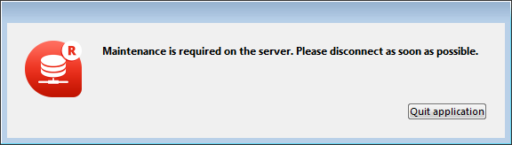

To shut down the server:

1. Choose the **Quit** command from the **File** menu of 4D Server (Windows) or the **4D Server** menu (macOS).

The following dialog box is displayed on the server machine:

2. Enter the number of minutes in which you want the server to shut down, or choose the "Wait for all Users to disconnect" option.

As soon as you do this, no new client can connect to the server.  

The following options are available:  

- **Disconnect from Server in XX min.**

After the specified period of time, the server quits and all users are disconnected, including any clients in sleep mode. The following window appears on the server:

An identical window appears on each remote 4D machine. This window is repeated or updated on each client machine every 20 seconds or so, in order to prompt them to quit. When the time limit is reached, the server quits even if there are client machines still connected.

- **Wait for all clients to disconnect.**

The server will only quit after all clients, including those in sleep mode, have disconnected. This option could be inappropriate for maintenance operations run during lunch time, for instance, since there are likely to be clients in [sleep mode](../ServerWindow/users.md#managing-sleeping-users).

- **Wait for active clients to disconnect. (Ignore sleeping clients)**

The server will only quit after all active clients have disconnected (in other words, all client machines that are not in [sleep mode](../ServerWindow/users.md#managing-sleeping-users)). With this option, any clients in sleep mode are not considered as connected. Use this option if you want to perform maintenance operations during lunch time, for example. When this option is used, any clients in sleep mode will have a connection error when they wake up.

:::note

A *sleeping client* refers to a remote 4D application on a machine that has switched to [sleep mode](../ServerWindow/users.md#managing-sleeping-users) while the connection to the server machine was still active. 

:::

When you choose one of these options, the following window appears, which indicates the number of clients that are still connected:

On each 4D client machine, the following window appears displaying a default message:

If you entered a custom message in the 4D Server shutdown dialog box, it is displayed instead of the default message on each client machine. For example:

- **Disconnect all clients and quit**

The server ends all processes and all connections and quits after a few seconds.

:::note Notes

- In all cases, if no client is connected to the server when the shutting down window is validated, 4D Server quits immediately.
- If you click **Cancel** in the 4D Server shutdown window, the process of shutting down the server is canceled.
- You can close the database (and disconnect the clients) without quitting the 4D Server using the **Close project...** menu command. 

:::