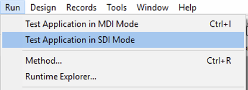

 
You use the Interface page to set various options related to the project interface.

## General

This area lets you set various options concerning display.

### Font to use with the MESSAGE command  

Click **Select...** to set the font and size for the characters used by the `MESSAGE` command.

The default font and its size depend on the platform where 4D is running.

> This property also affects the following parts of 4D: <li>certain preview areas of the Explorer</li><li>the ruler of the Form editor</li>

### Display Windows

Other options configure the display of various windows in the Application mode.

-   **Splash screen**: When this option is deselected, the [splash screen of the current menu bar](Menus/bars.md#splash-screen) does not appear in the Application mode. When you hide this window, it is up to you to manage the display of all your windows by programming, for example in the `On Startup` database method.

-   **Flushing progress**: When this option is checked, 4D displays a window at the bottom left of the screen while the data in the cache is flushed. Since this operation momentarily blocks user actions, displaying this window lets them know that flushing is underway.

:::note

You can set the [frequency for cache flushing](database.md#memory-page) in **Settings** > **Database** > **Memory**.

:::

-   **Printing progress**: Lets you enable or disable the display of the printing progress dialog box when printing.

-   **Use SDI mode on Windows**: When this option checked, 4D enables automatically the [SDI mode (Single-Document Interface)](../Menus/sdi.md) in your application when executed in a [supported context](../Menus/sdi.md#sdi-mode-availability). When you select this option, on Windows the **Run** menu of the 4D menu bar allows you to select the mode in which you want to test the application:

	
	
:::note

This option can be selected on macOS but will be ignored when the application is executed on this platform.

:::

### Appearance  

This menu lets you select the color scheme to use at the main application level. A color scheme defines a global set of interface colors for texts, backgrounds, windows, etc., used in your forms.

> This option only works on macOS. On Windows, the "Light" scheme is always used.

The following schemes are available:

-   **Light**: the application will use the Default Light Theme
    
-   **Dark**: the application will use the Default Dark Theme
    
-   **Inherited** (default): the application will inherit from the higher priority level (i.e., OS user preferences)

> Default themes can be handled using CSS. For more information, please refer to the [Media Queries](../FormEditor/createStylesheet.md#media-queries) section. 

The main application scheme will be applied to forms by default. However, it can be overriden:

-   by the [SET APPLICATION COLOR SCHEME](https://doc.4d.com/4dv19R/help/command/en/page1762.html) command at the working session level;
-   using by the [Color Scheme](../FormEditor/propertiesForm.html#color-scheme) form property at each form level (highest priority level). **Note:** When printed, forms always use the "Light" scheme.

## Shortcuts  

You use the Shortcuts area for viewing and modifying default shortcuts for three basic 4D form operations in your desktop applications. These shortcuts are identical for both platforms. Key icons indicate the corresponding Windows and macOS keys. 

The default shortcuts are as follows:

-   Accept input form: **Enter**
-   Cancel input form: **Esc**
-   Add to subform: **Ctrl+Shift+/** (Windows) or **Command+Shift+/** (macOS)

To change the shortcut of an operation, click the corresponding **Edit** button. The following dialog box appears:

To change the shortcut, type the new key combination on your keyboard and click **OK**. If you prefer not to have a shortcut for an operation, click **Clear**.

