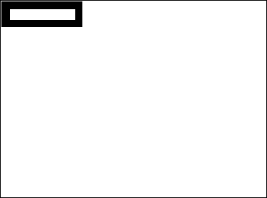

Datenfelder, Variablen oder Ausdrücke vom Typ Bild können in gängigen Windows- oder MacOS-Formaten sein. Dazu gehört jedes Bild, das Sie in die Zwischenablage legen oder mit 4D Befehlen wie `READ PICTURE FILE` von der Festplatte lesen können.

4D verwendet native APIs, um Felder und Variablen vom Typ Bild unter Windows und auf macOS zu codieren (schreiben) bzw. decodieren (lesen). Dies bietet Zugriff auf zahlreiche native Formate, inkl. RAW, dem gängigen Format für Digitalkameras.

* Unter Windows verwendet 4D WIC (Windows Imaging Component).
* Auf MacOS verwendet 4D ImageIO.

Mit WIC und ImageIO lassen sich auch Metadaten in Bildern verwenden. Dafür können Sie die beiden Befehle `SET PICTURE METADATA` und `GET PICTURE METADATA` einsetzen.

## Bild Codec Kennung

4D unterstützt nativ ein breites Spektrum an [Bildformaten](FormEditor/pictures.md#native-formats-supported), wie .jpeg, .png oder .svg.

Der Befehl `PICTURE CODEC LIST` gibt von 4D erkannte Bildformate als Codec ID für Bilder zurück.  Es gibt folgende Formen:

* Als Endung (zum Beispiel “.gif”)
* Als Mime Typ (zum Beispiel “image/jpeg”)

Die vom Befehl zurückgegebene Form richtet sich nach der Art, wie der Codec auf Ebene des Betriebssystems gespeichert ist. Beachten Sie, dass die Liste der verfügbaren Codecs zum Lesen und Schreiben unterschiedlich sein können, da für Codecs zum Codieren u. U. spezifische Lizenzen erforderlich sind.

Die meisten [4D Befehle zur Bildverwaltung](https://doc.4d.com/4Dv18/4D/18/Bilder.201-4504337.de.html) können eine Codec ID als Parameter empfangen. Deshalb muss unbedingt die vom Befehl `PICTURE CODEC LIST` zurückgegebene ID des Systems verwendet werden. Der Befehl `PICTURE CODEC LIST` gibt von 4D erkannte Bildformate zurück.

## Bildoperatoren

| Operation                    | Syntax             | Ergibt | Aktion                                                                                                                                                                |
| ---------------------------- | ------------------ | ------ | --------------------------------------------------------------------------------------------------------------------------------------------------------------------- |
| Horizontal Aneinanderfügen   | Bild1 + Bild2      | Bild   | Fügt Bild2 rechts von Bild1 an                                                                                                                                        |
| Vertikal Aneinanderfügen     | Bild1 / Bild2      | Bild   | Fügt Bild2 unter Bild1 an                                                                                                                                             |
| Exklusives Aufeinandersetzen | Bild1 & Bild2      | Bild   | Setzt Bild2 vor Bild1 (Bild2 ist vorne) Liefert dasselbe Ergebnis wie `COMBINE PICTURES(pict3;pict1;Superimposition;pict2)`                                           |
| Inklusives Aufeinandersetzen | Bild1 &#124; Bild2 | Bild   | Setzt Bild2 auf Bild1 und gibt Ergebnisbild zurück, wenn beide Bilder dieselbe Größe haben. Liefert dasselbe Ergebnis wie `$equal:=Equal pictures(Pict1;Pict2;Pict3)` |
| Horizontal Verschieben       | Bild + Zahl        | Bild   | Verschiebt Bild horizontal um n Pixel                                                                                                                                 |
| Vertikal Verschieben         | Bild / Zahl        | Bild   | Verschiebt Bild vertikal um n Pixel                                                                                                                                   |
| Zoomen                       | Bild * Zahl        | Bild   | Verändert Bildgröße gemäß Faktor n                                                                                                                                    |
| Horizontal Skalieren         | Bild *+ Zahl       | Bild   | Skaliert Bild horizontal gemäß Faktor n                                                                                                                               |
| Vertikal Skalieren           | Bild *&#124; Zahl  | Bild   | Skaliert Bild vertikal gemäß Faktor n                                                                                                                                 |

**Hinweise:**

* Beim Operator | müssen Bild1 und Bild2 exakt dieselben Ausmaße haben. Haben sie unterschiedliche Ausmaße, ergibt die Operation Bild1 | Bild2 ein leeres Bild.
* Mit dem Befehl `COMBINE PICTURES` können Sie Bilder übereinanderlegen und die Merkmale jedes Ausgangsbildes im Ergebnisbild beibehalten.
* Zusätzliche Operationen auf Bilder können Sie mit dem Befehl `TRANSFORM PICTURE` ausführen.
* Es gibt keine Vergleichoperatoren für Bilder. 4D bietet jedoch den Befehl `Equal picture` zum Vergleichen von zwei Bildern.

### Beispiele

Horizontal Aneinanderfügen

```4d
 circle+rectangle //Place the rectangle to the right of the circle
 rectangle+circle //Place the circle to the right of the rectangle
```

 

Vertikal Aneinanderfügen

```4d
 circle/rectangle //Place the rectangle under the circle
 rectangle/circle //Place the circle under the rectangle
```

 

Exklusives Aufeinandersetzen

```4d
Pict3:=Pict1 & Pict2 // Superimposes Pict2 on top of  Pict1
```


Inklusives Aufeinandersetzen

```4d
Pict3:=Pict1|Pict2 // Recovers resulting mask from superimposing two pictures of the same size
```


Horizontal Verschieben

```4d
rectangle+50 //Move the rectangle 50 pixels to the right
rectangle-50 //Move the rectangle 50 pixels to the left
```


Vertikal Verschieben

```4d
rectangle/50 //Move the rectangle down by 50 pixels
rectangle/-20 //Move the rectangle up by 20 pixels
```


Zoomen

```4d
rectangle*1.5 //The rectangle becomes 50% bigger
rectangle*0.5 //The rectangle becomes 50% smaller
```



Horizontal Skalieren

```4d
circle*+3 //The circle becomes 3 times wider
circle*+0.25 //The circle's width becomes a quarter of what it was
```


Vertikal Skalieren

```4d
circle*|2 //The circle becomes twice as tall
circle*|0.25 //The circle's height becomes a quarter of what it was
```


