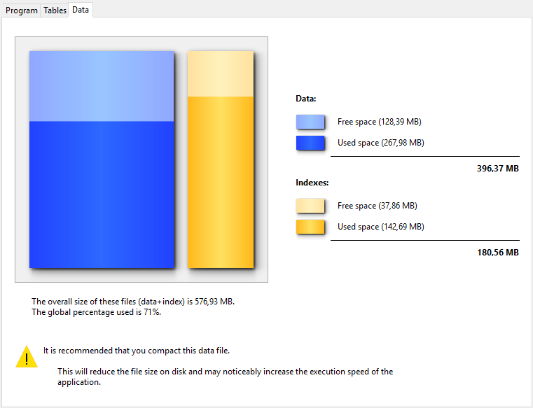

Die Seite “Information” liefert Informationen über die 4D Umgebung und die Systemumgebung, die Dateien der Datenbank und der Anwendung. Über die Registerkarten am oberen Rand können Sie die einzelnen Seiten aufrufen.

## Programm

Der obere Bereich gibt Name, Version und Speicherort des Programms und des aktiven 4D Ordners an. Weitere Informationen dazu finden Sie unter dem Befehl `Get 4D folder` im Handbuch *4D Programmiersprache*.

Der mittlere Bereich gibt Name und Speicherort der Projektdatei und der Datendatei der Datenbank und des Logbuchs (wenn vorhanden) an. Der untere Bereich zeigt den Namen des 4D Lizenzinhabers, die Art der Lizenz, und bei aktivierten Kennwörtern auch den Anwendernamen. Ist das nicht der Fall, erscheint als Anwendername Designer.

- **Display and selection of pathnames**: On the **Program** tab, pathnames are displayed in pop-up menus containing the folder sequence as found on the disk:  
   If you select a menu item (disk or folder), it is displayed in a new system window. Der Eintrag **Pfad kopieren** kopiert den vollständigen Pfadnamen als Text mit den Trennern der aktuellen Plattform in die Zwischenablage.

- **"Licenses" Folder** The **"Licenses" Folder** button displays the contents of the active Licenses folder in a new system window. Alle Lizenzdateien, die in Ihrer 4D Umgebung installiert sind, sind in diesem Ordner auf Ihrer Festplatte zusammengefasst. Beim Öffnen über einen Web Browser erscheinen die Informationen über die enthaltenen Lizenzen und ihre Merkmale. Der Speicherort des Ordners Licenses kann je nach Version Ihres Betriebssystems variieren. Weitere Informationen dazu finden Sie unter dem Befehl `Get 4D folder`. ***Hinweis:** Sie können auf diesen Ordner auch zugreifen, wenn Sie im Menü Hilfe > Lizenz aktualisieren aufrufen.*

## Tabellen

Diese Seite gibt einen Überblick über die Tabellen in Ihrer Anwendung:

> Information auf dieser Seite ist im Standardmodus und im Wartungsmodus verfügbar.

Die Seite listet alle Tabellen der Anwendung - auch die ausgeblendeten - mit den dazugehörigen Merkmalen:

- **ID**: Interne Nummer der Tabelle.
- **Tabellen**: Name der Tabelle Namen von gelöschten Tabellen erscheinen in Klammern (wenn sie noch im Papierkorb sind).
- **Datensätze**: Gesamtanzahl der Datensätze in der Tabelle. Ist ein Datensatz beschädigt oder nicht lesbar, erscheint *Error* anstelle der Zahl. Dann können Sie abwägen, ob Sie die Tools zum Prüfen und Reparieren einsetzen.
- **Felder**: Anzahl der Felder in der Tabelle Ausgeblendete Felder werden mitgezählt, gelöschte Felder dagegen nicht.
- **Indizes**: Anzahl der verschiedenen Indizes in der Tabelle
- **Verschlüsselbar**: Ist dieses Attribut aktiv, wird es für die Tabelle auf der Strukturebene ausgewählt (siehe unter Abschnitt **Verschlüsselbar** im Handbuch 4D Designmodus).
- **Verschlüsselt**: Ist dieses Attribut aktiv, werden die Datensätze der Tabelle in der Datendatei verschlüsselt. **Encrypted**: If checked, the records of the table are encrypted in the data file.
- **Größe der Adresstabelle**: Größe der Adresstabelle für jede Tabelle. In der Adresstabelle wird pro angelegtem Datensatz in der Tabelle intern ein Element gespeichert. Es verbindet Datensätze mit ihrer physikalischen Adresse. Aus Performance Gründen wird sie beim Löschen von Datensätzen nicht angepasst, so dass ihre Größe von der aktuellen Anzahl der Datensätze in der Tabelle abweichen kann. Bei einem deutlichen Unterschied können Sie die Größe der Adresstabelle über die Option "Komprimiere Adresstabelle" optimieren (siehe Seite [Kompakt](compact.md)). ***Hinweis:** Unterschiede zwischen Größe der Adresstabelle und Anzahl der Datensätze kann auch bei einer Störung während dem Leeren des Cache entstehen.*

## Data

Die Seite **Daten** zeigt Informationen über den verfügbaren und den verwendeten Speicherplatz der Datendatei.
> Diese Seite ist im Wartungsmodus nicht verfügbar

Diese Angaben werden grafisch dargestellt:

> Diese Seite berücksichtigt keine Daten, die außerhalb der Datendatei gespeichert sind (siehe "Daten extern speichern").

Zu stark fragmentierte Dateien senken die Performance der Festplatte und somit der Datenbank. Bei zu niedriger Auslastungsrate zeigt 4D ein Icon als gelbes Warndreieck und meldet, dass Komprimieren notwendig ist. Das Icon erscheint in der Schaltfläche Information und in der Registerkarte der entsprechenden Datei:

Das Warndreieck erscheint auch in der Schaltfläche Komprimieren auf der Seite [Kompakt](compact.md): 
