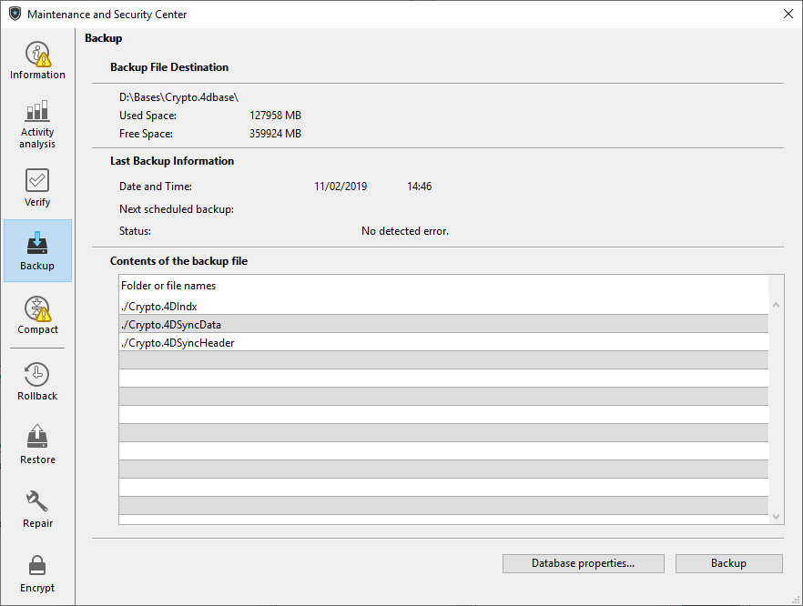

Die Seite Backup des MSC zeigt die Backup-Einstellungen für die Datenbank. Hier können Sie auch ein manuelles Backup starten:

Diese Seite ist in drei Bereiche unterteilt:

- **Backup Zielpfad**: Zeigt Informationen zum Speicherort der Backup-Datei der Anwendung an, sowie den freien bzw. verwendeten Platz auf der Backup-Festplatte.
- **Letztes Backup**: Zeigt Datum und Uhrzeit des zuletzt für die Anwendung ausgeführten Backup (automatisch oder manuell).
- **Inhalt der Backup-Datei**: Zeigt die in der Backup-Datei enthaltenen Dateien und Ordner an.

Mit der Schaltfläche **Backup** starten Sie ein manuelles Backup.

Auf dieser Seite können Sie keine Backup-Parameter verändern. Dazu müssen Sie am unteren Rand auf die Schaltfläche **Datenbank-Eigenschaften** klicken.