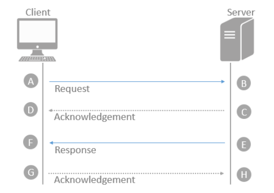

4D applications can generate several log files that are useful for debugging or optimizing their execution. Logs are usually started or stopped using selectors of the [SET DATABASE PARAMETER](https://doc.4d.com/4dv19/help/command/en/page642.html) or [WEB SET OPTION](https://doc.4d.com/4dv19/help/command/en/page1210.html) commands and are stored in the [Logs folder](Project/architecture.md#logs) of the project.

Information logged needs to be analyzed to detect and fix issues. This section provides a comprehensive description of the following log files:

* [4DRequestsLog.txt](#4drequestslogtxt)
* [4DRequestsLog_ProcessInfo.txt](l#4drequestslog_processinfotxt)
* [HTTPDebugLog.txt](#httpdebuglogtxt)
* 4DDebugLog.txt ([standard](#4ddebuglogtxt-standard) & [tabular](#4ddebuglogtxt-tabular))
* [4DDiagnosticLog.txt](#4ddiagnosticlogtxt)
* [4DIMAPLog.txt](#4dsmtplogtxt-4dpop3logtxt-and-4dimaplogtxt)
* [4DPOP3Log.txt](#4dsmtplogtxt-4dpop3logtxt-and-4dimaplogtxt)
* [4DSMTPLog.txt](#4dsmtplogtxt-4dpop3logtxt-and-4dimaplogtxt)
* [ORDA client requests log file](#orda-client-requests)

Note: When a log file can be generated either on 4D Server or on the remote client, the word "Server" is added to the server-side log file name, for example "4DRequestsLogServer.txt"

Log files share some fields so that you can establish a chronology and make connections between entries while debugging:

* `sequence_number`: this number is unique over all debug logs and is incremented for each new entry whatever the log file, so that you can know the exact sequence of the operations.
* `connection_uuid`: for any 4D process created on a 4D client that connects to a server, this connection UUID is logged on both server and client side. It allows you to easily identify the remote client that launched each process.

## 4DRequestsLog.txt

This log file records standard requests carried out by the 4D Server machine or the 4D remote machine that executed the command (excluding Web requests).

How to start this log:

* on the server:

```4d
SET DATABASE PARAMETER(4D Server log recording;1)
//server side
```

* on a client:

```4d
SET DATABASE PARAMETER(Client Log Recording;1)
//remote side
```
> This statement also starts the [4DRequestsLog_ProcessInfo.txt](#4drequestslog_processinfotxt) log file.

#### Headers

This file starts with the following headers:

* Log Session Identifier
* Hostname of the server that hosts the application
* User Login Name: login on the OS of the user that ran the 4D application on the server.

#### Inhalt

For each request, the following fields are logged:

| Field name                                 | Beschreibung                                                                                                                                                                           |
| ------------------------------------------ | -------------------------------------------------------------------------------------------------------------------------------------------------------------------------------------- |
| sequence_number                            | Unique and sequential operation number in the logging session                                                                                                                          |
| time                                       | Date and time using ISO 8601 format: 'YYYY-MM-DDTHH:MM:SS.mmm'                                                                                                                         |
| systemid                                   | System ID                                                                                                                                                                              |
| component                                  | Component signature (e.g., '4SQLS' or 'dbmg')                                                                                                                                          |
| process\_info_                           | index Corresponds to the "index" field in 4DRequestsLog_ProcessInfo.txt log, and permits linking a request to a process.                                                               |
| request                                    | Request ID in C/S or message string for SQL requests or `LOG EVENT` messages                                                                                                           |
| bytes_in                                   | Number of bytes received                                                                                                                                                               |
| bytes_out                                  | Number of bytes sent                                                                                                                                                                   |
| server\_duration &#124; exec\_duration | Depends on where the log is generated:<li>*server\_duration* when generated on the client --Time taken in microseconds for the server to process the request and return a response. B to F in image below, OR</li><li>*exec\_duration* when generated on the server --Time taken in microseconds for the server to process the request. B to E in image below.</li>                                                                                               |
| write\_duration                          | Time taken in microseconds for sending the:<li>Request (when run on the client). A to B in image below.</li><li>Response (when run on the server). E to F in image below.</li>                                                                                          |
| task_kind                                  | Preemptive or cooperative (respectively 'p' or 'c')                                                                                                                                    |
| rtt                                        | Time estimate in microseconds for the client to send the request and the server to acknowledge it. A to D and E to H in image below.<li>Only measured when using the ServerNet network layer, returns 0 when used with the legacy network layer.</li><li>For Windows versions prior to Windows 10 or Windows Server 2016, the call will return 0.</li> |

Request flow:



## 4DRequestsLog_ProcessInfo.txt

This log file records information on each process created on the 4D Server machine or the 4D remote machine that executed the command (excluding Web requests).

How to start this log:

* on the server:

```4d
SET DATABASE PARAMETER(4D Server log recording;1) //server side
```

* on a client:

```4d
SET DATABASE PARAMETER(Client Log Recording;1) //remote side
```
> This statement also starts the [4DRequestsLog.txt](#4drequestslogtxt) log file.

#### Headers

This file starts with the following headers:

* Log Session Identifier
* Hostname of the server that hosts the application
* User Login Name: login on the OS of the user that ran the 4D application on the server.

#### Inhalt

For each process, the following fields are logged:

| Field name                        | Beschreibung                                                   |
| --------------------------------- | -------------------------------------------------------------- |
| sequence_number                   | Unique and sequential operation number in the logging session  |
| time                              | Date and time using ISO 8601 format: "YYYY-MM-DDTHH:MM:SS.mmm" |
| process\_info_index             | Unique and sequential process number                           |
| CDB4DBaseContext                  | DB4D component database context UUID                           |
| systemid                          | System ID                                                      |
| server\_process\_id           | Process ID on Server                                           |
| remote\_process\_id           | Process ID on Client                                           |
| process\_name                   | Process name                                                   |
| cID                               | Identifier of 4D Connection                                    |
| uID                               | Identifier of 4D Client                                        |
| IP Client                         | IPv4/IPv6 address                                              |
| host_name                         | Client hostname                                                |
| user_name                         | User Login Name on client                                      |
| connection\_uuid                | UUID identifier of process connection                          |
| server\_process\_unique\_id | Unique process ID on Server                                    |

## HTTPDebugLog.txt

This log file records each HTTP request and each response in raw mode. Whole requests, including headers, are logged; optionally, body parts can be logged as well.

How to start this log:

```4d
WEB SET OPTION(Web debug log;wdl enable without body)  
//other values are available
```

The following fields are logged for both Request and Response:

| Field name     | Beschreibung                                                  |
| -------------- | ------------------------------------------------------------- |
| SocketID       | ID of socket used for communication                           |
| PeerIP         | IPv4 address of host (client)                                 |
| PeerPort       | Port used by host (client)                                    |
| TimeStamp      | Timestamp in milliseconds (since system startup)              |
| ConnectionID   | Connection UUID (UUID of VTCPSocket used for communication)   |
| SequenceNumber | Unique and sequential operation number in the logging session |

## 4DDebugLog.txt (standard)

This log file records each event occurring at the 4D programming level. Standard mode provides a basic view of events.

How to start this log:

```4d
SET DATABASE PARAMETER(Debug Log Recording;2)  
//standard, all processes

SET DATABASE PARAMETER(Current process debug log recording;2)  
//standard, current process only
```

The following fields are logged for each event:

| Column # | Beschreibung                                                                                                  |
| -------- | ------------------------------------------------------------------------------------------------------------- |
| 1        | Unique and sequential operation number in the logging session                                                 |
| 2        | Date and time in ISO 8601 format (YYYY-MM-DDThh:mm:ss.mmm)                                                    |
| 3        | Process ID (p=xx) and unique process ID (puid=xx)                                                             |
| 4        | Stack level                                                                                                   |
| 5        | Can be Command Name/ Method Name/Message/ Task Start Stop info/Plugin Name, event or Callback/Connection UUID |
| 6        | Time taken for logging operation in milliseconds                                                              |

## 4DDebugLog.txt (tabular)

This log file records each event occurring at the 4D programming level in a tabbed, compact format that includes additional information (compared to the standard format).

How to start this log:

```4d
SET DATABASE PARAMETER(Debug Log Recording;2+4)  
//extended tabbed format, all processes

SET DATABASE PARAMETER(Current process debug log recording;2+4)  
//extended, current process only
```

The following fields are logged for each event:

| Column # | Field name                      | Beschreibung                                                                                                                                                                                                                                                                                                                                                                                                                                                                                                                                                                                                 |
| -------- | ------------------------------- | ------------------------------------------------------------------------------------------------------------------------------------------------------------------------------------------------------------------------------------------------------------------------------------------------------------------------------------------------------------------------------------------------------------------------------------------------------------------------------------------------------------------------------------------------------------------------------------------------------------ |
| 1        | sequence_number                 | Unique and sequential operation number in the logging session                                                                                                                                                                                                                                                                                                                                                                                                                                                                                                                                                |
| 2        | time                            | Date and time in ISO 8601 format (YYYY-MM-DDThh:mm:ss.mmm)                                                                                                                                                                                                                                                                                                                                                                                                                                                                                                                                                   |
| 3        | ProcessID                       | Process ID                                                                                                                                                                                                                                                                                                                                                                                                                                                                                                                                                                                                   |
| 4        | unique_processID                | Unique process ID                                                                                                                                                                                                                                                                                                                                                                                                                                                                                                                                                                                            |
| 5        | stack_level                     | Stack level                                                                                                                                                                                                                                                                                                                                                                                                                                                                                                                                                                                                  |
| 6        | operation_type                  | Log operation type. This value may be an absolute value:<ol><li>Geändert</li><li>Method (project method, database method, etc.)</li><li>Message (sent by [LOG EVENT](https://doc.4d.com/4dv19/help/command/en/page667.html) command only)</li><li>PluginMessage</li><li>PluginEvent</li><li>PluginCommand</li><li>PluginCallback</li><li>Task</li><li>Member method (method attached to a collection or an object)</li></ol>When closing a stack level, the `operation_type`, `operation` and `operation_parameters` columns have the same value as the opening stack level logged in the `stack_opening_sequence_number` column. Beispiel:<ol><li>121  15:16:50:777  5  8  1  2 CallMethod Parameters 0</li><li>122  15:16:50:777  5  8  2  1 283  0</li><li>123  15:16:50:777  5  8  2  1 283  0 122 3</li><li>124  15:16:50:777  5  8  1  2 CallMethod Parameters 0 121 61</li></ol>The 1st and 2nd lines open a stack level, the 3rd and 4th lines close a stack level. Values in the columns 6, 7 and 8 are repeated in the closing stack level line. The column 10 contains the stack level opening sequence numbers, i.e. 122 for the 3rd line and 121 for the 4th. |
| 7        | operation                       | May represent (depending on operation type):<li>a Language Command ID (when type=1)</li><li>a Method Name (when type=2)</li><li>a combination of pluginIndex;pluginCommand (when type=4, 5, 6 or 7). May contain something like '3;2'</li><li>a Task Connection UUID (when type=8)</li>                                                                                                                                                                                                                                                                                                                                                                                                                                                           |
| 8        | operation_parameters            | Parameters passed to commands, methods, or plugins                                                                                                                                                                                                                                                                                                                                                                                                                                                                                                                                                           |
| 9        | form_event                      | Form event if any; empty in other cases (suppose that column is used when code is executed in a form method or object method)                                                                                                                                                                                                                                                                                                                                                                                                                                                                                |
| 10       | stack_opening_sequence_number | Only for the closing stack levels: Sequence number of the corresponding opening stack level                                                                                                                                                                                                                                                                                                                                                                                                                                                                                                                  |
| 11       | stack_level_execution_time    | Only for the closing stack levels: Elapsed time in micro seconds of the current logged action; only for the closing stack levels (see 10th columns in lines 123 and 124 in the log above)                                                                                                                                                                                                                                                                                                                                                                                                                    |

## 4DDiagnosticLog.txt

This log file records many events related to the internal application operation and is human-readable. You can include custom information in this file using the [LOG EVENT](https://doc.4d.com/4dv19/help/command/en/page667.html) command.

How to start this log:

```4d
 SET DATABASE PARAMETER(Diagnostic log recording;1) //start recording
```

The following fields are logged for each event:

| Field Name         | Beschreibung                                                  |
| ------------------ | ------------------------------------------------------------- |
| sequenceNumber     | Unique and sequential operation number in the logging session |
| timestamp          | Date and time in ISO 8601 format (YYYY-MM-DDThh:mm:ss.mmm)    |
| loggerID           | Optional                                                      |
| componentSignature | Optional - internal component signature                       |
| messageLevel       | Info, Warning, Error                                          |
| message            | Description of the log entry                                  |

Depending on the event, various other fields can also be logged, such as task, socket, etc.

## 4DSMTPLog.txt, 4DPOP3Log.txt, and 4DIMAPLog.txt

These log files record each exchange between the 4D application and the mail server (SMTP, POP3, IMAP) that has been initiated by the following commands:

* SMTP - [SMTP New transporter](API/SMTPTransporterClass.md#smtp-new-transporter)
* POP3 - [POP3 New transporter](API/POP3TransporterClass.md#pop3-new-transporter)
* IMAP  - [IMAP New transporter](API/IMAPTransporterClass.md#imap-new-transporter)

The log files can be produced in two versions:

* a regular version:
  * named 4DSMTPLog.txt, 4DPOP3Log.txt, or 4DIMAPLog.txt
  * no attachments
  * uses an automatic circular file recycling each 10 MB
  * intended for usual debugging

 To start this log:

 ```4d
 SET DATABASE PARAMETER(SMTP Log;1) //start SMTP log 
 SET DATABASE PARAMETER(POP3 Log;1) //start POP3 log 
 SET DATABASE PARAMETER(IMAP Log;1) //start IMAP log
 ```

 4D Server: Click on the **Start Request and Debug Logs** button in the [Maintenance Page](https://doc.4d.com/4Dv18R5/4D/18-R5/Maintenance-Page.300-5149308.en.html) of the 4D Server administration window.

   This log path is returned by the `Get 4D file` command.

* an extended version:
  * attachment(s) included no automatic recycling
  * custom name
  * reserved for specific purposes

 To start this log:

 ```4d
 $server:=New object
 ...
 $server:=New object
 ...
 //SMTP
 $server.logFile:="MySMTPAuthLog.txt"
 $transporter:=SMTP New transporter($server)

 // POP3
 $server.logFile:="MyPOP3AuthLog.txt"
 $transporter:=POP3 New transporter($server)

 //IMAP
 $server.logFile:="MyIMAPAuthLog.txt"
 $transporter:=IMAP New transporter($server)
 ```

#### Inhalt

For each request, the following fields are logged:

| Column # | Beschreibung                                                  |
| -------- | ------------------------------------------------------------- |
| 1        | Unique and sequential operation number in the logging session |
| 2        | Date and time in RFC3339 format (yyyy-mm-ddThh:mm:ss.ms)      |
| 3        | 4D Process ID                                                 |
| 4        | Unique process ID                                             |
| 5        | <ul><li>SMTP,POP3, or IMAP session startup information, including server host name, TCP port number used to connect to SMTP,POP3, or IMAP server and TLS status,or</li><li>data exchanged between server and client, starting with "S <" (data received from the SMTP,POP3, or IMAP server) or "C >" (data sent by the SMTP,POP3, or IMAP client): authentication mode list sent by the server and selected authentication mode, any error reported by the SMTP,POP3, or IMAP Server, header information of sent mail (standard version only) and if the mail is saved on the server,or</li><li>SMTP,POP3, or IMAP session closing information.</li></ul>                                    |

## ORDA client requests

This log records each ORDA request sent from a remote machine. You can direct log information to memory or to a file on disk. The name and location of this log file are your choice.

How to start this log:

```4d
//to be executed on a remote machine
ds.startRequestLog(File("/PACKAGE/Logs/ordaLog.txt"))  
//can be also sent to memory
```

If you want to use the unique sequence number in ORDA request log, you need to trigger it:

```4d
//to be executed on a remote machine

SET DATABASE PARAMETER(Client Log Recording;1)  
//to enable log sequence number

ds.startRequestLog(File("/PACKAGE/Logs/ordaLog.txt"))  
//can be also sent to memory

SET DATABASE PARAMETER(Client Log Recording;0)  
//disabling sequence number
```

The following fields are logged for each request:

| Field name     | Beschreibung                                                  | Beispiel                                                |
| -------------- | ------------------------------------------------------------- | ------------------------------------------------------- |
| sequenceNumber | Unique and sequential operation number in the logging session | 104                                                     |
| url            | Client ORDA request URL                                       | "rest/Persons(30001)"                                   |
| startTime      | Starting date and time using ISO 8601 format                  | "2019-05-28T08:25:12.346Z"                              |
| endTime        | Ending date and time using ISO 8601 format                    | "2019-05-28T08:25:12.371Z"                              |
| duration       | Client processing duration (ms)                               | 25                                                      |
| response       | Server response object                                        | {"status":200,"body":{"__entityModel":"Persons",\[...] |
