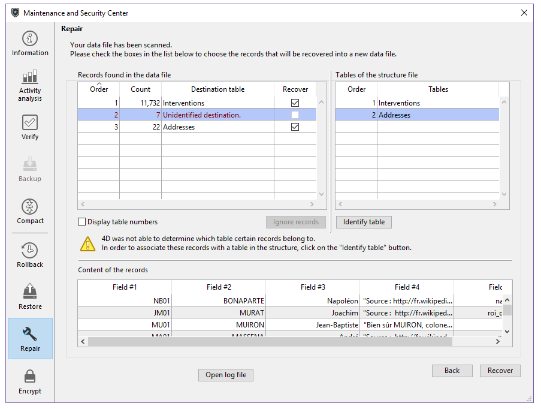

Auf dieser Seite wählen Sie Optionen zum Reparieren der Datendatei bei Beschädigung. Generally, you will only use these functions under the supervision of 4D technical teams, when anomalies have been detected while opening the application or following a [verification](verify.md).

**Warnung:** Die Originaldatei wird bei jedem Repariervorgang dupliziert, was den Anwendungsordner vergrößert. Sie sollten darauf achten (besonders auf macOS, wo 4D Anwendungen als Package erscheinen), dass die Größe der Anwendung nicht exzessiv ansteigt. In diesem Fall ist es hilfreich, die Kopien der Originaldatei im Package manuell zu entfernen, damit die Größe des Package im Rahmen bleibt.
> Reparieren ist nur im Wartungsmodus verfügbar. Versuchen Sie, diese Operation im Standardmodus auszuführen, erhalten Sie die Meldung, dass die Anwendung geschlossen und im Wartungsmodus neu gestartet wird.
> Bei einer verschlüsselten Anwendung enthält das Reparieren auch die Schritte Entschlüsselung und Verschlüsselung. Dazu ist auch der aktuelle Verschlüsselungscode erforderlich. Ist noch kein gültiger Verschlüsselungscode angegeben, erscheint ein Dialogfenster, das die Passphrase oder den Verschlüsselungscode anfordert (siehe Seite Verschlüsseln).

## Datei Überblick

### Datendatei reparieren

Pfadname der aktuellen Datendatei. Über die Schaltfläche ** [...]** können Sie eine andere Datendatei auswählen. Klicken Sie auf diese Schaltfläche, erscheint ein Standard-Öffnen Dialog, um die gewünschte Datendatei zum Reparieren auszuwählen. Bei der [Standard Reparatur](#standard-reparatur) müssen Sie eine Datendatei wählen, die mit der geöffneten Projektdatei kompatibel ist. Bei [Reparieren nach Datensatzheader](#wiederherstellen-nach-datensatzheader) können Sie jede Datendatei wählen. Bestätigen Sie dieses Dialogfenster, erscheint der Pfadname der Datei zum Reparieren im Fenster.

### Ordner Backup der Originaldateien

Standardmäßig wird die Originaldatei vor dem Reparieren dupliziert  und im Unterordner “Replaced files (repairing)” im Anwendungsordner abgelegt. Über die zweite Schaltfläche **[...]** können Sie vor dem Reparieren einen anderen Ort zum Speichern der Originaldateien angeben. Diese Möglichkeit ist insbesondere beim Reparieren umfangreicher Dateien auf verschiedenen Festplatten hilfreich.

### Reparierte Dateien

4D erstellt eine neue leere Datendatei an der Stelle der Originaldatei. Die Originaldatei wird in den Ordner mit Namen "\Ersetzte Dateien (Reparatur) Datum Zeit" geschoben. Seine Position wird im Bereich "Backup der Original Dateien" definiert. Standardmäßig ist der Anwendungsordner angegeben. Die leere Datei wird mit den wiederhergestellten Daten gefüllt.

## Standard Reparatur

Wählen Sie diese Option, wenn nur wenige Datensätze oder Indizes beschädigt sind (Adresstabellen sind intakt). Die Daten werden komprimiert und repariert. Diese Art der Reparatur lässt sich nur ausführen, wenn Datendatei und Strukturdatei zueinander passen.

Ist die Reparatur abgeschlossen, erscheint die Seite "Reparieren" des MSC. Eine Meldung gibt an, ob die Reparatur erfolgreich war. In diesem Fall können Sie die Anwendung sofort öffnen. 

## Wiederherstellen nach Datensatzheader

Verwenden Sie diese Reparatur auf niederer Ebene nur, wenn die Datendatei ernsthaft beschädigt ist und alle anderen Lösungen, wie Wiederherstellen über ein Backup, Standard Reparatur wirkungslos geblieben sind.

4D Datensätze sind unterschiedlich groß. Deshalb muss die Stelle, wo sie auf der Festplatte in einer spezifischen Tabelle, genannt Adresstabelle, gespeichert sind, beibehalten werden, um sie wieder zu finden. Das Programm greift deshalb auf die Adresse des Datensatzes über einen Index und eine Adresstabelle zu. Sind nur Datensätze oder Indizes beschädigt, reicht die Standardreparatur in der Regel aus, um das Problem zu lösen. Ist dagegen die Adresstabelle selbst betroffen, ist ein komplexeres Wiederherstellen erforderlich, da diese Tabelle wiederhergestellt werden muss. Dazu verwendet das MSC die Marker, die im Kopfteil jedes Datensatzes angelegt sind. Sie sind vergleichbar mit einem Inhaltsverzeichnis des Datensatzes, inkl. aller wichtigen Informationen, über die sich die Adresstabelle rekonstruieren lässt.

> Haben Sie in der Datenbankstruktur in den Tabelleneigenschaften die Option **Datensätze definitiv löschen** deaktiviert, können nach dem Wiederherstellen nach Datensatzheader zuvor gelöschte Datensätze wieder erscheinen.
> 
> Wiederherstellen nach Kopfteil berücksichtigt keine Einschränkungen zur Datenintegrität. So erhalten Sie nach Ausführen dieser Operation u. U. doppelte Werte in einmaligen Feldern oder NULL Werte mit Feldern, für die **Nie Null** definiert wurde.

Klicken Sie auf die Schaltfläche **Scannen und Reparieren**, scannt 4D die Datendatei komplett. Ist die Operation abgeschlossen, erscheint folgendes Fenster:

> Ließen sich alle Datensätze und alle Tabellen zuordnen, erscheint nur der Hauptbereich.

Der Bereich "Datensätze in Datendatei gefunden" besteht aus zwei Tabellen mit den Informationen aus dem Scan-Vorgang.

- Die erste Tabelle zeigt die Information aus dem Scannen der Datendatei. Jede Zeile enthält eine Gruppe der wiederherstellbaren Datensätze in der Datendatei:
  - Die Spalte **Reihenfolge** gibt die Reihenfolge der Wiederherstellung für die Gruppe der Datensätze an.
  - Die Spalte **Anzahl** zeigt die Anzahl der Datensätze in der Tabelle.
  - Die Spalte **Zieltabelle** gibt die Namen der Tabellen an, die automatisch den Gruppen der identifizierten Datensätze zugewiesen wurden. Die Namen der dazugehörigen Tabellen erscheinen automatisch in grün. Nicht zugewiesene Gruppen, z.B. Tabellen, die keinen Datensätzen zugeordnet werden konnten, erscheinen in rot.
  - Über die Spalte **Retten** können Sie für jede Gruppe angeben, ob Sie die Datensätze wiederherstellen wollen. Diese Option ist standardmäßig für jede Gruppe mit Datensätzen markiert, die einer Tabelle zugeordnet werden können.

- Die zweite Tabelle zeigt die Tabellen der Projekt-Datei.

### Manuell zuweisen

Ließen sich einige Datensatzgruppen aufgrund einer beschädigten Adresstabelle keinen Tabellen zuweisen, können Sie diese manuell zuweisen. Dazu wählen Sie zuerst im ersten Bereich eine nicht zugewiesene Gruppe aus. Zur leichteren Zuordnung zeigt der untere Bereich "Inhalt der Datensätze" eine Vorschau vom Inhalt der ersten Datensätze:

Als nächstes wählen Sie im rechten Bereich "Nicht-zugewiesene Tabellen" die passende Tabelle für die Gruppe aus und klicken auf die Schaltfläche **Tabelle identifizieren**. Sie können eine Tabelle auch per Drag-and-Drop zuweisen. Die Datensatzgruppe wird dann der Tabelle zugewiesen und in dieser Tabelle wiederhergestellt. Die per Hand zugewiesenen Tabellennamen erscheinen in schwarz. Über die Schaltfläche **Datensätze ignorieren** können Sie die manuell ausgeführte Zuweisung zwischen Tabelle und Datensatzgruppe wieder entfernen.

## Logbuch öffnen

Ist das Komprimieren abgeschlossen, erzeugt 4D ein Logbuch im Ordner Logs des Projekts. Hier können Sie alle ausgeführten Operationen ansehen. Es wird im XML-Format erstellt und lautet: *ApplicationName**_Repair_Log_yyyy-mm-dd hh-mm-ss.xml*":

- *ApplicationName* ist der Name der Projektdatei ohne Endung, zum Beispiel "Rechnungen"
- *yyyy-mm-dd hh-mm-ss* ist der Zeitstempel der Datei. Er basiert auf der lokalen Systemzeit, zur der die Wartungsoperation gestartet wurde, zum Beispiel "2019-02-11 15-20-45".

Klicken Sie auf die Schaltfläche **Logbuch öffnen**, zeigt 4D das neueste Logbuch im standardmäßigen Browser des Rechners an.
