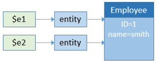
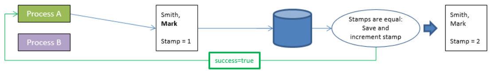
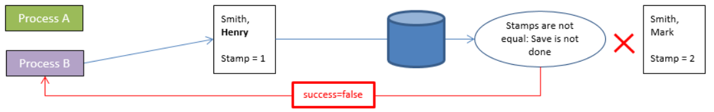
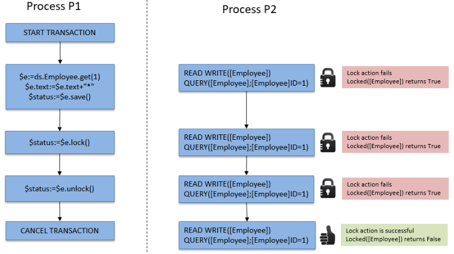

In ORDA, you access data through [entities](dsMapping.md#entity) and [entity selections](dsMapping.md#entity-selection). These objects allow you to create, update, query, or sort the data of the datastore.

## Creating an entity

There are two ways to create a new entity in a dataclass:

* Since entities are references to database records, you can create entities by creating records using the "classic" 4D language and then reference them with ORDA methods such as `entity.next( )` or `entitySelection.first( )`.
* You can also create an entity using the `dataClass.new( )` method.

Keep in mind that the entity is only created in memory. If you want to add it to the datastore, you must call the `entity.save( )` method.

Entity attributes are directly available as properties of the entity object. For more information, please refer to [Using entity attributes](#using-entity-attributes).

For example, we want to create a new entity in the "Employee" dataclass in the current datastore with "John" and "Dupont" assigned to the firstname and name attributes:

```4d
var $myEntity : cs.EmployeeEntity
$myEntity:=ds.Employee.new() //Create a new object of the entity type
$myEntity.name:="Dupont" //assign 'Dupont' to the 'name' attribute
$myEntity.firstname:="John" //assign 'John' to the 'firstname' attribute
$myEntity.save() //save the entity
```
> An entity is defined only in the process where it was created. You cannot, for example, store a reference to an entity in an interprocess variable and use it in another process.

## Entities and references

An entity contains a reference to a 4D record. Different entities can reference the same 4D record. Also, since an entity can be stored in a 4D object variable, different variables can contain a reference to the same entity.

If you execute the following code:

```4d
 var $e1; $e2 : cs.EmployeeEntity
 $e1:=ds.Employee.get(1) //access the employee with ID 1
 $e2:=$e1
 $e1.name:="Hammer"
  //both variables $e1 and $e2 share the reference to the same entity
  //$e2.name contains "Hammer"
```

This is illustrated by the following graphic:


Now if you execute:

```4d
 var $e1; $e2 : cs.EmployeeEntity
 $e1:=ds.Employee.get(1)
 $e2:=ds.Employee.get(1)
 $e1.name:="Hammer"
  //variable $e1 contains a reference to an entity
  //variable $e2 contains another reference to another entity
  //$e2.name contains "smith"
```

This is illustrated by the following graphic:



Note however that entities refer to the same record. In all cases, if you call the `entity.save( )` method, the record will be updated (except in case of conflict, see [Entity locking](#entity-locking)).

In fact, `$e1` and `$e2` are not the entity itself, but a reference to the entity. It means that you can pass them directly to any function or method, and it will act like a pointer, and faster than a 4D pointer. Beispiel:

```4d
 For each($entity;$selection)
    do_Capitalize($entity)
 End for each
```

And the method is:

```4d
 $entity:=$1
 $name:=$entity.lastname
 If(Not($name=Null))
    $name:=Uppercase(Substring($name;1;1))+Lowercase(Substring($name;2))
 End if
 $entity.lastname:=$name
```

You can handle entities like any other object in 4D and pass their references directly as [parameters](Concepts/parameters.md).
> With the entities, there is no concept of "current record" as in the classic 4D language. You can use as many entities as you need, at the same time. There is also no automatic lock on an entity (see [Entity locking](#entity-locking)). When an entity is loaded, it uses the [lazy loading](glossary.md#lazy-loading) mechanism, which means that only the needed information is loaded. Nevertheless, in client/server, the entity can be automatically loaded directly if necessary.

## Using entity attributes

Entity attributes store data and map corresponding fields in the corresponding table. Entity attributes of the storage kind can be set or get as simple properties of the entity object, while entity of the **relatedEntity** or **relatedEntities** kind will return an entity or an entity selection.
> For more information on the attribute kind, please refer to the [Storage and Relation attributes](dsMapping.md#storage-and-relation-attributes) paragraph.

For example, to set a storage attribute:

```4d
 $entity:=ds.Employee.get(1) //get employee attribute with ID 1
 $name:=$entity.lastname //get the employee name, e.g. "Smith"
 $entity.lastname:="Jones" //set the employee name
```
> Pictures attributes cannot be assigned directly with a given path in an entity.

Accessing a related attribute depends on the attribute kind. For example, with the following structure:


You can access data through the related object(s):

```4d
 $entity:=ds.Project.all().first().theClient //get the Company entity associated to the project
 $EntitySel:=ds.Company.all().first().companyProjects //get the selection of projects for the company
```

Note that both *theClient* and *companyProjects* in the above example are primary relation attributes and represent a direct relationship between the two dataclasses. However, relation attributes can also be built upon paths through relationships at several levels, including circular references. For example, consider the following structure:


Each employee can be a manager and can have a manager. To get the manager of the manager of an employee, you can simply write:

```4d
 $myEmp:=ds.Employee.get(50)
 $manLev2:=$myEmp.manager.manager.lastname
```

## Assigning values to relation attributes

In the ORDA architecture, relation attributes directly contain data related to entities:

* An N->1 type relation attribute (**relatedEntity** kind) contains an entity
* A 1->N type relation attribute (**relatedEntities** kind) contains an entity selection

Let's look at the following (simplified) structure:


In this example, an entity in the "Employee" dataclass contains an object of type Entity in the "employer" attribute (or a null value). An entity in the "Company" dataclass contains an object of type EntitySelection in the "staff" attribute (or a null value).
> In ORDA, the Automatic or Manual property of relations has no effect.

To assign a value directly to the "employer" attribute, you must pass an existing entity from the "Company" dataclass. Beispiel:

```4d
 $emp:=ds.Employee.new() // create an employee
 $emp.lastname:="Smith" // assign a value to an attribute
 $emp.employer:=ds.Company.query("name =:1";"4D")[0]  //assign a company entity
 $emp.save()
```

4D provides an additional facility for entering a relation attribute for an N entity related to a "1" entity: you pass the primary key of the "1" entity directly when assigning a value to the relation attribute. For this to work, you pass data of type Number or Text (the primary key value) to the relation attribute. 4D then automatically takes care of searching for the corresponding entity in the dataclass. Beispiel:

```4d
 $emp:=ds.Employee.new()
 $emp.lastname:="Wesson"
 $emp.employer:=2 // assign a primary key to the relation attribute
  //4D looks for the company whose primary key (in this case, its ID) is 2
  //and assigns it to the employee
 $emp.save()
```

This is particularly useful when you are importing large amounts of data from a relational database. This type of import usually contains an "ID" column, which references a primary key that you can then assign directly to a relation attribute.

This also means that you can assign primary keys in the N entities without corresponding entities having already been created in the 1 datastore class. If you assign a primary key that does not exist in the related datastore class, it is nevertheless stored and assigned by 4D as soon as this "1" entity is created.

You can assign or modify the value of a "1" related entity attribute from the "N" dataclass directly through the related attribute. For example, if you want to modify the name attribute of a related Company entity of an Employee entity, you can write:

```code4d
 $emp:=ds.Employee.get(2) // load the Employee entity with primary key 2
 $emp.employer.name:="4D, Inc." //modify the name attribute of the related Company
 $emp.employer.save() //save the related attribute
  //the related entity is updated
```

## Creating an entity selection

You can create an object of type [entity selection](dsMapping.md#entity-selection) as follows:

* Querying the entities [in a dataclass](API/DataClassClass.md#query) or in an [existing entity selection](API/EntitySelectionClass.md#query);
* Using the [`.all()`](API/DataClassClass.md#all) dataclass function to select all the entities in a dataclass;
* Using the `Create entity selection` command or the [`.newSelection()`](API/DataClassClass.md#newselection) dataclass function to create a blank entity selection;
* Using the [`.copy()`](API/EntitySelectionClass.md#copy) function to duplicate an existing entity selection;
* Using one of the various functions from the [Entity selection class](API/EntitySelectionClass.md) that returns a new entity selection, such as [`.or()`](API/EntitySelectionClass.md#or);
* Using a relation attribute of type "related entities" (see below).

You can simultaneously create and use as many different entity selections as you want for a dataclass. Keep in mind that an entity selection only contains references to entities. Different entity selections can contain references to the same entities.

### Shareable or alterable entity selections

An entity selection can be **shareable** (readable by multiple processes, but not alterable after creation) or **alterable** (supports the [`.add()`](API/EntitySelectionClass.md#add) function, but only usable by the current process).

#### Properties

A **shareable** entity selection has the following characteristics:

* it can be stored in a shared object or shared collection, and can be passed as parameter between several processes or workers;
* it can be stored in several shared objects or collections, or in a shared object or collection which already belongs to a group (it does not have a *locking identifier*);
* it does not allow the addition of new entities. Trying to add an entity to a shareable entity selection will trigger an error (1637 - This entity selection cannot be altered). To add an entity to a shareable entity selection, you must first transform it into a non-shareable entity selection using the [`.copy()`](API/EntitySelectionClass.md#copy) function, before calling [`.add()`](API/EntitySelectionClass.md#add).

> Most entity selection functions (such as [`.slice()`](API/EntitySelectionClass.md#slice), [`.and()`](API/EntitySelectionClass.md#and)...) support shareable entity selections since they do not need to alter the original entity selection (they return a new one).

An **alterable** entity selection has the following characteristics:

* it cannot be shared between processes, nor be stored in a shared object or collection. Trying to store a non-shareable entity selection in a shared object or collection will trigger an error (-10721 - Not supported value type in a shared object or shared collection);
* it accepts the addition of new entities, i.e. it is supports the [`.add()`](API/EntitySelectionClass.md#add) function.

#### How are they defined?

The **shareable** or **alterable** nature of an entity selection is defined when the entity selection is created (it cannot be modified afterwards). You can know the nature of an entity selection using the [.isAlterable()](API/EntitySelectionClass.md#isalterable) function or the `OB Is shared` command.

A new entity selection is **shareable** in the following cases:

* the new entity selection results from an ORDA class function applied to a dataClass: [dataClass.all()](API/DataClassClass.md#all), [dataClass.fromCollection()](API/DataClassClass.md#fromcollection), [dataClass.query()](API/DataClassClass.md#query),
* the new entity selection is based upon a relation [entity.*attributeName*](API/EntityClass.md#attributename) (e.g. "company.employees") when *attributeName* is a one-to-many related attribute but the entity does not belong to an entity selection.
* the new entity selection is explicitely copied as shareable with [entitySelection.copy()](API/EntitySelectionClass.md#copy) or `OB Copy` (i.e. with the `ck shared` option).

Beispiel:

```4d
$myComp:=ds.Company.get(2) //$myComp does not belong to an entity selection
$employees:=$myComp.employees //$employees is shareable
```

A new entity selection is **alterable** in the following cases:

* the new entity selection created blank using the [dataClass.newSelection()](API/DataClassClass.md#newselection) function or `Create entity selection` command,
* the new entity selection is explicitely copied as alterable with [entitySelection.copy()](API/EntitySelectionClass.md#copy) or `OB Copy` (i.e. without the `ck shared` option).

Beispiel:

```4d
$toModify:=ds.Company.all().copy() //$toModify is alterable
```

A new entity selection **inherits** from the original entity selection nature in the following cases:

* the new entity selection results from one of the various ORDA class functions applied to an existing entity selection ([.query()](API/EntitySelectionClass.md#query), [.slice()](API/EntitySelectionClass.md#slice), etc.) . .
* the new entity selection is based upon a relation:
  * [entity.*attributeName*](API/EntityClass.md#attributename) (e.g. "company.employees") when *attributeName* is a one-to-many related attribute and the entity belongs to an entity selection (same nature as [.getSelection()](API/EntityClass.md#getselection) entity selection),
  * [entitySelection.*attributeName*](API/EntitySelectionClass.md#attributename) (e.g. "employees.employer") when *attributeName* is a related attribute (same nature as the entity selection),
  * [.extract()](API/EntitySelectionClass.md#extract) when the resulting collection contains entity selections (same nature as the entity selection).

Beispiele:

```4d
$highSal:=ds.Employee.query("salary >= :1"; 1000000)   
 //$highSal is shareable because of the query on dataClass
$comp:=$highSal.employer //$comp is shareable because $highSal is shareable

$lowSal:=ds.Employee.query("salary <= :1"; 10000).copy() 
 //$lowSal is alterable because of the copy()
$comp2:=$lowSal.employer //$comp2 is alterable because $lowSal is alterable
```

#### Sharing an entity selection between processes (example)

You work with two entity selections that you want to pass to a worker process so that it can send mails to appropriate persons:

```4d

var $paid; $unpaid : cs.InvoicesSelection
//We get entity selections for paid and unpaid invoices
$paid:=ds.Invoices.query("status=:1"; "Paid")
$unpaid:=ds.Invoices.query("status=:1"; "Unpaid")

//We pass entity selection references as parameters to the worker
CALL WORKER("mailing"; "sendMails"; $paid; $unpaid)

```

The `sendMails` method:

```4d

 #DECLARE ($paid : cs.InvoicesSelection; $unpaid : cs.InvoicesSelection)
 var $invoice : cs.InvoicesEntity

 var $server; $transporter; $email; $status : Object

  //Prepare emails
 $server:=New object()
 $server.host:="exchange.company.com"
 $server.user:="myName@company.com"
 $server.password:="my!!password"
 $transporter:=SMTP New transporter($server)
 $email:=New object()
 $email.from:="myName@company.com"

  //Loops on entity selections
 For each($invoice;$paid)
    $email.to:=$invoice.customer.address // email address of the customer
    $email.subject:="Payment OK for invoice # "+String($invoice.number)
    $status:=$transporter.send($email)
 End for each

 For each($invoice;$unpaid)
    $email.to:=$invoice.customer.address // email address of the customer
    $email.subject:="Please pay invoice # "+String($invoice.number)
    $status:=$transporter.send($email)
 End for each
```

### Entity selections and Storage attributes

All storage attributes (text, number, boolean, date) are available as properties of entity selections as well as entities. When used in conjunction with an entity selection, a scalar attribute returns a collection of scalar values. Beispiel:

```4d
 $locals:=ds.Person.query("city = :1";"San Jose") //entity selection of people
 $localEmails:=$locals.emailAddress //collection of email addresses (strings)
```

This code returns in *$localEmails* a collection of email addresses as strings.

### Entity selections and Relation attributes

In addition to the variety of ways you can query, you can also use relation attributes as properties of entity selections to return new entity selections. For example, consider the following structure:


```4d
 $myParts:=ds.Part.query("ID < 100") //Return parts with ID less than 100
 $myInvoices:=$myParts.invoiceItems.invoice
  //All invoices with at least one line item related to a part in $myParts
```

The last line will return in $myInvoices an entity selection of all invoices that have at least one invoice item related to a part in the entity selection myParts. When a relation attribute is used as a property of an entity selection, the result is always another entity selection, even if only one entity is returned. When a relation attribute is used as a property of an entity selection, the result is always another entity selection, even if only one entity is returned.

## Entity Locking

You often need to manage possible conflicts that might arise when several users or processes load and attempt to modify the same entities at the same time. Record locking is a methodology used in relational databases to avoid inconsistent updates to data. The concept is to either lock a record upon read so that no other process can update it, or alternatively, to check when saving a record to verify that some other process hasn’t modified it since it was read. The former is referred to as **pessimistic record locking** and it ensures that a modified record can be written at the expense of locking records to other users. The latter is referred to as **optimistic record locking** and it trades the guarantee of write privileges to the record for the flexibility of deciding write privileges only if the record needs to be updated. In pessimistic record locking, the record is locked even if there is no need to update it. In optimistic record locking, the validity of a record’s modification is decided at update time.

ORDA provides you with two entity locking modes:

* an automatic "optimistic" mode, suitable for most applications,
* a "pessimistic" mode allowing you to lock entities prior to their access.

### Automatic optimistic lock

This automatic mechanism is based on the concept of "optimistic locking" which is particularly suited to the issues of web applications. This concept is characterized by the following operating principles:

* All entities can always be loaded in read-write; there is no *a priori* "locking" of entities.
* Each entity has an internal locking stamp that is incremented each time it is saved.
* When a user or process tries to save an entity using the `entity.save( )` method, 4D compares the stamp value of the entity to be saved with that of the entity found in the data (in the case of a modification):
  * When the values match, the entity is saved and the internal stamp value is incremented.
  * When the values do not match, it means that another user has modified this entity in the meantime. The save is not performed and an error is returned.

The following diagram illustrates optimistic locking:

1. Two processes load the same entity.<br/><br/>

2. The first process modifies the entity and validates the change. The `entity.save( )` method is called. The 4D engine automatically compares the internal stamp value of the modified entity with that of the entity stored in the data. Since they match, the entity is saved and its stamp value is incremented.<br/><br/>

3. The second process also modifies the loaded entity and validates its changes. The `entity.save( )` method is called. Since the stamp value of the modified entity does not match the one of the entity stored in the data, the save is not performed and an error is returned.<br/><br/>

This can also be illustrated by the following code:

```4d
 $person1:=ds.Person.get(1) //Reference to entity
 $person2:=ds.Person.get(1) //Other reference to same entity
 $person1.name:="Bill"
 $result:=$person1.save() //$result.success=true, change saved
 $person2.name:="William"
 $result:=$person2.save() //$result.success=false, change not saved
```

In this example, we assign to $person1 a reference to the person entity with a key of 1. Then, we assign another reference of the same entity to variable $person2. Using $person1, we change the first name of the person and save the entity. When we attempt to do the same thing with $person2, 4D checks to make sure the entity on disk is the same as when the reference in $person1 was first assigned. Since it isn't the same, it returns false in the success property and doesn’t save the second modification.

When this situation occurs, you can, for example, reload the entity from the disk using the `entity.reload()` method so that you can try to make the modification again. The `entity.save()` method also proposes an "automerge" option to save the entity in case processes modified attributes that were not the same.

> Record stamps are not used in **transactions** because only a single copy of a record exists in this context. Whatever the number of entities that reference a record, the same copy is modified thus `entity.save()` operations will never generate stamp errors.

### Pessimistic lock

You can lock and unlock entities on demand when accessing data. When an entity is getting locked by a process, it is loaded in read/write in this process but it is locked for all other processes. The entity can only be loaded in read-only mode in these processes; its values cannot be edited or saved.

This feature is based upon two methods of the `Entity` class:

* `entity.lock()`
* `entity.unlock()`

For more information, please refer to the descriptions for these functions.

> Pessimistic locks can also be handled through the [REST API](../REST/$lock.md).

### Concurrent use of 4D classic locks and ORDA pessimistic locks

Using both classic and ORDA commands to lock records is based upon the following principles:

* A lock set with a classic 4D command on a record prevents ORDA to lock the entity matching the record.
* A lock set with ORDA on an entity prevents classic 4D commands to lock the record matching the entity.

These principles are shown in the following diagram:


**Transaction locks** also apply to both classic and ORDA commands. In a multiprocess or a multi-user application, a lock set within a transaction on a record by a classic command will result in preventing any other processes to lock entities related to this record (or conversely), until the transaction is validated or canceled.

* Example with a lock set by a classic command:<br/><br/>
* Example with a lock set by an ORDA method:<br/><br/>

## Client/server optimization

4D provides an automatic optimization for ORDA requests that use entity selections or load entities in client/server configurations. This optimization speeds up the execution of your 4D application by reducing drastically the volume of information transmitted over the network.

The following optimization mechanisms are implemented:

* When a client requests an entity selection from the server, 4D automatically "learns" which attributes of the entity selection are actually used on the client side during the code execution, and builds a corresponding "optimization context". This context is attached to the entity selection and stores the used attributes. It will be dynamically updated if other attributes are used afterwards.

* Subsequent requests sent to the server on the same entity selection automatically reuse the optimization context and only get necessary attributes from the server, which accelerates the processing. For example in an entity selection-based list box, the learning phase takes place during the display of the first rows, next rows display is very optimized.

* An existing optimization context can be passed as a property to another entity selection of the same dataclass, thus bypassing the learning phase and accelerating the application (see [Using the context property](#using-the-context-property) below).

The following methods automatically associate the optimization context of the source entity selection to the returned entity selection:

* `entitySelection.and()`
* `entitySelection.minus()`
* `entitySelection.or()`
* `entitySelection.orderBy()`
* `entitySelection.slice()`
* `entitySelection.drop()`

**Beispiel**

Given the following code:

```4d
 $sel:=$ds.Employee.query("firstname = ab@")
 For each($e;$sel)
    $s:=$e.firstname+" "+$e.lastname+" works for "+$e.employer.name // $e.employer refers to Company table
 End for each
```

Thanks to the optimization, this request will only get data from used attributes (firstname, lastname, employer, employer.name) in *$sel* after a learning phase.

### Using the context property

You can increase the benefits of the optimization by using the **context** property. This property references an optimization context "learned" for an entity selection. It can be passed as parameter to ORDA methods that return new entity selections, so that entity selections directly request used attributes to the server and bypass the learning phase.

A same optimization context property can be passed to unlimited number of entity selections on the same dataclass. All ORDA methods that handle entity selections support the **context** property (for example `dataClass.query( )` or `dataClass.all( )` method). Keep in mind, however, that a context is automatically updated when new attributes are used in other parts of the code. Reusing the same context in different codes could result in overloading the context and then, reduce its efficiency.
> A similar mechanism is implemented for entities that are loaded, so that only used attributes are requested (see the `dataClass.get( )` method).

**Example with `dataClass.query( )` method:**

```4d
 var $sel1; $sel2; $sel3; $sel4; $querysettings; $querysettings2 : Object
 var $data : Collection
 $querysettings:=New object("context";"shortList")
 $querysettings2:=New object("context";"longList")

 $sel1:=ds.Employee.query("lastname = S@";$querysettings)
 $data:=extractData($sel1) // In extractData method an optimization is triggered and associated to context "shortList"

 $sel2:=ds.Employee.query("lastname = Sm@";$querysettings)
 $data:=extractData($sel2) // In extractData method the optimization associated to context "shortList" is applied

 $sel3:=ds.Employee.query("lastname = Smith";$querysettings2)
 $data:=extractDetailedData($sel3) // In extractDetailedData method an optimization is triggered and associated to context "longList"

 $sel4:=ds.Employee.query("lastname = Brown";$querysettings2)
 $data:=extractDetailedData($sel4) // In extractDetailedData method the optimization associated to context "longList" is applied
```

### Entity selection-based list box

Entity selection optimization is automatically applied to entity selection-based list boxes in client/server configurations, when displaying and scrolling a list box content: only the attributes displayed in the list box are requested from the server.

A specific "page mode" context is also provided when loading the current entity through the **Current item** property expression of the list box (see [Collection or entity selection type list boxes](FormObjects/listbox_overview.md#list-box-types)). This feature allows you to not overload the list box initial context in this case, especially if the "page" requests additional attributes. Note that only the use of **Current item** expression will create/use the page context (access through `entitySelection\[index]` will alter the entity selection context).

Subsequent requests to server sent by entity browsing methods will also support this optimization. The following methods automatically associate the optimization context of the source entity to the returned entity:

* `entity.next( )`
* `entity.first( )`
* `entity.last( )`
* `entity.previous( )`

For example, the following code loads the selected entity and allows browsing in the entity selection. Entities are loaded in a separate context and the list box initial context is left untouched:

```4d
 $myEntity:=Form.currentElement //current item expression
  //... do something
 $myEntity:=$myEntity.next() //loads the next entity using the same context
```
