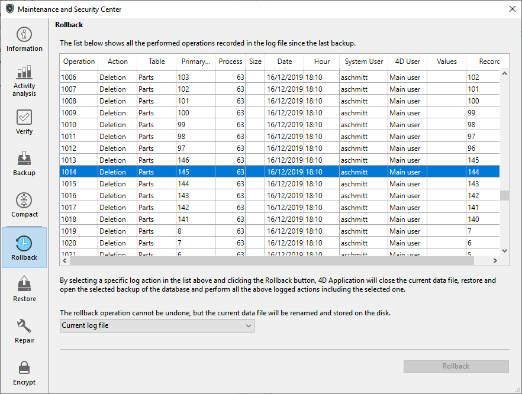

Auf dieser Seite können Sie auf die Funktion Rollback für die im Logbuch ausgeführten Operationen zugreifen. Sie arbeitet ähnlich wie die Operation Rückgängig auf mehreren Ebenen. Das ist besonders hilfreich, wenn ein Datensatz versehentlich in der Anwendung gelöscht wurde.

Diese Funktion ist nur verfügbar, wenn die Anwendung mit einem Logbuch arbeitet.

> Ist die Anwendung verschlüsselt und wird kein gültiger Verschlüsselungscode für das offene Logbuch geliefert, erscheinen verschlüsselte Werte nicht in der Spalte **Werte**. Klicken Sie auf die Schaltfläche **Rollback**, erscheint ein Dialogfenster, das die Passphrase oder den Datenschlüssel anfordert.

Die Liste ist genauso aufgebaut und funktioniert wie auf der Seite [Aktivitätsanalyse](analysis.md).

Um ein Rollback in den Operationen auszuführen, wählen Sie die Zeile, nach der alle Operationen annulliert werden sollen. Die Operation der gewählten Zeile bleibt als letzte erhalten. Wollen Sie z. B. einen Löschvorgang aufheben, wählen Sie die direkt davor liegende Operation. Diese bleibt dann erhalten, alle nachfolgenden Operationen werden annulliert.

Als nächstes klicken Sie auf die Schaltfläche **Rollback**. Auf dem Bildschirm erscheint ein Dialogfenster zum Bestätigen. Klicken Sie auf die Schaltfläche **OK**, werden die Daten exakt in dem Stadium wiederhergestellt, das zum Zeitpunkt der gewählten Operation galt.

Über das PopUp-Menü am unteren Rand wählen Sie das passende Logbuch zum Ausführen der Rollback-Funktion in einer wiederhergestellten Datenbank. In diesem Fall müssen Sie das passende Logbuch der Datei im Archiv angeben.

Rollback funktioniert folgendermaßen: Klickt der Benutzer auf die Schaltfläche **Rollback**, schließt 4D die aktuelle Anwendung und stellt das letzte Backup der Daten der Anwendung wieder her. Die wiederhergestellte Anwendung wird dann geöffnet. 4D integriert die Operationen des Logbuchs bis zur gewählten Operation. Wurde die Anwendung noch nicht gesichert, startet 4D mit einer leeren Datendatei.