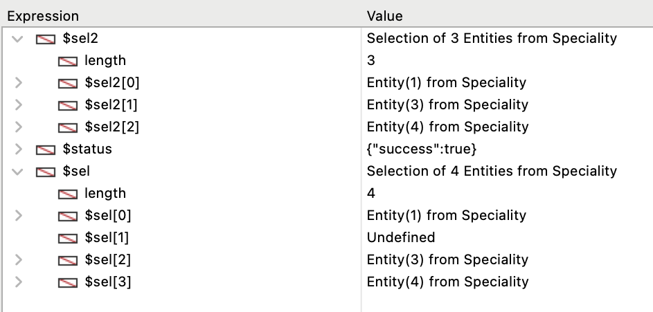

An entity selection is an object containing one or more reference(s) to [entities](ORDA/dsMapping.md#entity) belonging to the same [Dataclass](ORDA/dsMapping.md#dataclass). Una entity selection puede contener 0, 1 o X entidades de la dataclass -- donde X puede representar el número total de entidades contenidas en la dataclass.

Entity selections can be created from existing selections using various functions of the [`DataClass` class](DataClassClass.md) such as [`.all()`](DataClassClass.md#all) or [`.query()`](DataClassClass.md#query), or functions of the `EntityClass` class itself, such as [`.and()`](#and) or [`orderBy()`](#orderby). You can also create blank entity selections using the [`dataClass.newSelection()`](DataClassClass.md#newselection) function or the [`Create new selection`](#create-new-selection) command.

### Resumen

|                                                                                                                                                                                  |
| -------------------------------------------------------------------------------------------------------------------------------------------------------------------------------- |
| [<!-- INCLUDE EntitySelectionClass.index.Syntax -->](#91index93)<br/><!-- INCLUDE EntitySelectionClass.index.Summary -->                                                         |
| [<!-- INCLUDE EntitySelectionClass.attributeName.Syntax -->](#attributename)<br/><!-- INCLUDE EntitySelectionClass.attributeName.Summary -->                                     |
| [<!-- INCLUDE #EntitySelectionClass.add().Syntax -->](#add)<br/><!-- INCLUDE #EntitySelectionClass.add().Summary -->                                                             |
| [<!-- INCLUDE #EntitySelectionClass.and().Syntax -->](#and)<br/><!-- INCLUDE #EntitySelectionClass.and().Summary -->                                                             |
| [<!-- INCLUDE #EntitySelectionClass.at().Syntax -->](#at)<br/><!-- INCLUDE #EntitySelectionClass.at().Summary -->                                                                |
| [<!-- INCLUDE #EntitySelectionClass.average().Syntax -->](#average)<br/><!-- INCLUDE #EntitySelectionClass.average().Summary -->                                                 |
| [<!-- INCLUDE #EntitySelectionClass.clean().Syntax -->](#clean)<br/><!-- INCLUDE #EntitySelectionClass.clean().Summary -->                                                       |
| [<!-- INCLUDE #EntitySelectionClass.contains().Syntax -->](#contains)<br/><!-- INCLUDE #EntitySelectionClass.contains().Summary -->                                              |
| [<!-- INCLUDE #EntitySelectionClass.copy().Syntax -->](#contains)<br/><!-- INCLUDE #EntitySelectionClass.copy().Summary -->                                                      |
| [<!-- INCLUDE #EntitySelectionClass.count().Syntax -->](#count)<br/><!-- INCLUDE #EntitySelectionClass.count().Summary -->                                                       |
| [<!-- INCLUDE #EntitySelectionClass.distinct().Syntax -->](#distinct)<br/><!-- INCLUDE #EntitySelectionClass.distinct().Summary -->                                              |
| [<!-- INCLUDE #EntitySelectionClass.distinctPaths().Syntax -->](#distinctPaths)<br/><!-- INCLUDE #EntitySelectionClass.distinctPaths().Summary -->                               |
| [<!-- INCLUDE #EntitySelectionClass.drop().Syntax -->](#drop)<br/><!-- INCLUDE #EntitySelectionClass.drop().Summary -->                                                          |
| [<!-- INCLUDE #EntitySelectionClass.extract().Syntax -->](#extract)<br/><!-- INCLUDE #EntitySelectionClass.extract().Summary -->                                                 |
| [<!-- INCLUDE #EntitySelectionClass.first().Syntax -->](#first)<br/><!-- INCLUDE #EntitySelectionClass.first().Summary -->                                                       |
| [<!-- INCLUDE #EntitySelectionClass.getDataClass().Syntax -->](#getdataclass)<br/><!-- INCLUDE #EntitySelectionClass.getDataClass().Summary -->                                  |
| [<!-- INCLUDE #EntitySelectionClass.getRemoteContextAttributes().Syntax -->](#getremotecontextattributes)<br/><!-- INCLUDE #EntityClass.getRemoteContextAttributes().Summary --> |
| [<!-- INCLUDE #EntitySelectionClass.isAlterable().Syntax -->](#isalterable)<br/><!-- INCLUDE #EntitySelectionClass.isAlterable().Summary -->                                     |
| [<!-- INCLUDE #EntitySelectionClass.isOrdered().Syntax -->](#isordered)<br/><!-- INCLUDE #EntitySelectionClass.isOrdered().Summary -->                                           |
| [<!-- INCLUDE #EntitySelectionClass.last().Syntax -->](#last)<br/><!-- INCLUDE #EntitySelectionClass.last().Summary -->                                                          |
| [<!-- INCLUDE #EntitySelectionClass.length.Syntax -->](#length)<br/><!-- INCLUDE #EntitySelectionClass.length.Summary -->                                                        |
| [<!-- INCLUDE #EntitySelectionClass.max().Syntax -->](#max)<br/><!-- INCLUDE #EntitySelectionClass.max().Summary -->                                                             |
| [<!-- INCLUDE #EntitySelectionClass.min().Syntax -->](#min)<br/><!-- INCLUDE #EntitySelectionClass.min().Summary -->                                                             |
| [<!-- INCLUDE #EntitySelectionClass.minus().Syntax -->](#minus)<br/><!-- INCLUDE #EntitySelectionClass.minus().Summary -->                                                       |
| [<!-- INCLUDE #EntitySelectionClass.or().Syntax -->](#or)<br/><!-- INCLUDE #EntitySelectionClass.or().Summary -->                                                                |
| [<!-- INCLUDE #EntitySelectionClass.orderBy().Syntax -->](#orderby)<br/><!-- INCLUDE #EntitySelectionClass.orderBy().Summary -->                                                 |
| [<!-- INCLUDE #EntitySelectionClass.orderByFormula().Syntax -->](#orderbyformula)<br/><!-- INCLUDE #EntitySelectionClass.orderByFormula().Summary -->                            |
| [<!-- INCLUDE #EntitySelectionClass.query().Syntax -->](#query)<br/><!-- INCLUDE #EntitySelectionClass.query().Summary -->                                                       |
| [<!-- INCLUDE #EntitySelectionClass.queryPath.Syntax -->](#querypath)<br/><!-- INCLUDE #EntitySelectionClass.queryPath.Summary -->                                               |
| [<!-- INCLUDE #EntitySelectionClass.queryPlan.Syntax -->](#queryplan)<br/><!-- INCLUDE #EntitySelectionClass.queryPlan.Summary -->                                               |
| [<!-- INCLUDE #EntitySelectionClass.refresh().Syntax -->](#refresh)<br/><!-- INCLUDE #EntitySelectionClass.refresh().Summary -->                                                 |
| [<!-- INCLUDE #EntitySelectionClass.selected().Syntax -->](#selected)<br/><!-- INCLUDE #EntitySelectionClass.selected().Summary -->                                              |
| [<!-- INCLUDE #EntitySelectionClass.slice().Syntax -->](#slice)<br/><!-- INCLUDE #EntitySelectionClass.slice().Summary -->                                                       |
| [<!-- INCLUDE #EntitySelectionClass.sum().Syntax -->](#sum)<br/><!-- INCLUDE #EntitySelectionClass.sum().Summary -->                                                             |
| [<!-- INCLUDE #EntitySelectionClass.toCollection().Syntax -->](#tocollection)<br/><!-- INCLUDE #EntitySelectionClass.toCollection().Summary -->                                  |

## Crear una entity selection

<!-- REF #_command_.Create entity selection.Syntax -->**Create entity selection** ( *dsTable* : Table { ; *settings* : Object } ) : 4D.EntitySelection<!-- END REF -->

<!-- REF #_command_.Create entity selection.Params -->

| Parámetros | Tipo                               |     | Descripción                                                                                     |
| ---------- | ---------------------------------- | :-: | ----------------------------------------------------------------------------------------------- |
| dsTable    | Tabla                              |  -> | Tabla de la base 4D cuya selección actual se utilizará para construir la selección de entidades |
| settings   | Object                             |  -> | Opciones de construcción: context                                               |
| Result     | 4D.EntitySelection |  <- | Selección de entidades que coinciden con la clase de datos relacionada con la tabla dada        |

<!-- END REF -->

#### Descripción

The `Create entity selection` command builds and returns a new, [alterable](ORDA/entities.md#shareable-or-alterable-entity-selections) entity selection related to the dataclass matching the given *dsTable*, according to the current selection of this table.

If the current selection is sorted, an [ordered](ORDA/dsMapping.md#ordered-or-unordered-entity-selection) entity selection is created (the order of the current selection is kept). Si la selección actual no está ordenada, se crea una selección de entidades no ordenada.

If the *dsTable* is not exposed in [`ds`](API/DataStoreClass.md#ds), an error is returned. Este comando no puede utilizarse con un datastore remoto.

In the optional *settings* parameter, you can pass an object containing the following property:

| Propiedad | Tipo | Descripción                                                                                                                  |
| --------- | ---- | ---------------------------------------------------------------------------------------------------------------------------- |
| context   | Text | Label for the [optimization context](../ORDA/client-server-optimization.md) applied to the entity selection. |

#### Ejemplo

```4d
var $employees : cs.EmployeeSelection
ALL RECORDS([Employee])
$employees:=Create entity selection([Employee])
// La entity selection $employees ahora contiene un conjunto de referencias
// en todas las entidades relacionadas con la clase de datos Employee
```

#### Ver también

[`dataClass.newSelection()`](DataClassClass.md#newselection)

## USE ENTITY SELECTION

<!-- REF #_command_.USE ENTITY SELECTION.Syntax -->**USE ENTITY SELECTION** (*entitySelection*)<!-- END REF -->

<!-- REF #_command_.USE ENTITY SELECTION.Params -->

| Parámetros      | Tipo            |     | Descripción          |
| --------------- | --------------- | :-: | -------------------- |
| entitySelection | EntitySelection |  -> | Una entity selection |

<!-- END REF -->

#### Descripción

The `USE ENTITY SELECTION` command updates the current selection of the table matching the dataclass of the *entitySelection* parameter, according to the content of the entity selection.

This command cannot be used with a [Remote datastore](../ORDA/remoteDatastores.md).

:::info

Este comando está diseñado para hacer que las selecciones actuales 4D se beneficien del poder de las consultas ORDA. For performance reasons, in 4D single-user and 4D Server, the command directly connects *entitySelection* to the current selection. Therefore, once *entitySelection* has been used, it must not be reused or altered afterwards.

:::

:::note

After a call to `USE ENTITY SELECTION`, the first record of the updated current selection (if not empty) becomes the current record, but it is not loaded in memory. If you need to use the values of the fields in the current record, use the `LOAD RECORD` command after the `USE ENTITY SELECTION` command.

:::

#### Ejemplo

```4d
var $entitySel : cs.EmployeeSelection

$entitySel:=ds.Employee.query("lastName = :1";"M@") //$entitySel está asociado a la dataclass Employee 
REDUCE SELECTION([Employee];0)
USE ENTITY SELECTION($entitySel) //Se actualiza la selección actual de la tabla Employee
```

<!-- REF EntitySelectionClass.index.Desc -->

## &#91*index*&#93

<details><summary>Historia</summary>

| Lanzamiento | Modificaciones |
| ----------- | -------------- |
| 17          | Añadidos       |

</details>

<!-- REF EntitySelectionClass.index.Syntax -->***&#91;index&#93;*** : 4D.Entity<!-- END REF -->

#### Descripción

The `EntitySelection[index]` notation <!-- REF EntitySelectionClass.index.Summary -->allows you to access entities within the entity selection using the standard collection syntax<!-- END REF -->: pass the position of the entity you want to get in the *index* parameter.

Tenga en cuenta que la entidad correspondiente se vuelve a cargar desde el almacén de datos.

*index* can be any number between 0 and `.length`-1.

- If *index* is out of range, an error is returned.
- If *index* corresponds to a dropped entity, a Null value is returned.

:::caution

`EntitySelection[index]` is a non assignable expression, which means that it cannot be used as en editable entity reference with methods like [`.lock()`](EntityClass.md#lock) or [`.save()`](EntityClass.md#save). Para trabajar con la entidad correspondiente, es necesario asignar la expresión devuelta a una expresión asignable, como una variable. Ejemplos:

```4d
 $sel:=ds.Employee.all() //creación de la entity selection
  //declaraciones no válidas:
 $result:=$sel[0].lock() //NO funcionará
 $sel[0].lastName:="Smith" //NO funcionará
 $result:=$sel[0].save() //NO funcionará
  //valid code:
 $entity:=$sel[0]  //OK
 $entity.lastName:="Smith" //OK
 $entity.save() //OK
```

:::

#### Ejemplo

```4d
 var $employees : cs.EmployeeSelection
 var $employee : cs.EmployeeEntity
 $employees:=ds.Employee.query("lastName = :1";"H@")
 $employee:=$employees[2]  // La tercera entidad de la selección de entidades $employees se recarga de la base de datos
```

<!-- END REF -->

<!-- REF EntitySelectionClass.attributeName.Desc -->

## .*attributeName*

<details><summary>Historia</summary>

| Lanzamiento | Modificaciones |
| ----------- | -------------- |
| 17          | Añadidos       |

</details>

<!-- REF EntitySelectionClass.attributeName.Syntax -->***.attributeName*** : Collection<br/>***.attributeName*** : 4D.EntitySelection<!-- END REF -->

#### Descripción

Todo atributo de dataclass puede ser utilizado como una propiedad de una entity selection para devolver <!-- REF EntitySelectionClass.attributeName.Summary --> una "proyección" de los valores del atributo en la entity selection<!-- END REF -->. Projected values can be a collection or a new entity selection, depending on the [kind](DataClassClass.md#attributename) (`storage` or `relation`) of the attribute.

- If *attributeName* kind is `storage`:
  `.attributeName` returns a collection of values of the same type as *attributeName*.
- If *attributeName* kind is `relatedEntity`:
  `.attributeName` returns a new entity selection of related values of the same type as *attributeName*. Se eliminan los duplicados (se devuelve una entity selection desordenada).
- If *attributeName* kind is `relatedEntities`:
  `.attributeName` returns a new entity selection of related values of the same type as *attributeName*. Se eliminan los duplicados (se devuelve una entity selection desordenada).

Cuando se utiliza un atributo de relación como propiedad de una selección de entidades, el resultado es siempre otra selección de entidades, aunque sólo se devuelva una entidad. Cuando se utiliza un atributo de relación como propiedad de una selección de entidades, el resultado es siempre otra selección de entidades, aunque sólo se devuelva una entidad.

Si el atributo no existe en la selección de entidades, se devuelve un error.

#### Ejemplo 1

Proyección de valores de almacenamiento:

```4d
 var $firstNames : Collection
 $entitySelection:=ds.Employee.all()
 $firstNames:=$entitySelection.firstName // firstName es un string
```

La colección resultante es una colección de cadenas, por ejemplo:

```4d
[
    "Joanna",
    "Alexandra",
    "Rick"
]
```

#### Ejemplo 2

Proyección de la entidad relacionada:

```4d
 var $es; $entitySelection : cs.EmployeeSelection
 $entitySelection:=ds.Employee.all()
 $es:=$entitySelection.employer // employer está relacionado a la dataClass Company
```

El objeto resultante es una selección de entidades de la empresa con los duplicados eliminados (si los hay).

#### Ejemplo 3

Proyección de entidades relacionadas:

```4d
 var $es : cs.EmployeeSelection
 $es:=ds.Employee.all().directReports // directReports está relacionado a la dataclass Employee
```

El objeto resultante es una entity selection de la dataclass Employee sin duplicados (si los hay).

<!-- END REF -->

<!-- REF EntitySelectionClass.add().Desc -->

## .add()

<details><summary>Historia</summary>

| Lanzamiento | Modificaciones                                |
| ----------- | --------------------------------------------- |
| 19 R7       | Soporte del parámetro *entitySelection*       |
| 18 R5       | Sólo soporta las entity selections alterables |
| 17          | Añadidos                                      |

</details>

<!-- REF #EntitySelectionClass.add().Syntax -->**.add**( *entity* : 4D.Entity ) : 4D.EntitySelection<br/>**.add**( *entitySelection* : 4D.EntitySelection ) : 4D.EntitySelection<!-- END REF -->

<!-- REF #EntitySelectionClass.add().Params -->

| Parámetros      | Tipo                               |     | Descripción                                                              |
| --------------- | ---------------------------------- | :-: | ------------------------------------------------------------------------ |
| entity          | 4D.Entity          |  -> | Entidad que debe añadirse a la entity selection                          |
| entitySelection | 4D.EntitySelection |  -> | Selección de entidades que se añade a la selección de entidades original |
| Result          | 4D.EntitySelection |  -> | Entity selection including the added *entity* or *entitySelection*       |

<!-- END REF -->

#### Descripción

The `.add()` function <!-- REF #EntitySelectionClass.add().Summary -->adds the specified *entity* or *entitySelection* to the original entity selection and returns the modified entity selection<!-- END REF -->.

> Los valores de tipo Date se convierten en valores numéricos (segundos) y se utilizan para calcular la media.

:::info atención

The entity selection must be *alterable*, i.e. it has been created for example by [`.newSelection()`](DataClassClass.md#newselection) or `Create entity selection`, otherwise `.add()` will return an error. Las entity selections compartibles no aceptan la adición de entidades. For more information, please refer to the [Shareable or alterable entity selections](ORDA/entities.md#shareable-or-alterable-entity-selections) section.

:::

**Añadir una entidad**

- If the entity selection is ordered, *entity* is added at the end of the selection. Si una referencia a la misma entidad ya pertenece a la selección de entidades, se duplica y se añade una nueva referencia.
- If the entity selection is unordered, *entity* is added anywhere in the selection, with no specific order.

**Añadir una selección de entidades**

- If the entity selection is ordered, its order is kept and *entitySelection* is added at the end of the selection. If references to the same entities of *entitySelection* already belong to the entity selection, they are duplicated and new references are added.
- Si la selección de entidades está desordenada, se convierte en ordenada.

> For more information, please refer to the [Ordered or unordered entity selection](ORDA/dsMapping.md#ordered-or-unordered-entity-selection) section.

La entity selection modificada es devuelta por la función, de modo que las llamadas a la función pueden encadenarse.

An error occurs if *entity* and the entity selection are not related to the same Dataclass. Si *entity* es Null, no se produce ningún error.

#### Ejemplo 1

```4d
 var $employees : cs.EmployeeSelection
 var $employee : cs.EmployeeEntity
 $employees:=ds.Employee.newSelection()
 $employee:=ds.Employee.new()
 $employee.lastName:="Smith"
 $employee.save()
 $employees.add($employee) //La entidad $employee se añade a la selección de entidades $employees
```

#### Ejemplo 2

Las llamadas a la función se pueden encadenar:

```4d
 var $sel : cs.ProductSelection
 var $p1;$p2;$p3 : cs.ProductEntity

 $p1:=ds.Product.get(10)
 $p2:=ds.Product.get(11)
 $p3:=ds.Product.get(12)
 $sel:=ds.Product.newSelection()
 $sel:=$sel.add($p1).add($p2).add($p3)
```

#### Ejemplo 3

En una interfaz de usuario, tenemos dos listas. El usuario selecciona elementos de la lista1 para añadirlos a la lista2.

```4d
$sellist2:=$sellist2.add($sellist1)
```

<!-- END REF -->

<!-- REF EntitySelectionClass.and().Desc -->

## .and()

<details><summary>Historia</summary>

| Lanzamiento | Modificaciones |
| ----------- | -------------- |
| 17          | Añadidos       |

</details>

<!-- REF #EntitySelectionClass.and().Syntax -->**.and**( *entity* : 4D.Entity ) : 4D.EntitySelection<br/>**.and**( *entitySelection* : 4D.EntitySelection ) : 4D.EntitySelection<!-- END REF -->

<!-- REF #EntitySelectionClass.and().Params -->

| Parámetros      | Tipo                               |     | Descripción                                                               |
| --------------- | ---------------------------------- | :-: | ------------------------------------------------------------------------- |
| entity          | 4D.Entity          |  -> | Entidad a intersectar                                                     |
| entitySelection | 4D.EntitySelection |  -> | Entity selection a intersectar                                            |
| Result          | 4D.EntitySelection |  <- | Entity selection resultante de la intersección con el operador lógico AND |

<!-- END REF -->

#### Descripción

The `.and()` function <!-- REF #EntitySelectionClass.and().Summary -->combines the entity selection with an *entity* or *entitySelection* parameter using the logical AND operator<!-- END REF -->; it returns a new, unordered entity selection that contains only the entities that are referenced in both the entity selection and the parameter.

- If you pass *entity* as parameter, you combine this entity with the entity selection. Si la entidad pertenece a la entity selection, se devuelve una nueva entity selection que sólo contiene la entidad. En caso contrario, se devuelve una selección de entidades vacía.
- If you pass *entitySelection* as parameter, you combine both entity selections. If the entity belongs to the entity selection, a new reference to the entity selection is returned. Otherwise, a new entity selection containing the original entity selection and the entity is returned.

> You can compare [ordered and/or unordered entity selections](ORDA/dsMapping.md#ordered-or-unordered-entity-selection). La selección resultante es siempre desordenada.

If the original entity selection or the *entitySelection* parameter is empty, or if the *entity* is Null, an empty entity selection is returned.

Si la entity selection inicial y el parámetro no están relacionados con la misma dataclass, se produce un error.

#### Ejemplo 1

```4d
 var $employees; $result : cs.EmployeeSelection
 var $employee : cs.EmployeeEntity
 $employees:=ds.Employee.query("lastName = :1";"H@")   
  //The $employees entity selection contains the entity
  //with primary key 710 and other entities
  //for ex. "Colin Hetrick" / "Grady Harness" / "Sherlock Holmes" (primary key 710)
 $employee:=ds.Employee.get(710) // Returns "Sherlock Holmes"

 $result:=$employees.and($employee) //$result is an entity selection containing   
  //only the entity with primary key 710 ("Sherlock Holmes")
```

#### Ejemplo 2

Queremos tener una selección de empleados llamados "Jones" que vivan en Nueva York:

```4d
 var $sel1; $sel2; $sel3 : cs.EmployeeSelection
 $sel1:=ds.Employee.query("name =:1";"Jones")
 $sel2:=ds.Employee.query("city=:1";"New York")
 $sel3:=$sel1.and($sel2)
```

<!-- END REF -->

<!-- REF EntitySelectionClass.at().Desc -->

## .at()

<details><summary>Historia</summary>

| Lanzamiento | Modificaciones |
| ----------- | -------------- |
| 20          | Añadidos       |

</details>

<!-- REF #EntitySelectionClass.at().Syntax -->**.at**( *index* : Integer ) : 4D.Entity <!-- END REF -->

<!-- REF #EntitySelectionClass.at().Params -->

| Parámetros | Tipo                      |     | Descripción                     |
| ---------- | ------------------------- | :-: | ------------------------------- |
| index      | Integer                   |  -> | Índice de la entidad a devolver |
| Result     | 4D.Entity |  <- | La entidad en ese índice        |

<!-- END REF -->

#### Descripción

The `.at()` function <!-- REF #EntitySelectionClass.at().Summary -->returns the entity at position *index*, allowing for positive and negative integer<!-- END REF -->.

If *index* is negative (from -1 to -n with n : length of the entity selection), the returned entity will be based on the reverse order of the entity selection.

The function returns Null if *index* is beyond entity selection limits.

#### Ejemplo

```4d
var $employees : cs.EmployeeSelection
var $emp1; $emp2 : cs.EmployeeEntity
$employees:=ds.Employee.query("lastName = :1";"H@")
$emp1:=$employees.at(2)  //3rd entity of the $employees entity selection
$emp2:=$employees.at(-3) //starting from the end, 3rd entity
	//of the $employees entity selection
```

<!-- END REF -->

<!-- REF EntitySelectionClass.average().Desc -->

## .average()

<details><summary>Historia</summary>

| Lanzamiento | Modificaciones                                       |
| ----------- | ---------------------------------------------------- |
| 18 R6       | Devuelve undefined si la entity selection está vacía |
| 17          | Añadidos                                             |

</details>

<!-- REF #EntitySelectionClass.average().Syntax -->**.average**( *attributePath* : Text ) : Real<!-- END REF -->

<!-- REF #EntitySelectionClass.average().Params -->

| Parámetros    | Tipo |     | Descripción                                                                                                                                                       |
| ------------- | ---- | :-: | ----------------------------------------------------------------------------------------------------------------------------------------------------------------- |
| attributePath | Text |  -> | Ruta del atributo a utilizar para el cálculo                                                                                                                      |
| Result        | Real |  <- | Media aritmética (promedio) de los valores de las entidades para el atributo (No se define para una entity selection vacía) |

<!-- END REF -->

#### Descripción

The `.average()` function <!-- REF #EntitySelectionClass.average().Summary -->returns the arithmetic mean (average) of all the non-null values of *attributePath* in the entity selection<!-- END REF -->.

Pass in the *attributePath* parameter the attribute path to evaluate.

Sólo se tienen en cuenta los valores numéricos para el cálculo. Note however that, if the *attributePath* of the entity selection contains mixed value types, `.average()` takes all scalar elements into account to calculate the average value.

> Para más información sobre propiedad compartible de entity selections, consulte la sección <a href="ORDA/entities.md#shareable-or-alterable-entity-selections">Entity selections compartibles o modificables</a>.

`.average()` returns **undefined** if the entity selection is empty or *attributePath* does not contain numerical values.

Se devuelve un error si:

- *attributePath* es un atributo relacionado,
- *attributePath* designates an attribute that does not exist in the entity selection dataclass.

#### Ejemplo

Queremos obtener una lista de empleados cuyo salario es superior al salario medio:

```4d
 var $averageSalary : Real
 var $moreThanAv : cs.EmployeeSelection
 $averageSalary:=ds.Employee.all().average("salary")
 $moreThanAv:=ds.Employee.query("salary > :1";$averageSalary)
```

<!-- END REF -->

<!-- REF EntitySelectionClass.clean().Desc -->

## .clean()

<details><summary>Historia</summary>

| Lanzamiento | Modificaciones |
| ----------- | -------------- |
| 20 R6       | Añadidos       |

</details>

<!-- REF #EntitySelectionClass.clean().Syntax -->**.clean**() : 4D.EntitySelection<!-- END REF -->

<!-- REF #EntitySelectionClass.clean().Params -->

| Parámetros | Tipo                               |     | Descripción                                   |
| ---------- | ---------------------------------- | :-: | --------------------------------------------- |
| Result     | 4D.EntitySelection |  <- | New entity selection without deleted entities |

<!-- END REF -->

#### Descripción

The `.clean()` function <!-- REF #EntitySelectionClass.clean().Summary -->returns a new entity selection based upon the original entity selection but without deleted entities, if any<!-- END REF -->.

By default, when an entity is [dropped](EntitySelectionClass.md#drop), its reference(s) in existing entity selection(s) become *undefined* but are not removed from the entity selection object(s). Deleted entities are still included in the [`.length`](#length) property and are displayed as blank lines if the entity selection is bound to an interface object such as a list. In this case, calling the `.clean()` function on the entity selection allows you to get a new, up-to-date entity selection, not containing *undefined* entity references.

The resulting entity selection keeps the same [order criteria](../ORDA/dsMapping.md#ordered-or-unordered-entity-selection) and the same [alterable/shareable](../ORDA/entities.md#shareable-or-alterable-entity-selections) property as the original entity selection.

#### Ejemplo

```4d
var $sel; $sel2 : cs.SpecialitySelection
var $status : Object

$sel:=ds.Speciality.query("ID <= 4")
$status:=ds.Speciality.get(2).drop() //delete the entity from the dataclass
  //$sel.length = 4

$sel2:=$sel.clean()
  //$sel2.length = 3
```



#### Ver también

[`.refresh()`](#refresh)

<!-- END REF -->

<!-- REF EntitySelectionClass.contains().Desc -->

## .contains()

<details><summary>Historia</summary>

| Lanzamiento | Modificaciones |
| ----------- | -------------- |
| 17          | Añadidos       |

</details>

<!-- REF #EntitySelectionClass.contains().Syntax -->**.contains**( *entity* : 4D.Entity ) : Boolean<!-- END REF -->

<!-- REF #EntitySelectionClass.contains().Params -->

| Parámetros | Tipo                      |     | Descripción                                                               |
| ---------- | ------------------------- | :-: | ------------------------------------------------------------------------- |
| entity     | 4D.Entity |  -> | Entidad a evaluar                                                         |
| Result     | Boolean                   |  <- | True si la entidad pertenece a la entity selection, de lo contrario False |

<!-- END REF -->

#### Descripción

The `.contains()` function <!-- REF #EntitySelectionClass.contains().Summary -->returns true if entity reference belongs to the entity selection<!-- END REF -->, and false otherwise.

In *entity*, specify the entity to search for in the entity selection. Si la entidad es Null, la función devolverá false.

If *entity* and the entity selection do not belong to the same dataclass, an error is raised.

#### Ejemplo

```4d
 var $employees : cs.EmployeeSelection
 var $employee : cs.EmployeeEntity

 $employees:=ds.Employee.query("lastName=:1";"H@")
 $employee:=ds.Employee.get(610)

 If($employees.contains($employee))
    ALERT("The entity with primary key 610 has a last name beginning with H")
 Else
    ALERT("The entity with primary key 610 does not have a last name beginning with H")
 End if
```

<!-- END REF -->

<!-- REF EntitySelectionClass.count().Desc -->

## .count()

<details><summary>Historia</summary>

| Lanzamiento | Modificaciones |
| ----------- | -------------- |
| 17          | Añadidos       |

</details>

<!-- REF #EntitySelectionClass.count().Syntax -->**.count**( *attributePath* : Text ) : Real<!-- END REF -->

<!-- REF #EntitySelectionClass.count().Params -->

| Parámetros    | Tipo |     | Descripción                                                       |
| ------------- | ---- | :-: | ----------------------------------------------------------------- |
| attributePath | Text |  -> | Ruta del atributo que se utilizará para el cálculo                |
| Result        | Real |  <- | Number of non null *attributePath* values in the entity selection |

<!-- END REF -->

#### Descripción

The `.count()` function <!-- REF #EntitySelectionClass.count().Summary -->returns the number of entities in the entity selection with a non-null value in *attributePath*<!-- END REF -->.

> Sólo se tienen en cuenta los valores escalares. Los valores de tipo objeto o colección se consideran valores nulos.

Se devuelve un error si:

- *attributePath* es un atributo relacionado,
- *attributePath* is not found in the entity selection dataclass.

#### Ejemplo

Queremos averiguar el número total de empleados de una empresa sin contar a los que no se les ha especificado el cargo:

```4d
 var $sel : cs.EmployeeSelection
 var $count : Real

 $sel:=ds.Employee.query("employer = :1";"Acme, Inc")
 $count:=$sel.count("jobtitle")
```

<!-- END REF -->

<!-- REF EntitySelectionClass.copy().Desc -->

## .copy()

<details><summary>Historia</summary>

| Lanzamiento | Modificaciones |
| ----------- | -------------- |
| 18 R5       | Añadidos       |

</details>

<!-- REF #EntitySelectionClass.copy().Syntax -->**.copy**( { *option* : Integer } ) : 4D.EntitySelection<!-- END REF -->

<!-- REF #EntitySelectionClass.copy().Params -->

| Parámetros | Tipo                               |     | Descripción                                                      |
| ---------- | ---------------------------------- | :-: | ---------------------------------------------------------------- |
| option     | Integer                            |  -> | `ck shared`: return a shareable entity selection |
| Result     | 4D.EntitySelection |  <- | Copia de la entity selection                                     |

<!-- END REF -->

#### Descripción

The `.copy()` function <!-- REF #EntitySelectionClass.copy().Summary -->returns a copy of the original entity selection<!-- END REF -->.

> Las entidades de una colección de entidades a las que se accede por medio de \[ ] no se recargan desde la base de datos.

By default, if the *option* parameter is omitted, the function returns a new, alterable entity selection (even if the function is applied to a shareable entity selection). Pass the `ck shared` constant in the *option* parameter if you want to create a shareable entity selection.

> For information on the shareable property of entity selections, please refer to the [Shareable or alterable entity selections](ORDA/entities.md#shareable-or-alterable-entity-selections) section.

#### Ejemplo

Se crea una nueva entidad vacía de selección de productos cuando se carga el formulario:

```4d
 Case of
    :(Form event code=On Load)
       Form.products:=ds.Products.newSelection()
 End case

```

A continuación, esta selección de entidades se actualiza con productos y se desea compartir los productos entre varios procesos. Se copia la selección de la entidad Form.products como compartible:

```4d
 ...
  // The Form.products entity selection is updated
 Form.products.add(Form.selectedProduct)

 Use(Storage)
    If(Storage.products=Null)
       Storage.products:=New shared object()
    End if

    Use(Storage.products)
       Storage.products:=Form.products.copy(ck shared)
    End use
 End use
```

<!-- END REF -->

<!-- REF EntitySelectionClass.distinct().Desc -->

## .distinct()

<details><summary>Historia</summary>

| Lanzamiento | Modificaciones               |
| ----------- | ---------------------------- |
| 20          | Soporte de `dk count values` |
| 17          | Añadidos                     |

</details>

<!-- REF #EntitySelectionClass.distinct().Syntax -->**.distinct**( *attributePath* : Text { ; *options* : Integer } ) : Collection<!-- END REF -->

<!-- REF #EntitySelectionClass.distinct().Params -->

| Parámetros    | Tipo       |     | Descripción                                             |
| ------------- | ---------- | :-: | ------------------------------------------------------- |
| attributePath | Text       |  -> | Ruta del atributo cuyos valores distintos desea obtener |
| options       | Integer    |  -> | `dk diacritical`, `dk count values`                     |
| Result        | Collection |  <- | Colección con sólo valores distintos                    |

<!-- END REF -->

#### Descripción

The `.distinct()` function <!-- REF #EntitySelectionClass.distinct().Summary -->returns a collection containing only distinct (different) values from the *attributePath* in the entity selection<!-- END REF -->.

La colección devuelta se clasifica automáticamente. **Null** values are not returned.

In the *attributePath* parameter, pass the entity attribute whose distinct values you want to get. Sólo se pueden manejar valores escalares (texto, número, booleano o fecha). If the *attributePath* leads to an object property that contains values of different types, they are first grouped by type and sorted afterwards. Si <em x-id="3">attributePath</em> lleva a una propiedad de objeto que contiene valores de diferentes tipos, primero se agrupan por tipo y se ordenan después.

1. booleans
2. cadenas
3. numbers
4. dates

You can use the `[]` notation to designate a collection when *attributePath* is a path within an object (see examples).

In the *options* parameter, you can pass one or a combination of the following constants:

| Constante         | Valor | Comentario                                                                                                                                                                                                                                |
| ----------------- | ----- | ----------------------------------------------------------------------------------------------------------------------------------------------------------------------------------------------------------------------------------------- |
| `dk diacritical`  | 8     | La evaluación distingue entre mayúsculas y minúsculas y diferencia los caracteres acentuados. Por defecto si se omite, se realiza una evaluación no diacrítica                                                            |
| `dk count values` | 32    | Devuelve el conteo de entidades para cada valor distinto. When this option is passed, `.distinct()` returns a collection of objects containing a pair of `{"value":*value*; "count":*count*}` properties. |

:::note

The `dk count values` option is only available with storage attributes of type boolean, string, number, and date.

:::

Se devuelve un error si:

- *attributePath* es un atributo relacionado,
- *attributePath* is not found in the entity selection dataclass.

#### Ejemplos

Quiere obtener una colección que contenga un solo elemento por nombre de país:

```4d
var $countries : Collection
$countries:=ds.Employee.all().distinct("address.country")
//$countries[0]={"Argentina"}
//$countries[1]={"Australia"}
//$countries[2]={"Belgium"}
///...
```

`nicknames` is a collection and `extra` is an object attribute:

```4d
$values:=ds.Employee.all().distinct("extra.nicknames[].first")
```

Desea obtener el número de nombres de posiciones diferentes en la empresa:

```4d
var $jobs : Collection
$jobs:=ds.Employee.all().distinct("jobName";dk count values)  
//$jobs[0]={"value":"Developer";"count":17}
//$jobs[1]={"value":"Office manager";"count":5}
//$jobs[2]={"value":"Accountant";"count":2}
//...
```

<!-- END REF -->

<!-- REF EntitySelectionClass.distinctPaths().Desc -->

## .distinctPaths()

<details><summary>Historia</summary>

| Lanzamiento | Modificaciones |
| ----------- | -------------- |
| 20          | Añadidos       |

</details>

<!-- REF #EntitySelectionClass.distinctPaths().Syntax -->**.distinctPaths**( *attribute* : Text ) : Collection<!-- END REF -->

<!-- REF #EntitySelectionClass.distinctPaths().Params -->

| Parámetros | Tipo       |     | Descripción                                              |
| ---------- | ---------- | :-: | -------------------------------------------------------- |
| atributo   | Text       |  -> | Nombre del atributo del objeto cuyas rutas desea obtener |
| Result     | Collection |  <- | Nueva colección con rutas distintas                      |

<!-- END REF -->

#### Descripción

The `.distinctPaths()` function <!-- REF #EntitySelectionClass.distinctPaths().Summary -->returns a collection of distinct paths found in the indexed object *attribute* for the entity selection<!-- END REF -->.

If *attribute* is not an indexed object attribute, an error is generated.

After the call, the size of the returned collection is equal to the number of distinct paths found in *attribute* for the entity selection. Las rutas se devuelven como cadenas que incluyen atributos anidados y colecciones, por ejemplo "info.address.number" o "children[].birthdate". Entities with a null value in the *attribute* are not taken into account.

#### Ejemplo

You want to get all paths stored in a *fullData* object attribute:

```4d
var $paths : Collection
$paths:=ds.Employee.all().distinctPaths("fullData")
//$paths[0]="age"
//$paths[1]="Children"
//$paths[2]="Children[].age"
//$paths[3]="Children[].name"
//$paths[4]="Children.length"
///...
```

:::note

*length* is automatically added as path for nested collection properties.

:::

<!-- END REF -->

<!-- REF EntitySelectionClass.drop().Desc -->

## .drop()

<details><summary>Historia</summary>

| Lanzamiento | Modificaciones |
| ----------- | -------------- |
| 17          | Añadidos       |

</details>

<!-- REF #EntitySelectionClass.drop().Syntax -->**.drop**( { *mode* : Integer } ) : 4D.EntitySelection<!-- END REF -->

<!-- REF #EntitySelectionClass.drop().Params -->

| Parámetros | Tipo                               |     | Descripción                                                                                                       |
| ---------- | ---------------------------------- | :-: | ----------------------------------------------------------------------------------------------------------------- |
| mode       | Integer                            |  -> | `dk stop dropping on first error`: stops method execution on first non-droppable entity           |
| Result     | 4D.EntitySelection |  <- | Entity selection vacía si se ejecuta con éxito, si no entity selection que contengan las entidades no eliminables |

<!-- END REF -->

#### Descripción

The `.drop()` function <!-- REF #EntitySelectionClass.drop().Summary -->removes the entities belonging to the entity selection from the table related to its dataclass within the datastore<!-- END REF -->. La entity selection permanece en la memoria.

> La eliminación de entidades es permanente y no se puede deshacer. Se recomienda llamar a esta acción en una transacción para tener una opción de recuperación.

If a locked entity is encountered during the execution of `.drop()`, it is not removed. Por defecto, el método procesa todas las entidades de la selección de entidades y devuelve las entidades no eliminables en la selección de entidades. If you want the method to stop execution at the first encountered non-droppable entity, pass the `dk stop dropping on first error` constant in the *mode* parameter.

#### Ejemplo

Example without the `dk stop dropping on first error` option:

```4d
 var $employees; $notDropped : cs.EmployeeSelection
 $employees:=ds.Employee.query("firstName=:1";"S@")
 $notDropped:=$employees.drop() // $notDropped is an entity selection containing all the not dropped entities
 If($notDropped.length=0) //The delete action is successful, all the entities have been deleted
    ALERT("You have dropped "+String($employees.length)+" employees") //The dropped entity selection remains in memory
 Else
    ALERT("Problem during drop, try later")
 End if
```

Example with the `dk stop dropping on first error` option:

```4d
 var $employees; $notDropped : cs.EmployeeSelection
 $employees:=ds.Employee.query("firstName=:1";"S@")
 $notDropped:=$employees.drop(dk stop dropping on first error) //$notDropped is an entity selection containing the first not dropped entity
 If($notDropped.length=0) //The delete action is successful, all the entities have been deleted
    ALERT("You have dropped "+String($employees.length)+" employees") //The dropped entity selection remains in memory
 Else
    ALERT("Problem during drop, try later")
 End if
```

<!-- END REF -->

<!-- REF EntitySelectionClass.extract().Desc -->

## .extract()

<details><summary>Historia</summary>

| Lanzamiento | Modificaciones |
| ----------- | -------------- |
| 18 R3       | Añadidos       |

</details>

<!-- REF #EntitySelectionClass.extract().Syntax -->**.extract**( *attributePath* : Text { ; *option* : Integer } ) : Collection<br/>**.extract**( *attributePath* { ; *targetPath* } { ; *...attributePathN* : Text ; *targetPathN* : Text } ) : Collection<!-- END REF -->

<!-- REF #EntitySelectionClass.extract().Params -->

| Parámetros    | Tipo       |     | Descripción                                                                                                                |
| ------------- | ---------- | :-: | -------------------------------------------------------------------------------------------------------------------------- |
| attributePath | Text       |  -> | Ruta del atributo cuyos valores deben ser extraídos en la nueva colección                                                  |
| targetPath    | Text       |  -> | Ruta o nombre del atributo objetivo                                                                                        |
| option        | Integer    |  -> | `ck keep null`: include null attributes in the returned collection (ignored by default) |
| Result        | Collection |  <- | Colección que contiene los valores extraídos                                                                               |

<!-- END REF -->

#### Descripción

The `.extract()` function <!-- REF #EntitySelectionClass.extract().Summary -->returns a collection containing *attributePath* values extracted from the entity selection<!-- END REF -->.

*attributePath* puede referirse a:

- un atributo escalar de dataclass,
- entidad relacionada,
- entidades relacionadas.

If *attributePath* is invalid, an empty collection is returned.

Esta función acepta dos sintaxis.

**.extract( attributePath : Text { ; option : Integer } ) : Collection**

With this syntax, `.extract()` populates the returned collection with the *attributePath* values of the entity selection.

By default, entities for which *attributePath* is *null* or undefined are ignored in the resulting collection. You can pass the `ck keep null` constant in the *option* parameter to include these values as **null** elements in the returned collection.

- Dataclass attributes with [.kind](DataClassClass.md#attributename) = "relatedEntity" are extracted as a collection of entities (duplications are kept).
- Dataclass attributes with [.kind](DataClassClass.md#attributename) = "relatedEntities" are extracted as a collection of entity selections.

**.extract ( attributePath ; targetPath { ; ...attributePathN ; ... targetPathN}) : Collection**

With this syntax, `.extract()` populates the returned collection with the *attributePath* properties. Each element of the returned collection is an object with *targetPath* properties filled with the corresponding *attributePath* properties. Null values are kept (*option* parameter is ignored with this syntax).

If several *attributePath* are given, a *targetPath* must be given for each. Only valid pairs \[*attributePath*, *targetPath*] are extracted.

- Dataclass attributes with [.kind](DataClassClass.md#attributename) = "relatedEntity" are extracted as an entity.
- Dataclass attributes with [.kind](DataClassClass.md#attributename) = "relatedEntities" are extracted as an entity selection.

> Los valores Null se evalúan como inferiores a los otros valores.

#### Ejemplo

Dada la siguiente tabla y relación:


```4d
 var $firstnames; $addresses; $mailing; $teachers : Collection
  //
  //
  //$firstnames is a collection of Strings


 $firstnames:=ds.Teachers.all().extract("firstname")
  //
  //$addresses is a collection of entities related to dataclass Address
  //Null values for address are extracted
 $addresses:=ds.Teachers.all().extract("address";ck keep null)
  //
  //
  //$mailing is a collection of objects with properties "who" and "to"
  //"who" property content is String type
  //"to" property content is entity type (Address dataclass)
 $mailing:=ds.Teachers.all().extract("lastname";"who";"address";"to")
  //
  //
  //$mailing is a collection of objects with properties "who" and "city"
  //"who" property content is String type
  //"city" property content is String type
 $mailing:=ds.Teachers.all().extract("lastname";"who";"address.city";"city")
  //
  //$teachers is a collection of objects with properties "where" and "who"
  //"where" property content is String
  //"who" property content is an entity selection (Teachers dataclass)
 $teachers:=ds.Address.all().extract("city";"where";"teachers";"who")
  //
  //$teachers is a collection of entity selections
 $teachers:=ds.Address.all().extract("teachers")
```

<!-- END REF -->

<!-- REF EntitySelectionClass.first().Desc -->

## .first()

<details><summary>Historia</summary>

| Lanzamiento | Modificaciones |
| ----------- | -------------- |
| 17          | Añadidos       |

</details>

<!-- REF #EntitySelectionClass.first().Syntax -->**.first**() : 4D.Entity<!-- END REF -->

<!-- REF #EntitySelectionClass.first().Params -->

| Parámetros | Tipo                      |     | Descripción                                                                                                 |
| ---------- | ------------------------- | :-: | ----------------------------------------------------------------------------------------------------------- |
| Result     | 4D.Entity |  <- | Referencia a la primera entidad de la entity selection (Null si la selección está vacía) |

<!-- END REF -->

#### Descripción

The `.first()` function <!-- REF #EntitySelectionClass.first().Summary -->returns a reference to the entity in the first position of the entity selection<!-- END REF -->.

El resultado de esta función es similar a:

```4d
 $entity:=$entitySel[0]
```

Sin embargo, hay una diferencia entre ambas afirmaciones cuando la selección está vacía:

```4d
 var $entitySel : cs.EmpSelection
 var $entity : cs.EmpEntity
 $entitySel:=ds.Emp.query("lastName = :1";"Nonexistentname") //no matching entity
  //entity selection is then empty
 $entity:=$entitySel.first() //returns Null
 $entity:=$entitySel[0]  //generates an error
```

#### Ejemplo

```4d
 var $entitySelection : cs.EmpSelection
 var $entity : cs.EmpEntity
 $entitySelection:=ds.Emp.query("salary > :1";100000)
 If($entitySelection.length#0)
    $entity:=$entitySelection.first()
 End if
```

<!-- END REF -->

<!-- REF EntitySelectionClass.getDataClass().Desc -->

## .getDataClass()

<details><summary>Historia</summary>

| Lanzamiento | Modificaciones |
| ----------- | -------------- |
| 17 R5       | Añadidos       |

</details>

<!-- REF #EntitySelectionClass.getDataClass().Syntax -->**.getDataClass**() : 4D.DataClass<!-- END REF -->

<!-- REF #EntitySelectionClass.getDataClass().Params -->

| Parámetros | Tipo                         |     | Descripción                                      |
| ---------- | ---------------------------- | :-: | ------------------------------------------------ |
| Result     | 4D.DataClass |  <- | DataClass a la que pertenece la entity selection |

<!-- END REF -->

#### Descripción

The `.getDataClass()` function <!-- REF #EntitySelectionClass.getDataClass().Summary -->returns the dataclass of the entity selection<!-- END REF -->.

Esta función es principalmente útil en el contexto del código genérico.

#### Ejemplo

El siguiente código genérico duplica todas las entidades de la entity selection:

```4d
  //duplicate_entities method
  //duplicate_entities($entity_selection)

 #DECLARE ( $entitySelection : 4D.EntitySelection )  
 var $dataClass : 4D.DataClass
 var $entity; $duplicate : 4D.Entity
 var $status : Object
 $dataClass:=$entitySelection.getDataClass()
 For each($entity;$entitySelection)
    $duplicate:=$dataClass.new()
    $duplicate.fromObject($entity.toObject())
    $duplicate[$dataClass.getInfo().primaryKey]:=Null //reset the primary key
    $status:=$duplicate.save()
 End for each
```

<!-- END REF -->

<!-- REF EntitySelectionClass.getRemoteContextAttributes().Desc -->

## .getRemoteContextAttributes()

<details><summary>Historia</summary>

| Lanzamiento | Modificaciones |
| ----------- | -------------- |
| 19R5        | Añadidos       |

</details>

<!-- REF #EntitySelectionClass.getRemoteContextAttributes().Syntax -->**.getRemoteContextAttributes**() : Text<!-- END REF -->

<!-- REF #EntitySelectionClass.getRemoteContextAttributes().Params -->

| Parámetros | Tipo |    | Descripción                                                                    |
| ---------- | ---- | -- | ------------------------------------------------------------------------------ |
| result     | Text | <- | Atributos de contexto vinculados a la entity selection, separados por una coma |

<!-- END REF -->

> **Advanced mode:** This function is intended for developers who need to customize ORDA default features for specific configurations. En la mayoría de los casos, no será necesario utilizarla.

#### Descripción

The `.getRemoteContextAttributes()` function <!-- REF #EntitySelectionClass.getRemoteContextAttributes().Summary -->returns information about the optimization context used by the entity selection<!-- END REF -->.

If there is no [optimization context](../ORDA/remoteDatastores.md#clientserver-optimization) for the entity selection, the function returns an empty Text.

#### Ejemplo

```4d
var $ds : 4D.DataStoreImplementation
var $persons : cs.PersonsSelection
var $p : cs.PersonsEntity

var $info : Text
var $text : Text

$ds:=Open datastore(New object("hostname"; "www.myserver.com"); "myDS")

$persons:=$ds.Persons.all()
$text:=""
For each ($p; $persons)
    $text:=$p.firstname+" lives in "+$p.address.city+" / "
End for each

$info:=$persons.getRemoteContextAttributes()
//$info = "firstname,address,address.city"
```

#### Ver también

[Entity.getRemoteContextAttributes()](./EntityClass.md#getRemoteContextAttributes)<br/>[.clearAllRemoteContexts()](./DataStoreClass.md#clearallremotecontexts)<br/>[.getRemoteContextInfo()](./DataStoreClass.md#getremotecontextinfo)<br/>[.getAllRemoteContexts()](./DataStoreClass.md#getallremotecontexts)<br/>[.setRemoteContextInfo()](./DataStoreClass.md#setremotecontextinfo)

<!-- REF EntitySelectionClass.isAlterable().Desc -->

## .isAlterable()

<details><summary>Historia</summary>

| Lanzamiento | Modificaciones |
| ----------- | -------------- |
| 18 R5       | Añadidos       |

</details>

<!-- REF #EntitySelectionClass.isAlterable().Syntax -->**.isAlterable**() : Boolean<!-- END REF -->

<!-- REF #EntitySelectionClass.isAlterable().Params -->

| Parámetros | Tipo    |     | Descripción                                                       |
| ---------- | ------- | :-: | ----------------------------------------------------------------- |
| Result     | Boolean |  <- | True si la entity selection es modificable, de lo contrario False |

<!-- END REF -->

#### Descripción

The `.isAlterable()` function <!-- REF #EntitySelectionClass.isAlterable().Summary -->returns True if the entity selection is alterable<!-- END REF -->, and False if the entity selection is not alterable.

For more information, please refer to [Shareable or alterable entity selections](ORDA/entities.md#shareable-or-alterable-entity-selections).

#### Ejemplo

You are about to display `Form.products` in a [list box](FormObjects/listbox_overview.md) to allow the user to add new products. Quiere asegurarse de que es modificable para que el usuario pueda añadir nuevos productos sin error:

```4d
If (Not(Form.products.isAlterable()))
    Form.products:=Form.products.copy()
End if
...
Form.products.add(Form.product)
```

<!-- END REF -->

<!-- REF EntitySelectionClass.isOrdered().Desc -->

## .isOrdered()

<details><summary>Historia</summary>

| Lanzamiento | Modificaciones |
| ----------- | -------------- |
| 17          | Añadidos       |

</details>

<!-- REF #EntitySelectionClass.isOrdered().Syntax -->**.isOrdered**() : Boolean<!-- END REF -->

<!-- REF #EntitySelectionClass.isOrdered().Params -->

| Parámetros | Tipo    |     | Descripción                                                    |
| ---------- | ------- | :-: | -------------------------------------------------------------- |
| Result     | Boolean |  <- | True si la entity selection es ordenada, de lo contrario False |

<!-- END REF -->

#### Descripción

The `.isOrdered()` function <!-- REF #EntitySelectionClass.isOrdered().Summary -->returns True if the entity selection is ordered<!-- END REF -->, and False if it is unordered.

> Esta función no modifica la selección de entidades original.

For more information, please refer to [Ordered or unordered entity selection](ORDA/dsMapping.md#ordered-or-unordered-entity-selection).

#### Ejemplo

```4d
 var $employees : cs.EmployeeSelection
 var $employee : cs.EmployeeEntity
 var $isOrdered : Boolean
 $employees:=ds.Employee.newSelection(dk keep ordered)
 $employee:=ds.Employee.get(714) // Gets the entity with primary key 714

  //In an ordered entity selection, we can add the same entity several times (duplications are kept)
 $employees.add($employee)
 $employees.add($employee)
 $employees.add($employee)

 $isOrdered:=$employees.isOrdered()
 If($isOrdered)
    ALERT("The entity selection is ordered and contains "+String($employees.length)+" employees")
 End if
```

<!-- END REF -->

<!-- REF EntitySelectionClass.last().Desc -->

## .last()

<details><summary>Historia</summary>

| Lanzamiento | Modificaciones |
| ----------- | -------------- |
| 17          | Añadidos       |

</details>

<!-- REF #EntitySelectionClass.last().Syntax -->**.last**() : 4D.Entity<!-- END REF -->

<!-- REF #EntitySelectionClass.last().Params -->

| Parámetros | Tipo                      |     | Descripción                                                                                                       |
| ---------- | ------------------------- | :-: | ----------------------------------------------------------------------------------------------------------------- |
| Result     | 4D.Entity |  <- | Referencia a la última entidad de la entity selection (Null si la entity selection está vacía) |

<!-- END REF -->

#### Descripción

The `.last()` function <!-- REF #EntitySelectionClass.last().Summary -->returns a reference to the entity in last position of the entity selection<!-- END REF -->.

El resultado de esta función es similar a:

```4d
 $entity:=$entitySel[length-1]
```

Si la entity selection está vacía, la función devuelve Null.

#### Ejemplo

```4d
 var $entitySelection : cs.EmpSelection
 var $entity : cs.EmpEntity
 $entitySelection:=ds.Emp.query("salary < :1";50000)
 If($entitySelection.length#0)
    $entity:=$entitySelection.last()
 End if
```

<!-- END REF -->

<!-- REF EntitySelectionClass.length.Desc -->

## .length

<details><summary>Historia</summary>

| Lanzamiento | Modificaciones |
| ----------- | -------------- |
| 17          | Añadidos       |

</details>

<!-- REF #EntitySelectionClass.length.Syntax -->**.length** : Integer<!-- END REF -->

#### Descripción

The `.length` property <!-- REF #EntitySelectionClass.length.Summary -->returns the number of entities in the entity selection<!-- END REF -->. Si la entity selection está vacía, devuelve 0.

Entity selections always have a `.length` property.

> To know the total number of entities in a dataclass, it is recommended to use the [`getCount()`](DataClassClass.md#getcount) function which is more optimized than the `ds.myClass.all().length` expression.

#### Ejemplo

```4d
 var $vSize : Integer
 $vSize:=ds.Employee.query("gender = :1";"male").length
 ALERT(String(vSize)+" male employees found.")
```

<!-- END REF -->

<!-- REF EntitySelectionClass.max().Desc -->

## .max()

<details><summary>Historia</summary>

| Lanzamiento | Modificaciones                                       |
| ----------- | ---------------------------------------------------- |
| 17          | Añadidos                                             |
| 18 R6       | Devuelve undefined si la entity selection está vacía |

</details>

<!-- REF #EntitySelectionClass.max().Syntax -->**.max**( *attributePath* : Text ) : any<!-- END REF -->

<!-- REF #EntitySelectionClass.max().Params -->

| Parámetros    | Tipo |    | Descripción                                        |
| ------------- | ---- | -- | -------------------------------------------------- |
| attributePath | Text | -> | Ruta del atributo que se utilizará para el cálculo |
| Result        | any  | <- | Valor más alto del atributo                        |

<!-- END REF -->

#### Descripción

The `.max()` function <!-- REF #EntitySelectionClass.max().Summary -->returns the highest (or maximum) value among all the values of *attributePath* in the entity selection<!-- END REF -->. It actually returns the value of the last entity of the entity selection as it would be sorted in ascending order using the [`.orderBy()`](#orderby) function.

If you pass in *attributePath* a path to an object property containing different types of values, the `.max()` function will return the maximum value within the first scalar type in the default 4D type list order (see [`.sort()`](CollectionClass.md#sort) description).

`.max()` returns **undefined** if the entity selection is empty or *attributePath* is not found in the object attribute.

Se devuelve un error si:

- *attributePath* es un atributo relacionado,
- *attributePath* designates an attribute that does not exist in the entity selection dataclass.

#### Ejemplo

Queremos encontrar el salario más alto entre todas las empleadas:

```4d
 var $sel : cs.EmpSelection
 var $maxSalary : Real
 $sel:=ds.Employee.query("gender = :1";"female")
 $maxSalary:=$sel.max("salary")
```

<!-- END REF -->

<!-- REF EntitySelectionClass.min().Desc -->

## .min()

<details><summary>Historia</summary>

| Lanzamiento | Modificaciones                                       |
| ----------- | ---------------------------------------------------- |
| 17          | Añadidos                                             |
| 18 R6       | Devuelve undefined si la entity selection está vacía |

</details>

<!-- REF #EntitySelectionClass.min().Syntax -->**.min**( *attributePath* : Text ) : any<!-- END REF -->

<!-- REF #EntitySelectionClass.min().Params -->

| Parámetros    | Tipo |     | Descripción                                        |
| ------------- | ---- | :-: | -------------------------------------------------- |
| attributePath | Text |  -> | Ruta del atributo que se utilizará para el cálculo |
| Result        | any  |  <- | Valor más bajo del atributo                        |

<!-- END REF -->

#### Descripción

The `.min()` function <!-- REF #EntitySelectionClass.min().Summary --> returns the lowest (or minimum) value among all the values of attributePath in the entity selection<!-- END REF -->.  It actually returns the first entity of the entity selection as it would be sorted in ascending order using the [`.orderBy()`](#orderby) function (excluding **null** values).

If you pass in *attributePath* a path to an object property containing different types of values, the `.min()` function will return the minimum value within the first scalar value type in the type list order (see [`.sort()`](CollectionClass.md#sort) description).

`.min()` returns **undefined** if the entity selection is empty or *attributePath* is not found in the object attribute.

Se devuelve un error si:

- *attributePath* es un atributo relacionado,
- *attributePath* designates an attribute that does not exist in the entity selection dataclass.

#### Ejemplo

En este ejemplo, queremos encontrar el salario más bajo entre todas las empleadas:

```4d
 var $sel : cs.EmpSelection
 var $minSalary : Real
 $sel:=ds.Employee.query("gender = :1";"female")
 $minSalary:=$sel.min("salary")
```

<!-- END REF -->

<!-- REF EntitySelectionClass.minus().Desc -->

## .minus()

<details><summary>Historia</summary>

| Lanzamiento | Modificaciones                    |
| ----------- | --------------------------------- |
| 19 R7       | Soporte del parámetro *keepOrder* |
| 17          | Añadidos                          |

</details>

<!-- REF #EntitySelectionClass.minus().Syntax -->**.minus**( *entity* : 4D.Entity { ; *keepOrder* : Integer } ) : 4D.EntitySelection<br/>**.minus**( *entitySelection* : 4D.EntitySelection { ; *keepOrder* : Integer } ) : 4D.EntitySelection<!-- END REF -->

<!-- REF #EntitySelectionClass.minus().Params -->

| Parámetros      | Tipo                               |     | Descripción                                                                                                |
| --------------- | ---------------------------------- | :-: | ---------------------------------------------------------------------------------------------------------- |
| entity          | 4D.Entity          |  -> | Entidad a sustraer                                                                                         |
| entitySelection | 4D.EntitySelection |  -> | Entity selection a sustraer                                                                                |
| keepOrder       | Integer                            |  -> | `dk keep ordered` (integer) to keep the initial order in the resulting entity selection |
| Result          | 4D.EntitySelection |  <- | Nueva entity selection o una nueva referencia en la entity selection existente                             |

<!-- END REF -->

#### Descripción

The `.minus()` function <!-- REF #EntitySelectionClass.minus().Summary -->excludes from the entity selection to which it is applied the *entity* or the entities of *entitySelection* and returns the resulting entity selection<!-- END REF -->.

- If you pass *entity* as parameter, the function creates a new entity selection without *entity* (if *entity* belongs to the entity selection). If *entity* was not included in the original entity selection, a new reference to the entity selection is returned.
- If you pass *entitySelection* as parameter, the function returns an entity selection containing the entities belonging to the original entity selection without the entities belonging to *entitySelection*. You can compare [ordered and/or unordered entity selections](ORDA/dsMapping.md#ordered-or-unordered-entity-selection).

By default, if you omit the *keepOrder* parameter, the resulting entity selection is unordered. If you want to keep the order of the original entity selection (for example if you want to reuse the entity selection in a user interface), pass the `dk keep ordered` constant in *keepOrder*. En este caso, el resultado es una selección de entidades ordenada y se mantiene el orden de la selección de entidades inicial.

:::note

If you pass `dk keep ordered` in *keepOrder* and the removed *entitySelection* contains entities duplicated in the original entity selection, all occurences of the duplicates are removed.

:::

If the original entity selection or both the original entity selection and the *entitySelection* parameter are empty, an empty entity selection is returned.

If *entitySelection* is empty or if *entity* is Null, a new reference to the original entity selection is returned.

Si la entity selection inicial y el parámetro no están relacionados con la misma dataclass, se produce un error.

#### Ejemplo 1

```4d
 var $employees; $result : cs.EmployeeSelection
 var $employee : cs.EmployeeEntity

 $employees:=ds.Employee.query("lastName = :1";"H@")
  // The $employees entity selection contains the entity with primary key 710 and other entities
  // for ex. "Colin Hetrick", "Grady Harness", "Sherlock Holmes" (primary key 710)

 $employee:=ds.Employee.get(710) // Returns "Sherlock Holmes"

 $result:=$employees.minus($employee) //$result contains "Colin Hetrick", "Grady Harness"
```

#### Ejemplo 2

Queremos tener una selección de empleadas llamadas "Jones" que vivan en Nueva York :

```4d
 var $sel1; $sel2; $sel3 : cs.EmployeeSelection
 $sel1:=ds.Employee.query("name =:1";"Jones")
 $sel2:=ds.Employee.query("city=:1";"New York")
 $sel3:=$sel1.and($sel2).minus(ds.Employee.query("gender='male'"))
```

#### Ejemplo 3

En una interfaz de usuario, tenemos una lista que muestra los elementos en un orden específico. Si el usuario selecciona elementos de la lista para eliminarlos, el orden debe mantenerse al refrescar la lista:

```4d
$listsel:=$listsel.minus($selectedItems; dk keep ordered)
```

<!-- END REF -->

<!-- REF EntitySelectionClass.or().Desc -->

## .or()

<details><summary>Historia</summary>

| Lanzamiento | Modificaciones |
| ----------- | -------------- |
| 17          | Añadidos       |

</details>

<!-- REF #EntitySelectionClass.or().Syntax -->**.or**( *entity* : 4D.Entity ) : 4D.EntitySelection<br/>**.or**( *entitySelection* : 4D.EntitySelection ) : 4D.EntitySelection<!-- END REF -->

<!-- REF #EntitySelectionClass.or().Params -->

| Parámetros      | Tipo                               |     | Descripción                                                                   |
| --------------- | ---------------------------------- | :-: | ----------------------------------------------------------------------------- |
| entity          | 4D.Entity          |  -> | Entidad a intersectar                                                         |
| entitySelection | 4D.EntitySelection |  -> | Entity selection a intersectar                                                |
| Result          | 4D.EntitySelection |  <- | Nueva entity selection o una nueva referencia a la entity selection de origen |

<!-- END REF -->

#### Descripción

The `.or()` function <!-- REF #EntitySelectionClass.or().Summary -->combines the entity selection with the *entity* or *entitySelection* parameter using the logical (not exclusive) OR operator<!-- END REF -->; it returns a new, unordered entity selection that contains all the entities from the entity selection and the parameter.

- If you pass *entity* as parameter, you compare this entity with the entity selection. Se devuelve una nueva selección de entidades que contiene sólo las entidades a las que se hace referencia en ambas selecciones. A new entity selection that contains only the entities that are referenced in both selections is returned.
- If you pass *entitySelection* as parameter, you compare entity selections. A new entity selection containing the entities belonging to the original entity selection or *entitySelection* is returned (or is not exclusive, entities referenced in both selections are not duplicated in the resulting selection).

> You can compare [ordered and/or unordered entity selections](ORDA/dsMapping.md#ordered-or-unordered-entity-selection). La selección resultante es siempre desordenada.

If the original entity selection and the *entitySelection* parameter are empty, an empty entity selection is returned. If the original entity selection is empty, a reference to *entitySelection* or an entity selection containing only *entity* is returned.

If *entitySelection* is empty or if *entity* is Null, a new reference to the original entity selection is returned.

Si la entity selection inicial y el parámetro no están relacionados con la misma dataclass, se produce un error.

#### Ejemplo 1

```4d
 var $employees1; $employees2; $result : cs.EmployeeSelection
 $employees1:=ds.Employee.query("lastName = :1";"H@") //Returns "Colin Hetrick","Grady Harness"
 $employees2:=ds.Employee.query("firstName = :1";"C@") //Returns "Colin Hetrick", "Cath Kidston"
 $result:=$employees1.or($employees2) //$result contains "Colin Hetrick", "Grady Harness","Cath Kidston"
```

#### Ejemplo 2

```4d
 var $employees; $result : cs.EmployeeSelection
 var $employee : cs.EmployeeEntity
 $employees:=ds.Employee.query("lastName = :1";"H@") // Returns "Colin Hetrick","Grady Harness", "Sherlock Holmes"
 $employee:=ds.Employee.get(686) //the entity with primary key 686 does not belong to the $employees entity selection
  //It matches the employee "Mary Smith"

 $result:=$employees.or($employee) //$result contains "Colin Hetrick", "Grady Harness", "Sherlock Holmes", "Mary Smith"
```

<!-- END REF -->

<!-- REF EntitySelectionClass.orderBy().Desc -->

## .orderBy()

<details><summary>Historia</summary>

| Lanzamiento | Modificaciones |
| ----------- | -------------- |
| 17          | Añadidos       |

</details>

<!-- REF #EntitySelectionClass.orderBy().Syntax -->**.orderBy**( *pathString* : Text ) : 4D.EntitySelection<br/>**.orderBy**( *pathObjects* : Collection ) : 4D.EntitySelection<!-- END REF -->

<!-- REF #EntitySelectionClass.orderBy().Params -->

| Parámetros  | Tipo                               |     | Descripción                                                                                       |
| ----------- | ---------------------------------- | :-: | ------------------------------------------------------------------------------------------------- |
| pathString  | Text                               |  -> | Ruta(s) de atributos e instrucciones de clasificación para la entity selection |
| pathObjects | Collection                         |  -> | Colección de objetos criterio                                                                     |
| Result      | 4D.EntitySelection |  <- | Nueva entity selection en el orden especificado                                                   |

<!-- END REF -->

#### Descripción

The `.orderBy()` function <!-- REF #EntitySelectionClass.orderBy().Summary -->returns a new ordered entity selection containing all entities of the entity selection in the order specified by *pathString* or *pathObjects* criteria<!-- END REF -->.

> - Este método no modifica la selección de entidades original.
> - For more information on ordered entity selections, please refer to the [Ordered or unordered entity selection](ORDA/dsMapping.md#ordered-or-unordered-entity-selection) section.

Debe utilizar un parámetro de criterio para definir cómo deben ordenarse las entidades. Se soportan dos parámetros diferentes:

- *pathString* (Text) : This parameter contains a formula made of 1 to x attribute paths and (optionally) sort orders, separated by commas. La sintaxis es:

```4d
"attributePath1 {desc or asc}, attributePath2 {desc or asc},..."
```

El orden en que se pasan los atributos determina la prioridad de ordenación de las entidades. Por defecto, los atributos se clasifican en orden ascendente. Puede definir el orden de clasificación de una propiedad en la cadena de criterios, separado de la ruta de la propiedad por un solo espacio: pase "asc" para ordenar en orden ascendente o "desc" en orden descendente.

- *pathObjects* (collection): each element of the collection contains an object structured in the following way:

```4d
{
    "propertyPath": string,
    "descending": boolean
}
```

Por defecto, los atributos se clasifican en orden ascendente ("descending" es false).

Puede añadir tantos objetos en la colección de criterios como sea necesario.

> Esta función sólo funciona con un datastore remoto (cliente/servidor o conexión <code>Open datastore</code>).

If you pass an invalid attribute path in *pathString* or *pathObject*, the function returns an empty entity selection.

#### Ejemplo

```4d
// ordenar por fórmula
 $sortedEntitySelection:=$entitySelection.orderBy("firstName asc, salary desc")
 $sortedEntitySelection:=$entitySelection.orderBy("firstName")

   // ordenar por colección con o sin órdenes de clasificación
 $orderColl:=New collection
 $orderColl.push(New object("propertyPath";"firstName";"descending";False))
 $orderColl.push(New object("propertyPath";"salary";"descending";True))
 $sortedEntitySelection:=$entitySelection.orderBy($orderColl)

 $orderColl:=New collection
 $orderColl.push(New object("propertyPath";"manager.lastName"))

 $orderColl.push(New object("propertyPath";"salary"))
 $sortedEntitySelection:=$entitySelection.orderBy($orderColl)
```

<!-- END REF -->

<!-- REF EntitySelectionClass.orderByFormula().Desc -->

## .orderByFormula()

<details><summary>Historia</summary>

| Lanzamiento | Modificaciones |
| ----------- | -------------- |
| 17 R6       | Añadidos       |

</details>

<!-- REF #EntitySelectionClass.orderByFormula().Syntax -->**.orderByFormula**( *formulaString* : Text { ; *sortOrder* : Integer } { ; *settings* : Object} ) : 4D.EntitySelection<br/>**.orderByFormula**( *formulaObj* : Object { ; *sortOrder* : Integer } { ; *settings* : Object} ) : 4D.EntitySelection<!-- END REF -->

<!-- REF #EntitySelectionClass.orderByFormula().Params -->

| Parámetros    | Tipo                               |     | Descripción                                                    |
| ------------- | ---------------------------------- | :-: | -------------------------------------------------------------- |
| formulaString | Text                               |  -> | Cadena formula                                                 |
| formulaObj    | Object                             |  -> | Objeto fórmula                                                 |
| sortOrder     | Integer                            |  -> | `dk ascending` (default) or `dk descending` |
| settings      | Object                             |  -> | Parámetros de la fórmula                                       |
| Result        | 4D.EntitySelection |  <- | Nueva entity selection ordenada                                |

<!-- END REF -->

#### Descripción

The `.orderByFormula()` function <!-- REF #EntitySelectionClass.orderByFormula().Summary -->returns a new, ordered entity selection<!-- END REF --> containing all entities of the entity selection in the order defined through the *formulaString* or *formulaObj* and, optionally, *sortOrder* and *settings* parameters.

> Las entidades de una colección de entidades a las que se accede por medio de \[ ] no se recargan desde la base de datos.

You can use either a *formulaString* or a *formulaObj* parameter:

- *formulaString*: you pass a 4D expression such as "Year of(this.birthDate)".
- *formulaObj*: pass a valid formula object created using the `Formula` or `Formula from string` command.

The *formulaString* or *formulaObj* is executed for each entity of the entity selection and its result is used to define the position of the entity in the returned entity selection. El resultado debe ser de un tipo ordenable (booleano, fecha, número, texto, hora, null).

> Un resultado null es siempre el valor más pequeño.

By default if you omit the *sortOrder* parameter, the resulting entity selection is sorted in ascending order. Optionnally, you can pass one of the following values in the *sortOrder* parameter:

| Constante     | Valor | Comentario                                        |
| ------------- | ----- | ------------------------------------------------- |
| dk ascending  | 0     | Orden ascendente (por defecto) |
| dk descending | 1     | Orden descendente                                 |

Within the *formulaString* or *formulaObj*, the processed entity and thus its attributes are available through the `This` command (for example, `This.lastName`).

You can pass parameter(s) to the formula using the `args` property (object) of the `settings` parameter: the formula receives the `settings.args` object in $1.

#### Ejemplo 1

Clasificar a los alumnos mediante una fórmula dada como texto:

```4d
 var $es1; $es2 : cs.StudentsSelection
 $es1:=ds.Students.query("nationality=:1";"French")
 $es2:=$es1.orderByFormula("length(this.lastname)") //ascending by default
 $es2:=$es1.orderByFormula("length(this.lastname)";dk descending)
```

El mismo orden de clasificación pero utilizando un objeto fórmula:

```4d
 var $es1; $es2 : cs.StudentsSelection
 var $formula : Object
 $es1:=ds.Students.query("nationality=:1";"French")
 $formula:=Formula(Length(This.lastname))
 $es2:=$es1.orderByFormula($formula) // ascending by default
 $es2:=$es1.orderByFormula($formula;dk descending)
```

#### Ejemplo 2

A formula is given as a formula object with parameters; `settings.args` object is received as $1 in the ***computeAverage*** method.

In this example, the "marks" object field in the **Students** dataClass contains students' grades for each subject. Se utiliza un solo objeto fórmula para calcular la nota media de un alumno con diferentes coeficientes para schoolA y schoolB.

```4d
 var $es1; $es2 : cs.StudentsSelection
 var $formula; $schoolA; $schoolB : Object
 $es1:=ds.Students.query("nationality=:1";"French")
 $formula:=Formula(computeAverage($1))

 $schoolA:=New object() //settings object
 $schoolA.args:=New object("english";1;"math";1;"history";1) // Coefficients to compute an average

  //Order students according to school A criteria
 $es2:=$es1.entitySelection.orderByFormula($formula;$schoolA)

 $schoolB:=New object() //settings object
 $schoolB.args:=New object("english";1;"math";2;"history";3) // Coefficients to compute an average

  //Order students according to school B criteria
 $es2:=$es1.entitySelection.orderByFormula($formula;dk descending;$schoolB)
```

```4d
  //
  // computeAverage method
  // -----------------------------
 #DECLARE ($coefList : Object) -> $result : Integer
 var $subject : Text
 var $average; $sum : Integer

 $average:=0
 $sum:=0

 For each($subject;$coefList)
    $sum:=$sum+$coefList[$subject]
 End for each

 For each($subject;This.marks)
    $average:=$average+(This.marks[$subject]*$coefList[$subject])
 End for each

 $result:=$average/$sum
```

<!-- END REF -->

<!-- REF EntitySelectionClass.query().Desc -->

## .query()

<details><summary>Historia</summary>

| Lanzamiento | Modificaciones                             |
| ----------- | ------------------------------------------ |
| 17 R6       | Soporte de los parámetros Formula          |
| 17 R5       | Soporte de los marcadores para los valores |
| 17          | Añadidos                                   |

</details>

<!-- REF #EntitySelectionClass.query().Syntax -->**.query**( *queryString* : Text { ; *...value* : any } { ; *querySettings* : Object } ) : 4D.EntitySelection <br/>**.query**( *formula* : Object { ; *querySettings* : Object } ) : 4D.EntitySelection<!-- END REF -->

<!-- REF #EntitySelectionClass.query().Params -->

| Parámetros    | Tipo                               |     | Descripción                                                                                                                        |
| ------------- | ---------------------------------- | :-: | ---------------------------------------------------------------------------------------------------------------------------------- |
| queryString   | Text                               |  -> | Criterios de búsqueda como cadena                                                                                                  |
| formula       | Object                             |  -> | Criterios de búsqueda como objeto fórmula                                                                                          |
| value         | any                                |  -> | Valor(es) a utilizar para los marcadores de posición indexados                                                  |
| querySettings | Object                             |  -> | Opciones de búsqueda: parameters, attributes, args, allowFormulas, context, queryPath, queryPlan                   |
| Result        | 4D.EntitySelection |  <- | New entity selection made up of entities from entity selection meeting the search criteria specified in *queryString* or *formula* |

<!-- END REF -->

#### Descripción

The `.query()` function <!-- REF #EntitySelectionClass.query().Summary -->searches for entities that meet the search criteria specified in *queryString* or *formula* and (optionally) *value*(s) among all the entities in the entity selection<!-- END REF -->, and returns a new object of type `EntitySelection` containing all the entities that are found. Se aplica carga diferida.

> Las entidades de una colección de entidades a las que se accede por medio de \[ ] no se recargan desde la base de datos.

If no matching entities are found, an empty `EntitySelection` is returned.

For detailed information on how to build a query using *queryString*, *value*, and *querySettings* parameters, please refer to the DataClass [`.query()`](DataClassClass.md#query) function description.

> By default if you omit the **order by** statement in the *queryString*, the returned entity selection is [not ordered](ORDA/dsMapping.md#ordered-or-unordered-entity-selection). Sin embargo, tenga en cuenta que, en modo Cliente/Servidor, se comporta como una selección de entidades ordenada (las entidades se añaden al final de la selección).

#### Ejemplo 1

```4d
 var $entitySelectionTemp : cs.EmployeeSelection
 $entitySelectionTemp:=ds.Employee.query("lastName = :1";"M@")
 Form.emps:=$entitySelectionTemp.query("manager.lastName = :1";"S@")
```

#### Ejemplo 2

More examples of queries can be found in the DataClass [`.query()`](DataClassClass.md#query) page.

#### Ver también

[`.query()`](DataClassClass.md#query) for dataclass

<!-- END REF -->

<!-- REF EntitySelectionClass.queryPath.Desc -->

## .queryPath

<details><summary>Historia</summary>

| Lanzamiento | Modificaciones |
| ----------- | -------------- |
| 17          | Añadidos       |

</details>

<!-- REF #EntitySelectionClass.queryPath.Syntax -->**.queryPath** : Text<!-- END REF -->

#### Descripción

The `.queryPath` property <!-- REF #EntitySelectionClass.queryPath.Summary -->contains a detailed description of the query as it was actually performed by 4D<!-- END REF -->. This property is available for `EntitySelection` objects generated through queries if the `"queryPath":true` property was passed in the *querySettings* parameter of the [`.query()`](#query) function.

For more information, refer to the **querySettings parameter** paragraph in the Dataclass[`.query()`](DataClassClass.md#query) page.

<!-- END REF -->

<!-- REF EntitySelectionClass.queryPlan.Desc -->

## .queryPlan

<details><summary>Historia</summary>

| Lanzamiento | Modificaciones |
| ----------- | -------------- |
| 17          | Añadidos       |

</details>

<!-- REF #EntitySelectionClass.queryPlan.Syntax -->**.queryPlan** : Text<!-- END REF -->

#### Descripción

The `.queryPlan` property <!-- REF #EntitySelectionClass.queryPlan.Summary --> contains a detailed description of the query just before it is executed (i.e., the planned query)<!-- END REF -->. This property is available for `EntitySelection` objects generated through queries if the `"queryPlan":true` property was passed in the *querySettings* parameter of the [`.query()`](#query) function.

For more information, refer to the **querySettings parameter** paragraph in the Dataclass[`.query()`](DataClassClass.html#query) page.

<!-- END REF -->

<!-- REF EntitySelectionClass.refresh().Desc -->

## .refresh()

<details><summary>Historia</summary>

| Lanzamiento | Modificaciones |
| ----------- | -------------- |
| 18 R3       | Añadidos       |

</details>

<!-- REF #EntitySelectionClass.refresh().Syntax -->**.refresh**()<!-- END REF -->

<!-- REF #EntitySelectionClass.refresh().Params -->

| Parámetros | Tipo |     | Descripción                  |
| ---------- | ---- | :-: | ---------------------------- |
|            |      |     | No requiere ningún parámetro |

<!-- END REF -->

#### Descripción

> This function only works with a remote datastore (client / server or `Open datastore` connection).

The `.refresh()` function <!-- REF #EntitySelectionClass.refresh().Summary -->immediately "invalidates" the entity selection data in the [local ORDA cache](../ORDA/client-server-optimization.md#orda-cache)<!-- END REF --> so that the next time 4D requires the entity selection, it will be reloaded from the database.

Por defecto, la caché local de ORDA se invalida después de 30 segundos. En el contexto de las aplicaciones cliente/servidor que utilizan tanto ORDA como el lenguaje clásico, este método le permite asegurarse de que una aplicación remota siempre funcionará con los datos más recientes.

#### Ejemplo 1

En este ejemplo, el código clásico y el código ORDA modifican los mismos datos simultáneamente:

```4d
 //On a 4D remote

 var $selection : cs.StudentsSelection
 var $student : cs.StudentsEntity

 $selection:=ds.Students.query("lastname=:1";"Collins")
  //The first entity is loaded in the ORDA cache
 $student:=$selection.first()

  //Update with classic 4D, ORDA cache is not aware of if
 QUERY([Students];[Students]lastname="Collins")
 [Students]lastname:="Colin"
 SAVE RECORD([Students])

  //to get the latest version, the ORDA cache must be invalidated
 $selection.refresh()
  // Even if cache is not expired, the first entity is reloaded from disk
 $student:=$selection.first()

  //$student.lastname contains "Colin"
```

#### Ejemplo 2

En este ejemplo, el código clásico y el código ORDA modifican los mismos datos simultáneamente:

```4d
// Form method: Case of
    :(Form event code=On Load)
       Form.students:=ds.Students.all()
 End case
  //
  //
  // On client #1, the user loads, updates, and saves the first entity
  // On client #2, the user loads, updates, and saves the same entity
  //
  //
  // On client #1:
 Form.students.refresh() // Invalidates the ORDA cache for the Form.students entity selection
  // The list box content is refreshed from the database with update made by client #2
```

#### Ver también

[`.clean()`](#clean)

<!-- END REF -->

<!-- REF EntitySelectionClass.selected().Desc -->

## .selected()

<details><summary>Historia</summary>

| Lanzamiento | Modificaciones |
| ----------- | -------------- |
| 19 R3       | Añadidos       |

</details>

<!-- REF #EntitySelectionClass.selected().Syntax -->**.selected**( *selectedEntities* : 4D.EntitySelection ) : Object<!-- END REF -->

<!-- REF #EntitySelectionClass.selected().Params -->

| Parámetros       | Tipo                               |     | Descripción                                                                                        |
| ---------------- | ---------------------------------- | :-: | -------------------------------------------------------------------------------------------------- |
| selectedEntities | 4D.EntitySelection |  -> | Selección de entidades con entidades para las cuales conocer el rango en la selección de entidades |
| Result           | Object                             |  <- | Rango(s) de entidades seleccionadas en la selección de entidades                |

<!-- END REF -->

#### Descripción

The `.selected()` function <!-- REF #EntitySelectionClass.selected().Summary -->returns an object describing the position(s) of *selectedEntities* in the original entity selection<!-- END REF -->.

> Las entidades de una colección de entidades a las que se accede por medio de \[ ] no se recargan desde la base de datos.

Pass in the *selectedEntities* parameter an entity selection containing entities for which you want to know the position in the original entity selection. *selectedEntities* must be an entity selection belonging to the same dataclass as the original entity selection, otherwise an error 1587 - "The entity selection comes from an incompatible dataclass" is raised.

#### Result

El objeto devuelto contiene las siguientes propiedades:

| Propiedad                                                                          | Tipo       | Descripción                              |
| ---------------------------------------------------------------------------------- | ---------- | ---------------------------------------- |
| ranges                                                                             | Collection | Colección de objetos rango               |
| ranges[].start | Integer    | Índice de la primera entidad en el rango |
| ranges[].end   | Integer    | Índice de la última entidad en el rango  |

If a `ranges` property contains a single entity, `start` = `end`. El índice comienza en 0.

The function returns an empty collection in the `ranges` property if the original entity selection or the *selectedEntities* entity selection is empty.

#### Ejemplo

```4d
var $invoices; $cashSel; $creditSel : cs.Invoices
var $result1; $result2 : Object

$invoices:=ds.Invoices.all()

$cashSelection:=ds.Invoices.query("payment = :1"; "Cash")
$creditSel:=ds.Invoices.query("payment IN :1"; New collection("Cash"; "Credit Card"))

$result1:=$invoices.selected($cashSelection)
$result2:=$invoices.selected($creditSel)

//$result1 = {ranges:[{start:0;end:0},{start:3;end:3},{start:6;end:6}]}
//$result2 = {ranges:[{start:0;end:1},{start:3;end:4},{start:6;end:7}]}

```

<!-- END REF -->

<!-- REF EntitySelectionClass.slice().Desc -->

## .slice()

<details><summary>Historia</summary>

| Lanzamiento | Modificaciones |
| ----------- | -------------- |
| 17          | Añadidos       |

</details>

<!-- REF #EntitySelectionClass.slice().Syntax -->**.slice**( *startFrom* : Integer { ; *end* : Integer } ) : 4D.EntitySelection<!-- END REF -->

<!-- REF #EntitySelectionClass.slice().Params -->

| Parámetros | Tipo                               |     | Descripción                                                                                  |
| ---------- | ---------------------------------- | :-: | -------------------------------------------------------------------------------------------- |
| startFrom  | Integer                            |  -> | Índice para iniciar la operación (incluído)                               |
| end        | Integer                            |  -> | Índice final (no incluido)                                                |
| Result     | 4D.EntitySelection |  <- | Nueva entity selection que contiene la entidades extraídas (shallow copy) |

<!-- END REF -->

#### Descripción

The `.slice()` function <!-- REF #EntitySelectionClass.slice().Summary -->returns a portion of an entity selection into a new entity selection<!-- END REF -->, selected from the *startFrom* index to the *end* index (*end* is not included) or to the last entity of the entity selection. Este método devuelve una shallow copy (copia superficial) de la entity selection (utiliza las mismas referencias de entidades).

> Las entidades de una colección de entidades a las que se accede por medio de \[ ] no se recargan desde la base de datos.

The returned entity selection contains the entities specified by *startFrom* and all subsequent entities up to, but not including, the entity specified by *end*. If only the *startFrom* parameter is specified, the returned entity selection contains all entities from *startFrom* to the last entity of the original entity selection.

- If *startFrom* < 0, it is recalculated as *startFrom:=startFrom+length* (it is considered as the offset from the end of the entity selection). If the calculated value < 0, *startFrom* is set to 0.
- If *startFrom >= length*, the function returns an empty entity selection.
- If *end* < 0, it is recalculated as *end:=end+length*.
- If *end < startFrom* (passed or calculated values), the method does nothing.

<code>.sum()</code> devuelve 0 si la entity selection está vacía.

#### Ejemplo 1

Si la entity selection contiene entidades que se han eliminado mientras tanto, también se devuelven.

```4d
var $sel; $sliced : cs.EmployeeSelection
$sel:=ds.Employee.query("salary > :1";50000)
$sliced:=$sel.slice(0;9) //
```

#### Ejemplo 2

Assuming we have ds. Employee.all().length = 10

```4d
var $slice : cs.EmployeeSelection


$slice:=ds.Employee.all().slice(-1;-2) //tries to return entities from index 9 to 8, but since 9 > 8, returns an empty entity selection

```

<!-- END REF -->

<!-- REF EntitySelectionClass.sum().Desc -->

## .sum()

<details><summary>Historia</summary>

| Lanzamiento | Modificaciones |
| ----------- | -------------- |
| 17          | Añadidos       |

</details>

<!-- REF #EntitySelectionClass.sum().Syntax -->**.sum**( *attributePath* : Text ) : Real<!-- END REF -->

<!-- REF #EntitySelectionClass.sum().Params -->

| Parámetros    | Tipo |     | Descripción                                        |
| ------------- | ---- | :-: | -------------------------------------------------- |
| attributePath | Text |  -> | Ruta del atributo que se utilizará para el cálculo |
| Result        | Real |  <- | Suma de los valores de la entity selection         |

<!-- END REF -->

#### Descripción

The `.sum()` function <!-- REF #EntitySelectionClass.sum().Summary -->returns the sum for all *attributePath* values in the entity selection<!-- END REF -->.

`.sum()` returns 0 if the entity selection is empty.

La suma sólo puede hacerse en valores de tipo numérico. If the *attributePath* is an object property, only numerical values are taken into account for the calculation (other value types are ignored). In this case, if *attributePath* leads to a property that does not exist in the object or does not contain any numeric values, `.sum()` returns 0.

Se devuelve un error si:

- *attributePath* is not a numerical or an object attribute,
- *attributePath* es un atributo relacionado,
- *attributePath* is not found in the entity selection dataclass.

#### Ejemplo

```4d
var $sel : cs.EmployeeSelection
var $sum : Real

$sel:=ds.Employee.query("salary < :1";20000)
$sum:=$sel.sum("salary")
```

<!-- END REF -->

<!-- REF EntitySelectionClass.toCollection().Desc -->

## .toCollection()

<details><summary>Historia</summary>

| Lanzamiento | Modificaciones |
| ----------- | -------------- |
| 17          | Añadidos       |

</details>

<!-- REF #EntitySelectionClass.toCollection().Syntax -->**.toCollection**( { *options* : Integer { ; *begin* : Integer { ; *howMany* : Integer } } ) : *Collection*<br/>**.toCollection**( *filterString* : Text {; *options* : Integer { ; *begin* : Integer { ; *howMany* : Integer }}} ) : *Collection*<br/>**.toCollection**( *filterCol* : Collection {; *options* : Integer { ; *begin* : Integer { ; *howMany* : Integer }}} ) : *Collection*<!-- END REF -->

<!-- REF #EntitySelectionClass.toCollection().Params -->

| Parámetros   | Tipo       |     | Descripción                                                                                                     |
| ------------ | ---------- | :-: | --------------------------------------------------------------------------------------------------------------- |
| filterString | Text       |  -> | Cadena con la(s) ruta(s) de atributos de la entidad a extraer             |
| filterCol    | Collection |  -> | Colección de rutas de atributos de entidad a extraer                                                            |
| options      | Integer    |  -> | `dk with primary key`: adds the primary key<br/>`dk with stamp`: adds the stamp |
| begin        | Integer    |  -> | Designa el índice inicial                                                                                       |
| howMany      | Integer    |  -> | Número de entidades a extraer                                                                                   |
| Result       | Collection |  <- | Colección de objetos que contienen atributos y valores de la selección de entidades                             |

<!-- END REF -->

#### Descripción

The `.toCollection()` function <!-- REF #EntitySelectionClass.toCollection().Summary -->creates and returns a collection where each element is an object containing a set of properties and values <!-- END REF -->corresponding to the attribute names and values for the entity selection.

Si no se pasa ningún parámetro de filtro o si el primer parámetro contiene una cadena vacía o "\*", se extraen todos los atributos. Attributes with [kind](DataClassClass.md#attributename) property as "relatedEntity" are extracted with the simple form: an object with property \_\_KEY (primary key). Los atributos con la propiedad kind como "relatedEntities" no se extraen.

O bien, puede designar los atributos de la entidad a extraer utilizando un parámetro de filtro. Puede utilizar uno de estos dos filtros:

- *filterString* --a string with property paths separated with commas: "propertyPath1, propertyPath2, ...".
- *filterCol* --a collection of strings containing property paths: \["propertyPath1","propertyPath2",...]

If a filter is specified for an attribute of the `relatedEntity` kind:

- propertyPath = "relatedEntity" -> it is extracted with simple form
- propertyPath = "relatedEntity.\*" -> all the properties are extracted
- propertyPath = "relatedEntity.propertyName1, relatedEntity.propertyName2, ..." -> sólo se extraen esas propiedades

If a filter is specified for an attribute of the `relatedEntities` kind:

- propertyPath = "relatedEntities.\*" -> all the properties are extracted
- propertyPath = "relatedEntities.propertyName1, relatedEntities.propertyName2, ..." -> sólo se extraen esas propiedades

In the *options* parameter, you can pass the `dk with primary key` and/or `dk with stamp` selector(s) to add the entity's primary keys and/or stamps in extracted objects.

:::caution Atención

Si utiliza otro atributo distinto de la llave primaria como atributo Uno en una relación, el valor de este atributo se escribirá en la propiedad "__KEY". Keep in mind that it is recommended to use the primary key as One attribute in your relations, especially when you use `.toCollection()` and `.fromCollection()` functions.

:::

The *begin* parameter allows you to indicate the starting index of the entities to extract. Puede pasar cualquier valor entre 0 y la longitud de la entity selection -1.

The *howMany* parameter lets you specify the number of entities to extract, starting with the one specified in *begin*. Dropped entities are not returned but are taken into account according to *howMany*. For example, if *howMany*= 3 and there is 1 dropped entity, only 2 entities are extracted.

If *howMany* > length of the entity selection, the method returns (length - *begin*) objects.

Si <em x-id="3">howMany</em> > longitud de la entity selection, el método devuelve (length - <em x-id="3">begin</em>) objetos.

- la entity selection está vacía, o
- *begin* is greater than the length of the entity selection.

#### Ejemplo 1

En todos los ejemplos de esta sección se utilizará la siguiente estructura:


Ejemplo sin parámetros de filtro ni de opciones:

```4d
 var $employeesCollection : Collection
 var $employees : cs.EmployeeSelection

 $employeesCollection:=New collection
 $employees:=ds.Employee.all()
 $employeesCollection:=$employees.toCollection()
```

Ejemplo con el tipo <code>relatedEntity</code> con una forma simple:

```4d
[
    {
        "ID": 416,
        "firstName": "Gregg",
        "lastName": "Wahl",
        "salary": 79100,
        "birthDate": "1963-02-01T00:00:00.000Z",
        "woman": false,
        "managerID": 412,
        "employerID": 20,
        "photo": "[object Picture]",
        "extra": null,
        "employer": {
            "__KEY": 20
        },
        "manager": {
            "__KEY": 412

        }
    },
    {
        "ID": 417,
        "firstName": "Irma",
        "lastName": "Durham",
        "salary": 47000,
        "birthDate": "1992-06-16T00:00:00.000Z",
        "woman": true,
        "managerID": 412,
        "employerID": 20,
        "photo": "[object Picture]",
        "extra": null,
        "employer": {
            "__KEY": 20
        },
        "manager": {
            "__KEY": 412
        }
    }
]
```

#### Ejemplo 2

Devuelve:

```4d
var $employeesCollection : Collection
var $employees : cs.EmployeeSelection

$employeesCollection:=New collection
$employees:=ds.Employee.all()
$employeesCollection:=$employees.toCollection("";dk with primary key+dk with stamp)
```

Ejemplo con el tipo <code>relatedEntity</code> con una forma simple:

```4d
[
    {
        "__KEY": 416,
        "__STAMP": 1,
        "ID": 416,
        "firstName": "Gregg",
        "lastName": "Wahl",
        "salary": 79100,
        "birthDate": "1963-02-01T00:00:00.000Z",
        "woman": false,
        "managerID": 412,
        "employerID": 20,
        "photo": "[object Picture]",
        "extra": null,
        "employer": {
            "__KEY": 20
        },
        "manager": {
            "__KEY": 412
        }
    },
    {
        "__KEY": 417,
        "__STAMP": 1,
        "ID": 417,
        "firstName": "Irma",
        "lastName": "Durham",
        "salary": 47000,
        "birthDate": "1992-06-16T00:00:00.000Z",
        "woman": true,
        "managerID": 412,
        "employerID": 20,
        "photo": "[object Picture]",
        "extra": null,
        "employer": {
            "__KEY": 20
        },
        "manager": {
            "__KEY": 412
        }
    }]
```

#### Ejemplo 3

Devuelve:

```4d
var $employeesCollection; $filter : Collection
var $employees : cs.EmployeeSelection


$employeesCollection:=New collection
$filter:=New collection


$filter.push("firstName")
$filter.push("lastName")

$employees:=ds.Employee.all()
$employeesCollection:=$employees.toCollection($filter;0;0;2)
```

Ejemplo con el tipo <code>relatedEntity</code> con una forma simple:

```4d
[
    {
        "firstName": "Gregg",
        "lastName": "Wahl"
    },
    {
        "firstName": "Irma",
        "lastName": "Durham"
    }
]

```

#### Ejemplo 4

Example with `relatedEntity` type with simple form:

```4d
var $employeesCollection : Collection
$employeesCollection:=New collection
$employeesCollection:=$employees.toCollection("firstName,lastName,employer")
```

Ejemplo con el tipo <code>relatedEntity</code> con una forma simple:

```4d
[
    {
        "firstName": "Gregg",
        "lastName": "Wahl",
        "employer": {
            "__KEY": 20
        }
    },
    {
        "firstName": "Irma",
        "lastName": "Durham",
        "employer": {
            "__KEY": 20
        }
    },
    {
        "firstName": "Lorena",
        "lastName": "Boothe",
        "employer": {
            "__KEY": 20
        }
    }
   ]
```

#### Ejemplo 5

Ejemplo con el parámetro *filterCol*:

```4d
var $employeesCollection; $coll : Collection
$employeesCollection:=New collection
$coll:=New collection("firstName";"lastName")
$employeesCollection:=$employees.toCollection($coll)
```

Ejemplo con el tipo <code>relatedEntity</code> con una forma simple:

```4d
[
    {
        "firstName": "Joanna",
        "lastName": "Cabrera"
    },
    {
        "firstName": "Alexandra",
        "lastName": "Coleman"
    }
]
```

#### Ejemplo 6

Devuelve:

```4d
var $employeesCollection; $coll : Collection
$employeesCollection:=New collection
$coll:=New collection
$coll.push("firstName")
$coll.push("lastName")
$coll.push("employer.*")
$employeesCollection:=$employees.toCollection($coll)
```

Ejemplo con el tipo <code>relatedEntity</code> con una forma simple:

```4d
[
    {
        "firstName": "Gregg",
        "lastName": "Wahl",
        "employer": {
            "ID": 20,
            "name": "India Astral Secretary",
            "creationDate": "1984-08-25T00:00:00.000Z",
            "revenues": 12000000,
            "extra": null
        }
    },
    {
        "firstName": "Irma",
        "lastName": "Durham",
        "employer": {
            "ID": 20,
            "name": "India Astral Secretary",
            "creationDate": "1984-08-25T00:00:00.000Z",
            "revenues": 12000000,
            "extra": null
        }
    },
    {
        "firstName": "Lorena",
        "lastName": "Boothe",
        "employer": {
            "ID": 20,
            "name": "India Astral Secretary",
            "creationDate": "1984-08-25T00:00:00.000Z",
            "revenues": 12000000,
            "extra": null
        }
    }
  ]
```

#### Ejemplo 7

Devuelve:

```4d
var $employeesCollection : Collection
$employeesCollection:=New collection
$employeesCollection:=$employees.toCollection("firstName, lastName, employer.name")
```

```4d
[
    {
        "firstName": "Gregg",
        "lastName": "Wahl",

        "employer": {
            "name": "India Astral Secretary"
        }
    },
    {
        "firstName": "Irma",
        "lastName": "Durham",
        "employer": {
            "name": "India Astral Secretary"
        }
    },
    {
        "firstName": "Lorena",
        "lastName": "Boothe",
        "employer": {
            "name": "India Astral Secretary"
        }
    }]
```

#### Ejemplo 8

Example with extraction of some properties of `relatedEntities`:

```4d
 var $employeesCollection : Collection
 $employeesCollection:=New collection
 $employeesCollection:=$employees.toCollection("firstName, lastName, directReports.firstName")
```

Ejemplo con el tipo <code>relatedEntity</code> con una forma simple:

```4d
[
    {
        "firstName": "Gregg",
        "lastName": "Wahl",
        "directReports": []
    },
    {
        "firstName": "Mike",
        "lastName": "Phan",
        "directReports": [
            {
                "firstName": "Gary"
            },
            {
                "firstName": "Sadie"
            },
            {
                "firstName": "Christie"
            }
        ]
    },
    {
        "firstName": "Gary",

        "lastName": "Reichert",
        "directReports": [
            {
                "firstName": "Rex"
            },
            {
                "firstName": "Jenny"
            },
            {
                "firstName": "Lowell"
            }
        ]
    }]
```

#### Ejemplo 9

Example with extraction of all properties of `relatedEntities`:

```4d
var $employeesCollection : Collection
$employeesCollection:=New collection
$employeesCollection:=$employees.toCollection("firstName, lastName, directReports.*")

```

```4d
[
    {
        "firstName": "Gregg",
        "lastName": "Wahl",
        "directReports": []
    },    
    {
        "firstName": "Mike",
        "lastName": "Phan",
        "directReports": [
            {
                "ID": 425,
                "firstName": "Gary",
                "lastName": "Reichert",
                "salary": 65800,
                "birthDate": "1957-12-23T00:00:00.000Z",
                "woman": false,
                "managerID": 424,
                "employerID": 21,
                "photo": "[object Picture]",
                "extra": null,
                "employer": {
                    "__KEY": 21
                },
                "manager": {
                    "__KEY": 424
                }
            },
            {
                "ID": 426,
                "firstName": "Sadie",
                "lastName": "Gallant",
                "salary": 35200,
                "birthDate": "2022-01-03T00:00:00.000Z",
                "woman": true,
                "managerID": 424,
                "employerID": 21,
                "photo": "[object Picture]",
                "extra": null,
                "employer": {
                    "__KEY": 21
                },
                "manager": {
                    "__KEY": 424
                }
            }
                   ]
    },
    {
        "firstName": "Gary",
        "lastName": "Reichert",
        "directReports": [
            {
                "ID": 428,
                "firstName": "Rex",
                "lastName": "Chance",
                "salary": 71600,
                "birthDate": "1968-08-09T00:00:00.000Z",
                "woman": false,

                "managerID": 425,
                "employerID": 21,
                "photo": "[object Picture]",
                "extra": null,
                "employer": {
                    "__KEY": 21
                },
                "manager": {
                    "__KEY": 425
                }
            },
            {
                "ID": 429,
                "firstName": "Jenny",
                "lastName": "Parks",
                "salary": 51300,
                "birthDate": "1984-05-25T00:00:00.000Z",
                "woman": true,
                "managerID": 425,
                "employerID": 21,
                "photo": "[object Picture]",
                "extra": null,
                "employer": {
                    "__KEY": 21
                },
                "manager": {
                    "__KEY": 425
                }
            }
           ]
 }
]
```

<!-- END REF -->
